## EC2 (Amazon Elastic Compute Cloud)

> 물리 서버가 하는 역할을 복제한 클라우드 서비스

## LAB1 : Create a Windows EC2 Instance and Connect using Remote Desktop Protocol (RDP)

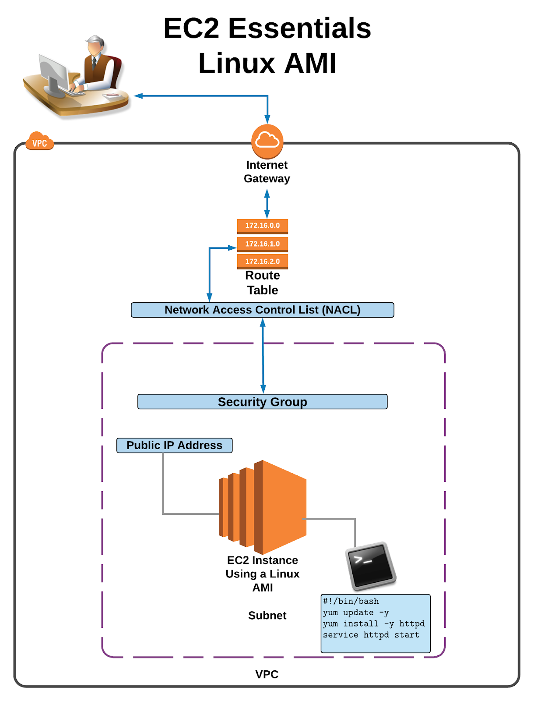 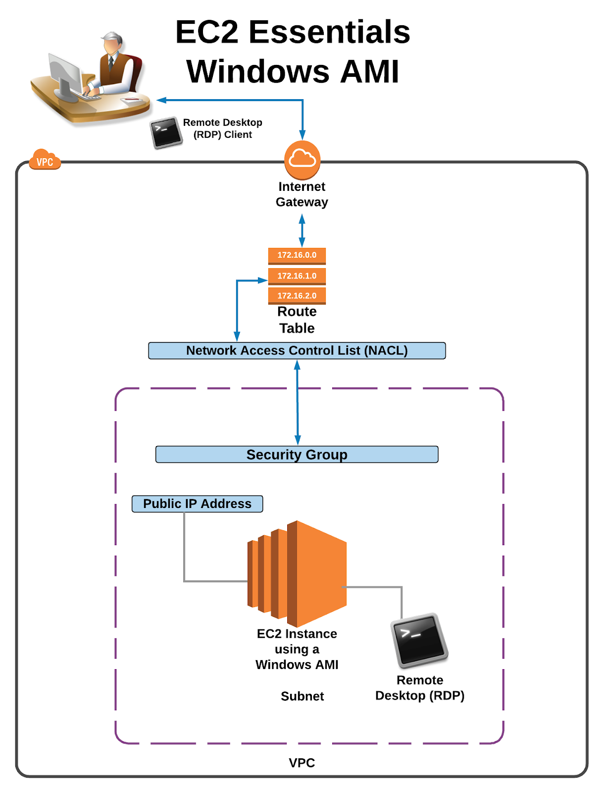

- 일반적으로

  - `Linux` 기반의 인스턴스의 경우에는 SSH를 이용해서 연결

  - `Windows` EC2 인스턴스의 경우에는 일반적으로 RDP(원격 데스크탑 프로토콜)를 사용해서 연결

    - `RDP` = Windows 컴퓨터를 관리하기 위한 GUI

  - 공통적으로

    1. 퍼블릭 IP
    2. 외부에서 접속할 수 있도록 서비스 포트를 개방 (보안그룹, NACL)
    3. 인터넷 게이트웨이로 라우팅이 설정
    4. 개인키 파일을 가지고 있어야함

    

- VPC 서비스를 확인

  - 라우팅 테이블 
    - IGW와 연결을 확인
  - NACL
    - RDP 접속을 허용
  - SG
    - 모든 접속을 허용

- RDP 전용 보안 그룹을 생성

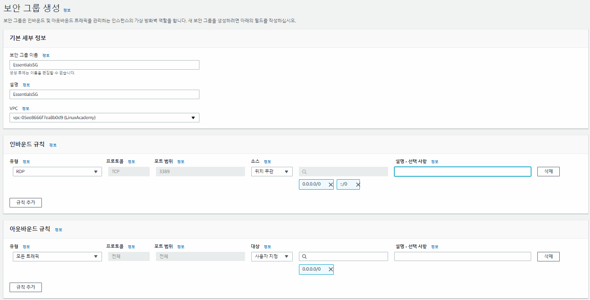

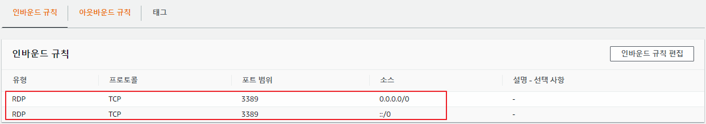

- Windows EC2 인스턴스를 생성

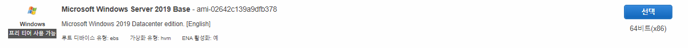

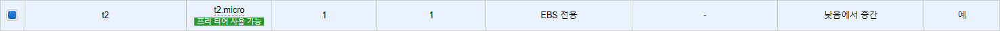

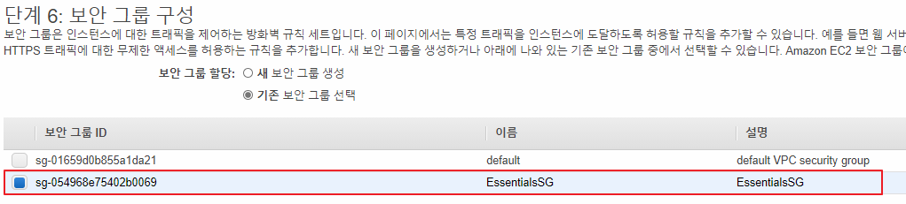

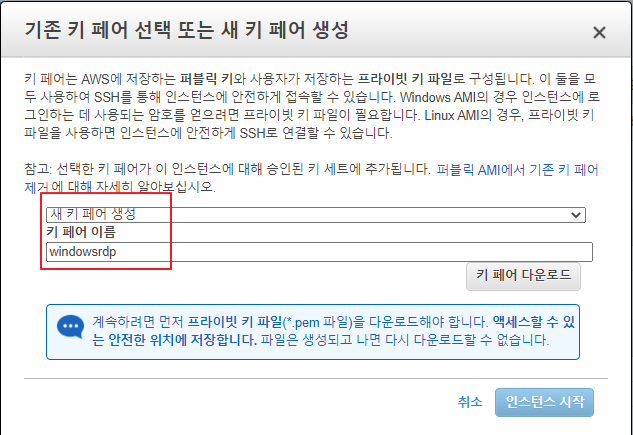

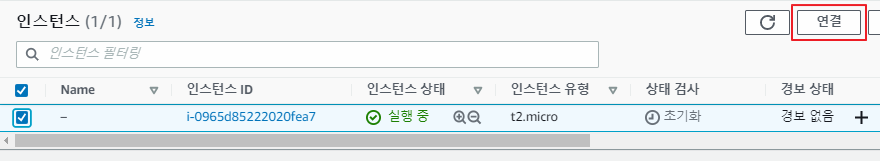

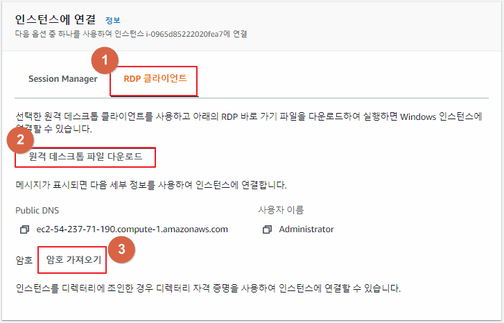

- 약 4분 정도 지난 후 (3) 암호 가져오기 링크를 클릭

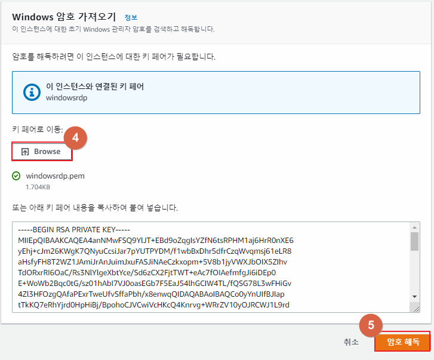

- (4)  Browser 버튼을 클릭 후 인스턴스 생성 시 다운로드 받은 개인 키 파일(windowsrdp.perm)을 선택


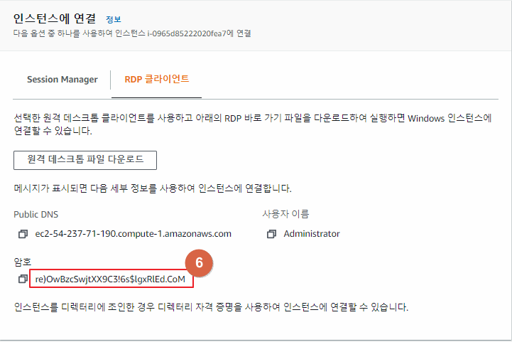

- (6) 접속 패스워드를 확인
- (3) 에서 다운로드 받은 원격 데스크탑 파일을 실행

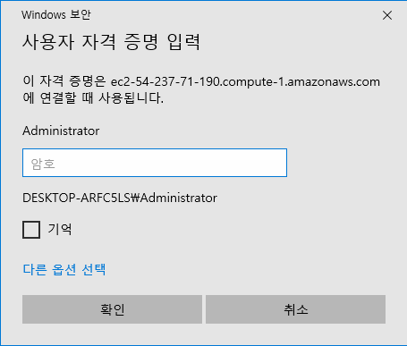

(6)에서 생성한 패스워드로 원격 접속

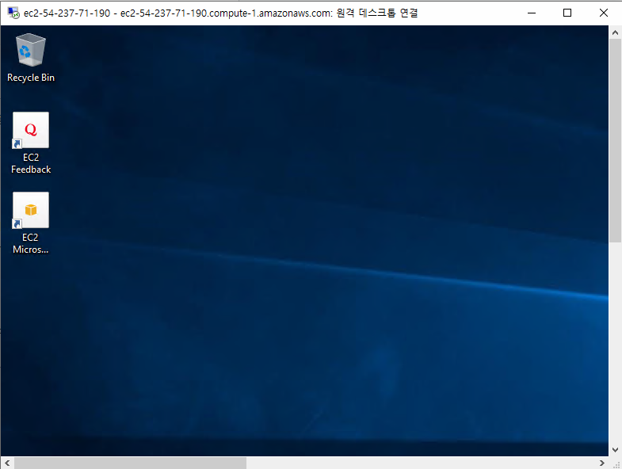

<br/>

---

<br/>

## LAB2 : Creating Your Own EC2 Workstation in the AWS Console

> EC2 인스턴스 생성 후 해당 인스턴스를 통해 S3 버킷을 생성하고, SNS 문자 메시지 전송

- Workstation
  - 작업을 위한 EC2 인스턴스
  - AWS CLI로 AWS 인스턴스를 생성하고 관리할 수 있는 권한을 가진 인스턴스

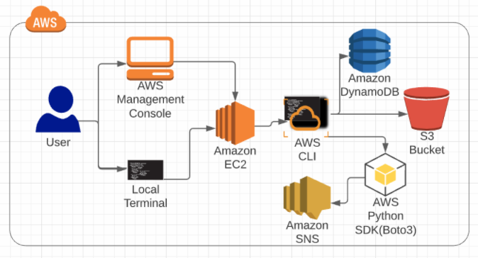

### 목표 : EC2 인스턴스 생성 후 해당 인스턴스를 통해 S3 버킷을 생성하고, SNS 문자 메시지 전송

### 1. EC2 인스턴스를 생성

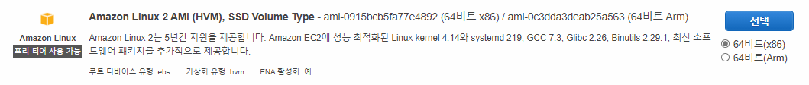

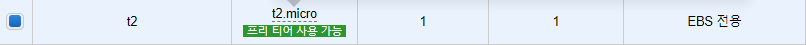

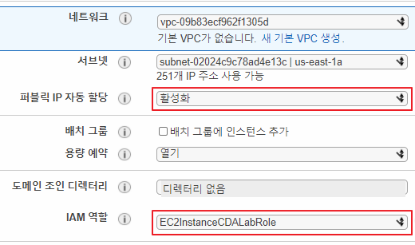

- EC2InstanceCDALabRole 
  - EC2 인스턴스에서 AWS 내의 다양한 작업을 수행할 수 있는 권한을 부여

### 2.  SSH 클라이언트를 이용해서 EC2 인스턴스에 접속

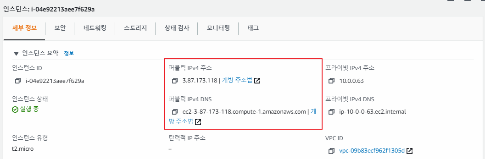

- 인스턴스의 퍼블릭 IP 주소를 확인

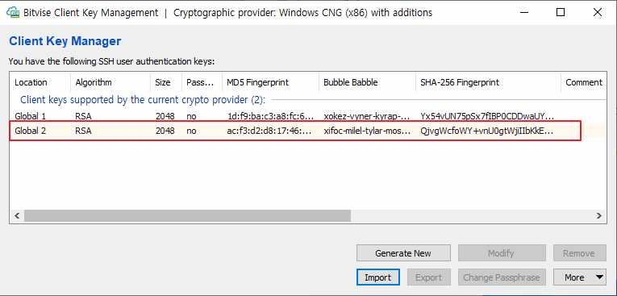

- 인스턴스 생성 시 발급받은 개인키를 등록

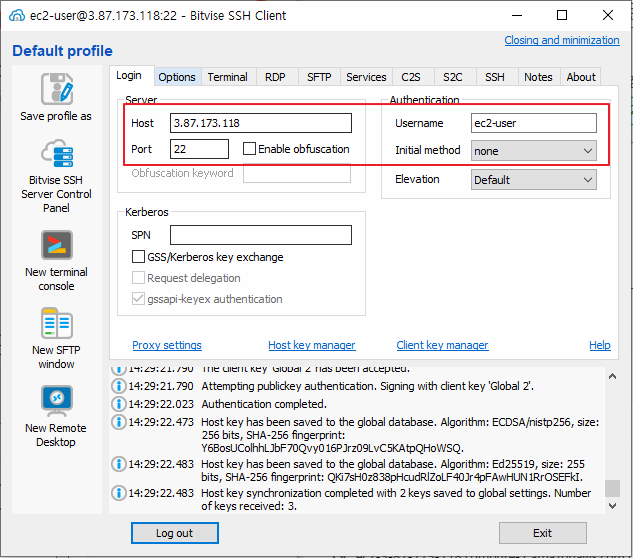

- ec2-user 계정으로 접속

<br/>

### 3 .SSH 접속 후

#### 1. aws config 명령어로 기본 지역(region)을 us-east-1로 설정

- `aws dynamodb list-tables`

```
[ec2-user@ip-10-0-0-63 ~]$ aws dynamodb list-tables
You must specify a region. You can also configure your region by running "aws configure".
```

- `aws configure`

```
[ec2-user@ip-10-0-0-63 ~]$ aws configure
AWS Access Key ID [None]:
AWS Secret Access Key [None]:
Default region name [None]: us-east-1
Default output format [None]:
```

#### 2. DynamoDB에 테이블 목록을 조회

- `aws dynamodb list-tables`

```
{
    "TableNames": []
}
```

- DynamoDB CLI 명령어
  -  ⇒ https://docs.aws.amazon.com/cli/latest/reference/dynamodb/index.html
  -  ⇒ https://docs.aws.amazon.com/cli/latest/reference/dynamodb/list-tables.html 		

#### 3.  S3 생성 및 조회

- 버킷 조회
  - `aws s3 ls`
- 버킷 생성
  - `aws s3 mb s3://1yangsh-20210302`
  - 버킷 이름은 유일하게!!
- `aws s3 ls`

```
2021-03-02 05:37:24 1yangsh-20210302   ⇐ 생성한 버킷이 조회
```

#### 4. boto3(Python API) SDK를 이용한 SNS 서비스

- https://boto3.amazonaws.com/v1/documentation/api/latest/index.html
- https://boto3.amazonaws.com/v1/documentation/api/latest/reference/services/sns.html#SNS.Client.publish
- pip 설치
  - `sudo yum -y install python-pip`
- boto3 설치
  - `sudo pip install boto3`
- `python`

```python
>>> import boto3
>>> sns = boto3.client('sns')
>>> phone_number = '+821050591152'
>>> sns.publish(Message='ysh410@gmail.com', PhoneNumber=phone_number)
```

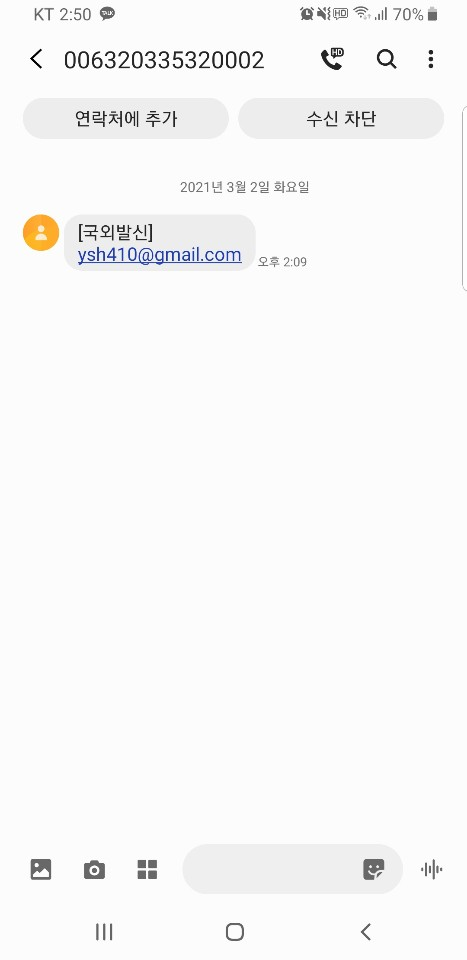

#### 기타 : PC에 AWS CLI 다운로드 및 설치

- Windows
  
- https://docs.aws.amazon.com/ko_kr/cli/latest/userguide/install-cliv2-windows.html
  
- MacOS

  - https://docs.aws.amazon.com/ko_kr/cli/latest/userguide/install-cliv2-mac.html

  <br/>

---

<br/>

## LAB3 : Create a Custom AMI in AWS

> 가상머신 이미지 생성

- 링크
  - https://learn.acloud.guru/course/178db59b-70f1-4bd8-8d74-9ab9263f8f9a/learn/c346e351-30dd-4668-ac6c-be9cdb4e7de5/c01f3c88-73a6-4cd3-9674-6008cc45ff95/lab/1ca2ca4a-48bc-49c7-b3df-e583352e8b0a
- 가상머신 이미지 생성 케이스
  1. Auto Scaling 환경과 같이 동일한 상태의 어플리케이션이 즉시 사용해야 하는 경우 
     - → 사용자 지정 AMI를 생성해서 사전 구성된 인스턴스를 시작하고 대리를 건너 뛸 수 있음

#### 1. 인스턴스 생성

#### 2. 인스턴스 생성 후 SSH 접속, 아래의 명령어를 실행

> apache 와 php7 설치

- `sudo yum update -y`
- `sudo yum install -y http php`
- `sudo service httpd start`
- `sudo chkconfig httpd on`
- `sudo usermod -a -G ec2-user`
- `sudo chown -R ec2-user:apache /var/www`
- `echo "<?php phpinfo(); ?>" > /var/ww/html/phpinfo.php`

#### 3. 사용자 정의 AMI 생성

- 현재 인스턴스의 상태를 사용자 정의 AMI로 생성

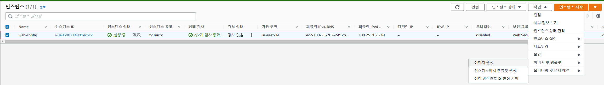

#### 추가 : 사용자 정의 AMI를 이용해서 인스턴스를 만들 때

- 이미지를 만들 때와 동일한 리전에서만 인스턴스 생성이 가능만약, 다른 리전에 인스턴를 생성할 경우에는 AMI 이미지를 복사해서 사용


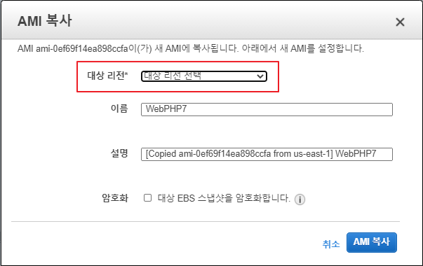

- 사용자 정의 AMI를 이용해서 인스턴스를 생성
  - ⇒ 응용 프로그램 설치 및 설정 시간을 단축할 수 있음

<br/>

---

<br/>

## LAB4 : Resizing Root AWS EBS Volumes to Increase Performance

> 루트 볼륨의 크기를 조정 ⇐ IOPS(Input/Output Operations Per Second: 아이옵스) 향상을 위해서

1. 독립형 인스턴스 (bastion host)

2. Auto Scaling Group (2개의 웹 서버 인스턴스)


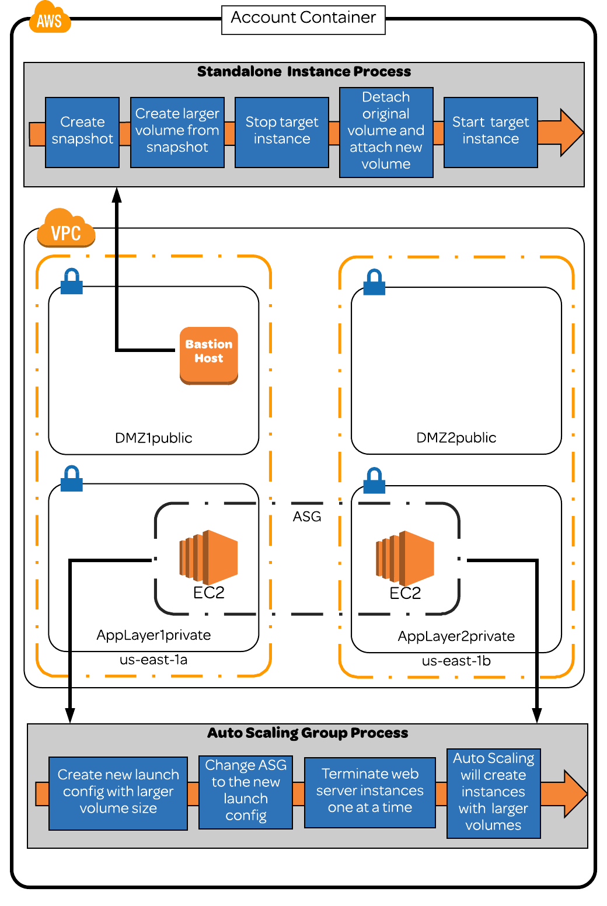

### 독립형 인스턴스 (bastion host)

#### 1. EBS 스냅샷 생성

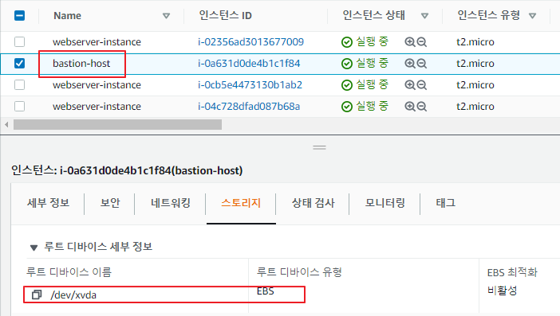

#### 2. 루트 디바이스의 볼륨 ID 링크를 클릭 후 작업에서 스냅샷 생성을 선택

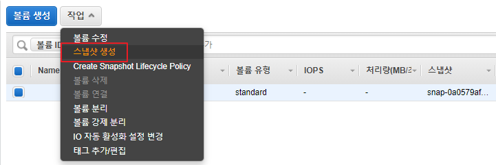

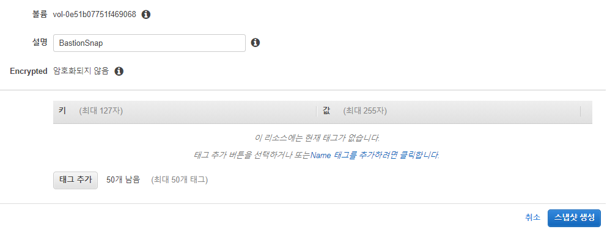

#### 3. 더 큰 크기의 EBS 볼륨을 생성

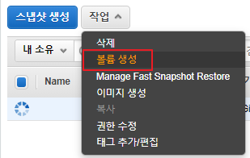

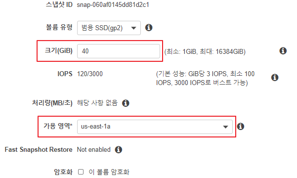

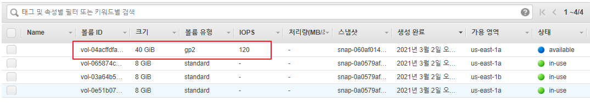


#### 4. 생성한 볼륨을 EC2 instance에 적용

1. 적용할 인스턴스 중지

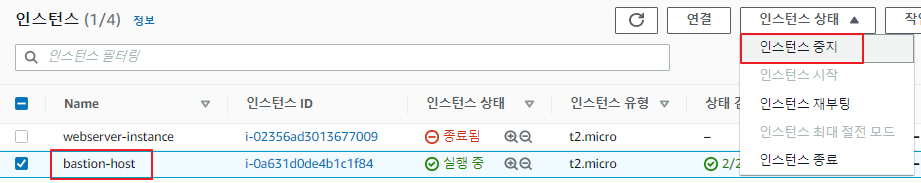

2. bastion host 볼륨 선택

   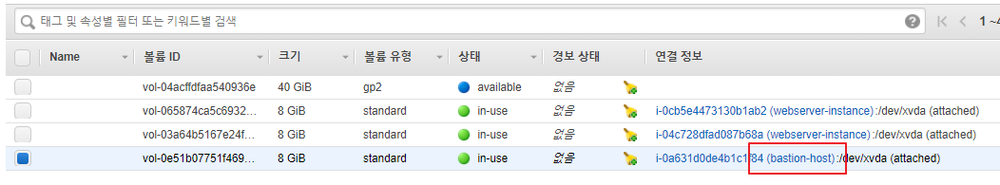

3. 볼륨 분리

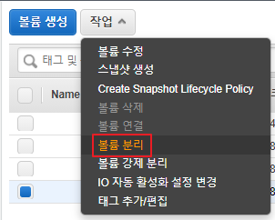

4. 볼륨 연결

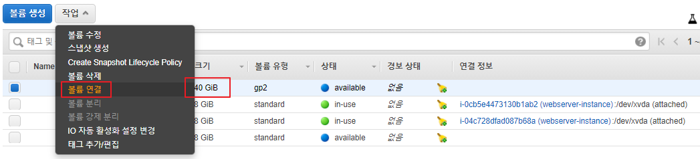

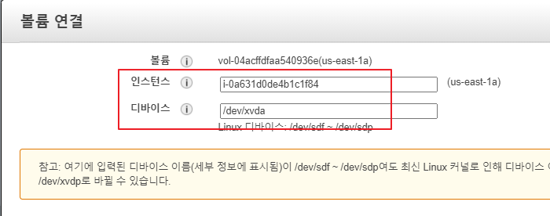

5. 중지된 인스턴스를 시작

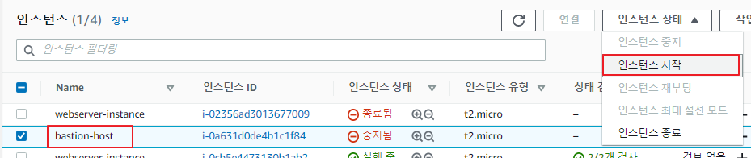

6. 스토리지 확인

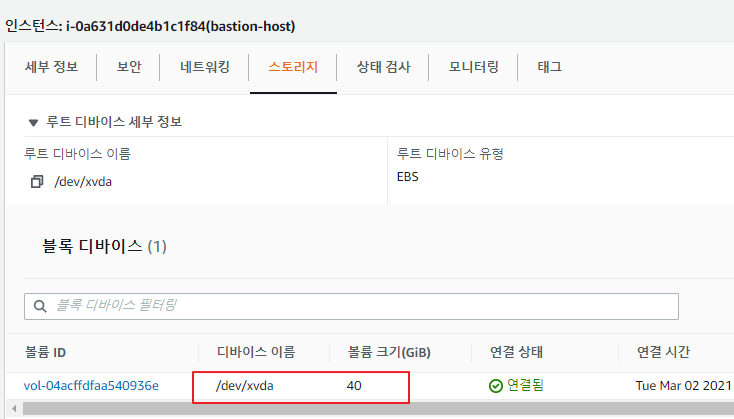

7. SSH 접속해서 확인

```
[cloud_user@ip-10-99-1-27 ~]$ lsblk
NAME    MAJ:MIN RM SIZE RO TYPE MOUNTPOINT
xvda    202:0    0  40G  0 disk		           	⇐ 확인
└─xvda1 202:1    0  40G  0 part /
```

---

<br/>

### Auto Scaling Group 설정

- 인스턴스를 확인

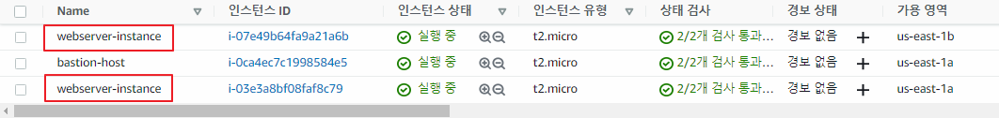

- Auto Scaling 확인

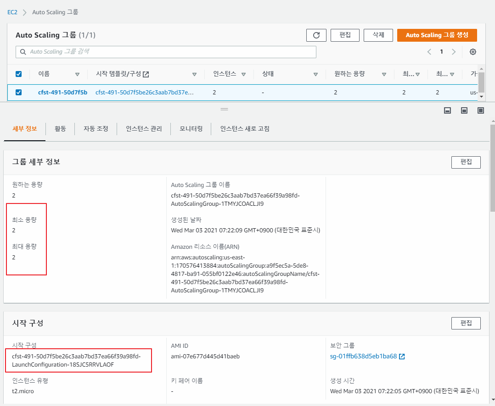

- 시작 구성을 확인

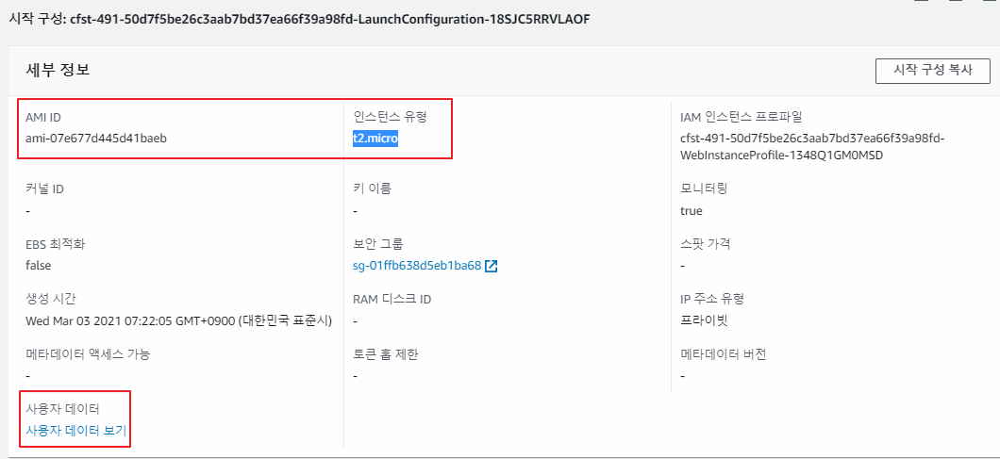

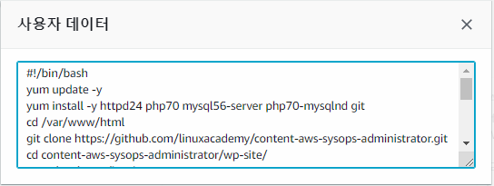

- 새로운 시작 구성을 생성

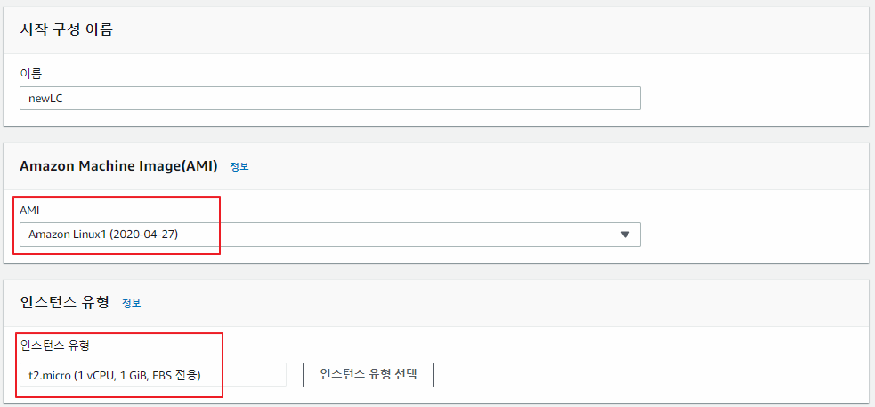

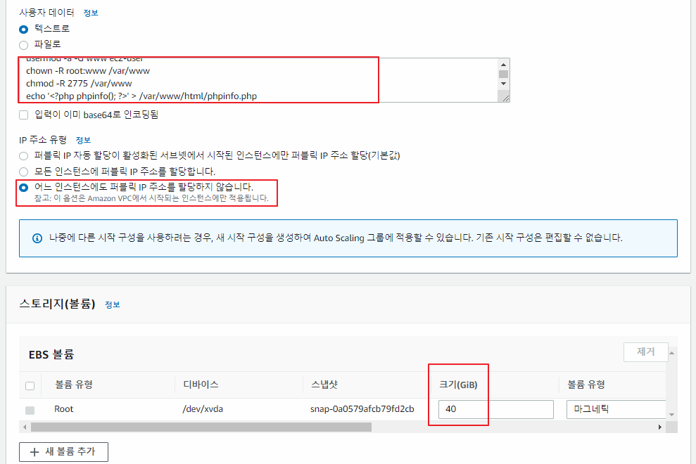

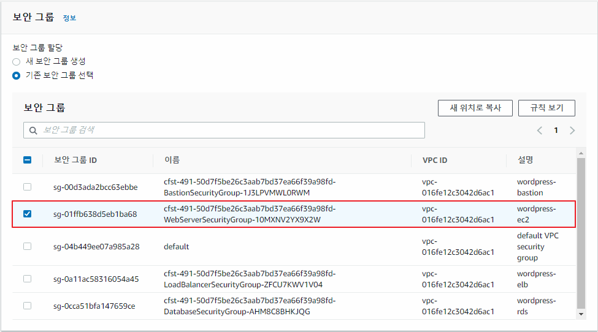

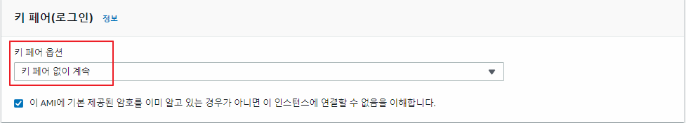

- Auto Scaling Group에 새롭게 생성한 시작 구성으로 변경

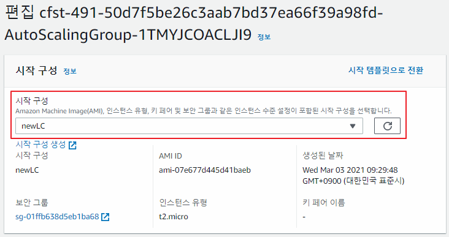

- 기존에 동작하고 있던 인스턴스를 종료 →  Auto Scaling 설정에 따라 (시작 구성에 설정된) 새로운 인스턴스가 생성


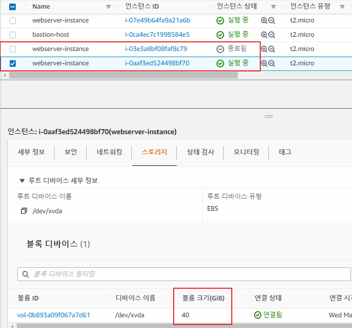