## Monitoring

> AWS 리소스의 로그 관리, 이벤트 모니터링 서비스

###  CloudTrail

- AWS 리소스의 모든 읽기, 쓰기 작업의 상세 로그(작업 내역, 관련 리소스와 리전, 작업 수행자의 작업 시간 등)를 보관
- API  작업과 비 API 작업을 모드 기록
  - API 작업 
    - 예 : 인스턴스 시작, S3 버킷 생성, VPC 생성
  - 비 API 작업
    - 예 : AWS Management Console에 로그인 등
- 이벤트(event)
  - AWS 계정의 활동 기록
  - `관리 이벤트` = 제어 플레인 작업(Control Plane Operations)
    - 보안 주체가 AWS 리소스에서 실행하는 작업을 포함
      - 보안 구성 
        - → IAM AttachRolePolicy API
      - 디바이스 등록 
        - → EC2 AttachRolePolicy API
      - 데이터 라우팅 규칙 구성  
        - → EC2 CreateSubnet API
      - 로깅 설정  
        - → CloudTrail CreateTrail API  
    - 계정에서 발생하는 비 API 이벤트
      - 사용자가 로그인하는 경우 ConsoleLogin 이벤트가 로깅
    - 쓰기 전용과 읽기 전용으로 분류
      - 쓰기 전용 이벤트 : 리소스를 변경하거나 변경할 수 있는 API 작업
      - 읽기 전용 이벤트 : 리소스를 읽기만하고 변경하지 않는 API 작업
  - `데이터 이벤트` = 데이터 플레인 작업(Data Plane Operations)
    - 리소스 또는 리소스 내에서 수행되는 리소스 작업에 대한 정보를 제공
    - 대량의 작업이 수행되는 S3 객체 수준 활동, Lambda 함수 실행
      - S3 객체 수준 활동 → GetObject, DeleteObject, PutObject API
      - Lambda 함수 실행  →  Invoke API
    -  추적을 생성할 때 데이터 이벤트는 기본적으로 기록되지 않음
      - 데이터 이벤트를 기록하려면 활동을 수집할 리소스 또는 리소스 유형을 추적에 명시적으로 추가해야 함
  - `인사이트 이벤트`
    - AWS 계정의 비정상적인 활동을 캡쳐
    - 계정 API 사용량 변화가 계정의 일반적인 사용 패턴과 크게 다를 때 로깅
      - S3 deleteBucket API 호출이 평균적으로 분당 20회 호출 
        - → 분당 100회 호출이 감지 
        - ⇒ 비정상적인 활동
        - ⇒ 비정상적인 활동이 시작될 때와 정상으로 돌아갔을 때를 기록

   

- 이벤트 기록 (Event History)
  - CloudTrail 이벤트에 대한 지난 90일 간의 기록
  - 조회, 검색, 다운로드 등이 가능
  - 각 리전별로 __이벤트 기록__을 작성하고 해당 리전에서의 활동만 기록
  - IAM, Route 53 등의 글로벌 서비스 이벤트는 모든 리전의 이벤트 기록에 포함

- 추적 (trail)
  - 90일이 경과한 이벤트 기록을 저장하거나 CloudTrail이 기록하는 이벤트 유형을 사용자 정의할 때 생성
  - 특정 이벤트를 기록하고 지정한 S3 버킷에 CloudTrail 로그 파일을 전달, 로그 파일에는 JSON 형식의 항목이 하나 이상 들어 있음
    - eventTime
    - userIdentity
    - eventSource
    - eventName
    - awsResion
    - sourceIPAddress  

  

### CloudWatch

- AWS 리소스와 AWS에서 실시간으로 실행되는 애플리케이션을 모니터링
- 리소스와 애플리케이션에 대한 지표(= 측정할 수 있는 변수)를 수집하고 추적
- CloudWatch 웹 사이트에는 사용 중인 모든 AWS 서비스에 한 지표가 자동으로 표시되고, 사용자 지정 대시보드 추가가 가능
- 지표를 감시해 알림을 보내거나 임계값을 위반한 경우 모니터링 중인 리소스를 자동으로 변경하는 경보를 생성
- 시스템 전체의 리소스 사용량, 애플리케이션 성능 및 운영 상태를 파악

<br/>

---

<br/>

## LAB1 : Monitoring and Notifications with CloudWatch Events and SNS

- LAB 링크
  - https://learn.acloud.guru/course/178db59b-70f1-4bd8-8d74-9ab9263f8f9a/learn/6bc3035e-205b-4a57-bcfe-b5ded5593bcb/35c57628-7e64-41f6-8d37-59017a9cbeb4/lab/9087f514-28eb-4ace-acd4-b6cb83f666a0

- EC2 인스턴스가 중지(shutdown)되었을 때 이메일 통지(notification)를 발생

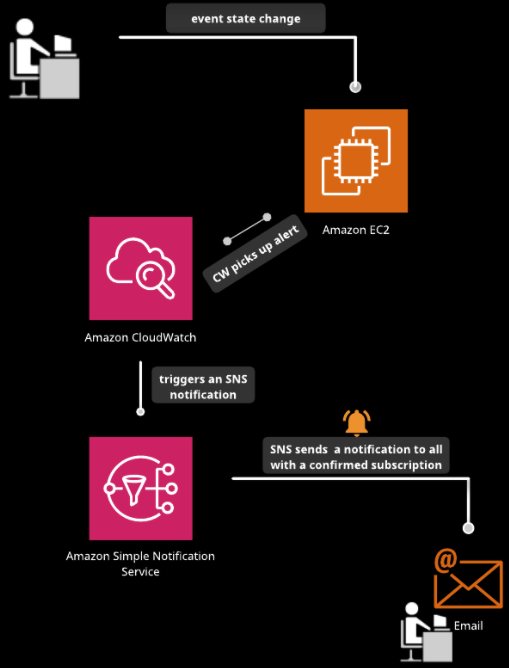

#### #1 EC2 인스턴스 확인

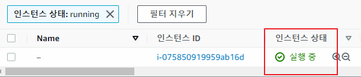


#### #2 SNS 주제(topic)와 이메일 구독(subscribe)을 생성

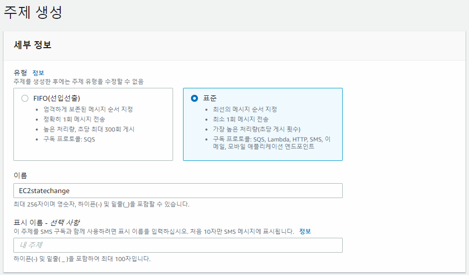

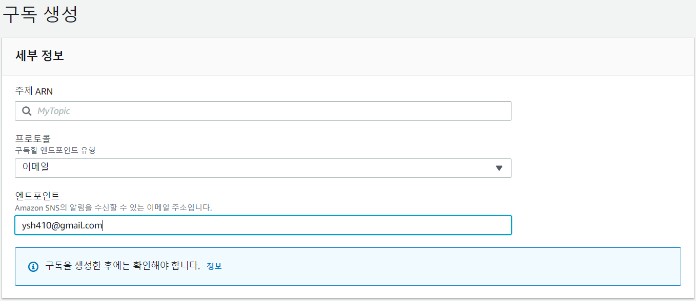

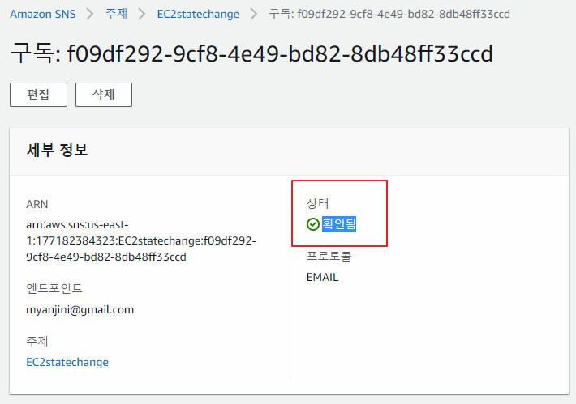

  

#### #3 SNS 주제를 트리거하는 CloudWatch 이벤트 규칙을 생성

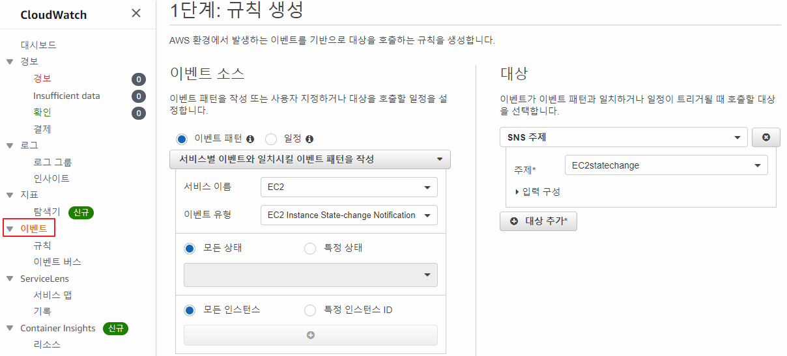

  

#### #4 EC2 인스턴스의 상태를 변경했을 때 이메일 통지가 수신되는지 확인

- 인스턴스 중지

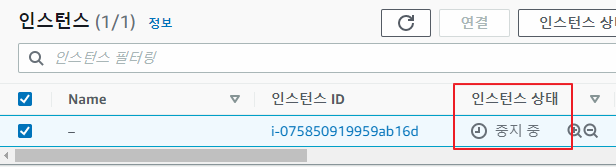

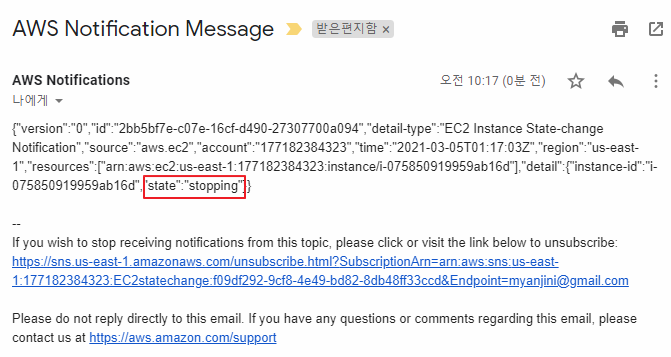

- 인스턴스 실행

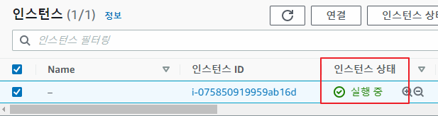

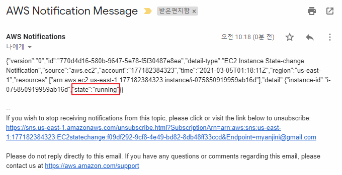

<br/>

---

<br/>

## LAB1-2 : EC2 인스턴스가 중지(stopped)되었을 때 이메일과 함께 SMS 통지를 발생하도록 설정

- SMS 구독 생성

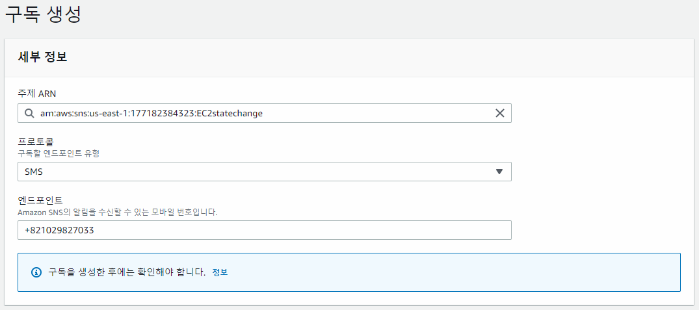

- 이벤트 수정

  - 이벤트 유형 -> 특정상태(shutdown)

  - 일치하는 이벤트의 일부 -> JSON에서 detail만 받아 오기 위해

    ```json
    "detail":{"instance-id":"i-0697bdc417cb5d414","state":"stopping"}}
    ```

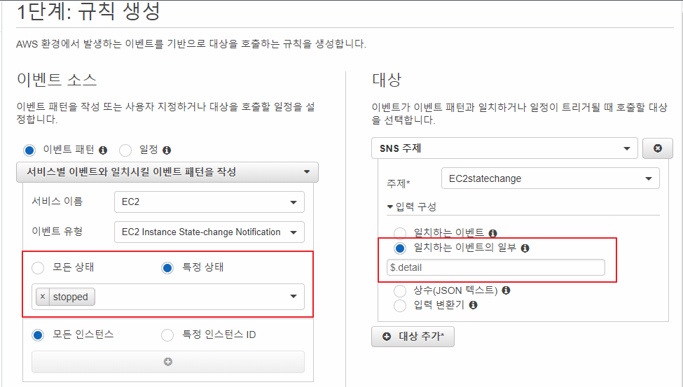

- 이메일 확인

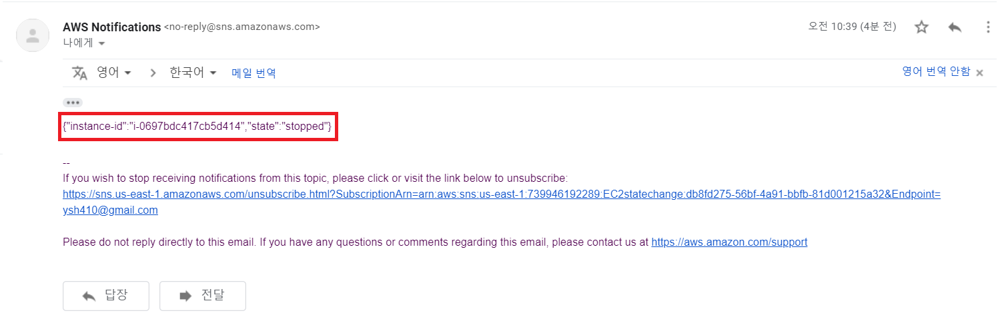


- 문자 확인

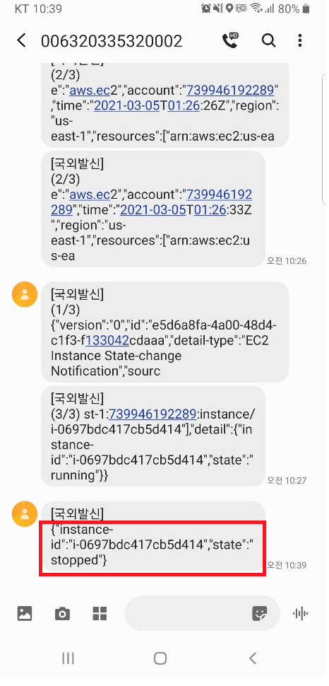

#### TODO. EC2 인스턴스가 중지(stopped)되었을 때 포맷팅된 알림 메시지를 전송하시오.

<br/>

---

<br/>

## LAB2 : AWS EC2 Custom Logging with CloudWatch

> 인스턴스에서 생성되는 로그 정보를 CloudWatcch로 전송해서 로그를 통합

- EC2 인스턴스에 CloudWatch Logs 에이전트를 설치하고, 로그 서비스를 켜고, 메시지를 수신하도록 CloudWatcch를 구성

#### #1 EC2 인스턴스 생성

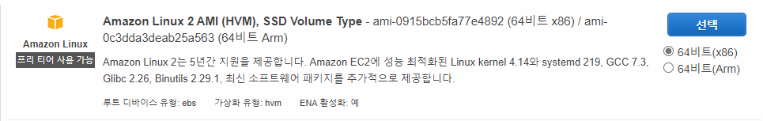

**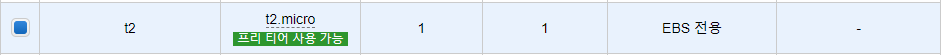**

---

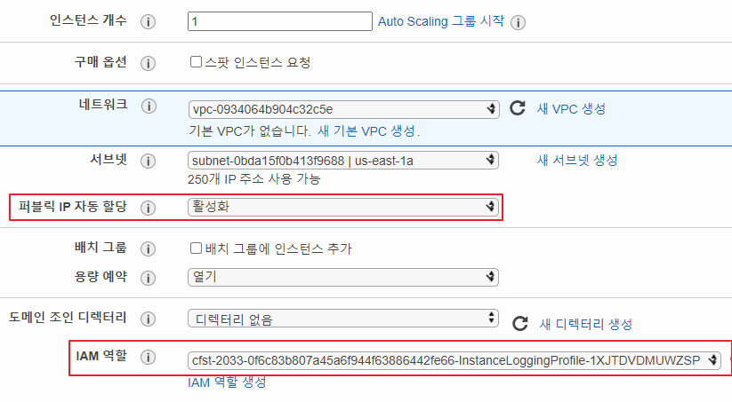

  

#### #2 작업을 위해 EC2 인스턴스에 SSH 접속

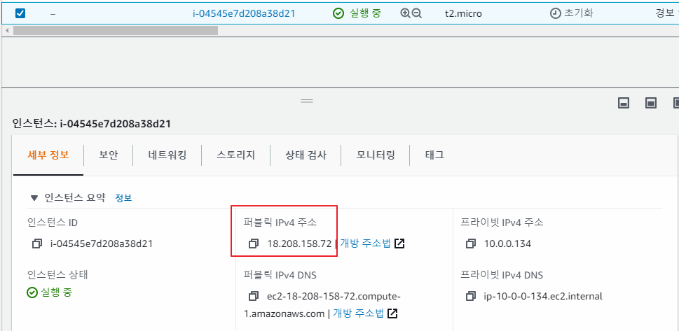

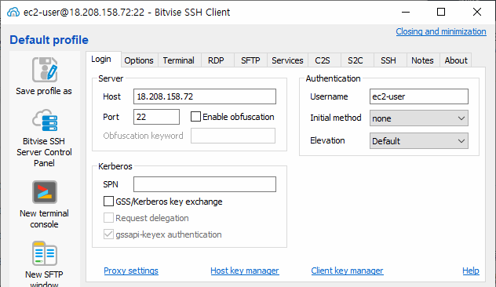

  

#### #3 EC2 인스턴스에 awslogs 서비스를 추가

- [ec2-user@ip-10-0-0-134 ~]$ `sudo yum update -y`

- [ec2-user@ip-10-0-0-134 ~]$ `sudo yum install -y awslogs`

- [ec2-user@ip-10-0-0-134 ~]$ `cd /etc/awslogs`

- [ec2-user@ip-10-0-0-134 awslogs]$ `ls -l`

  ```
  total 20
  -rw------- 1 root root   55 Mar  5 02:14 awscli.conf	⇐ 자격증명과 지역정보를 포함
  -rw-r--r-- 1 root root 8355 Jul 25  2018 awslogs.conf	⇐ CloudWatch 로깅에 대한 설정 정보를 포함
  drwxr-xr-x 2 root root    6 Jul 25  2018 config
  -rw-r--r-- 1 root root  147 Jul 25  2018 proxy.conf
  ```

- [ec2-user@ip-10-0-0-134 awslogs]$ `sudo systemctl start awslogsd	`

  - awslogs 서비스를 시작

- [ec2-user@ip-10-0-0-134 awslogs]$ `tail -f /var/log/awslogs.log`

  - awslogs 에이전트가 생성하는 로그를 확인

  ```
  2021-03-05 02:18:18,404 - cwlogs.push - INFO - 3448 - MainThread - Missing or invalid value for use_gzip_http_content_encoding config. Defaulting to use gzip encoding.
  2021-03-05 02:18:18,404 - cwlogs.push - INFO - 3448 - MainThread - Missing or invalid value for queue_size config. Defaulting to use 10
  2021-03-05 02:18:18,404 - cwlogs.push - INFO - 3448 - MainThread - Using default logging configuration.
  2021-03-05 02:18:18,425 - cwlogs.push.stream - INFO - 3448 - Thread-1 - Starting publisher for [1538ea66cfd1d4424de78dedc63516f8, /var/log/messages]
  2021-03-05 02:18:18,431 - cwlogs.push.stream - INFO - 3448 - Thread-1 - Starting reader for [1538ea66cfd1d4424de78dedc63516f8, /var/log/messages]
  2021-03-05 02:18:18,432 - cwlogs.push.reader - INFO - 3448 - Thread-4 - Start reading file from 0.
  2021-03-05 02:18:24,519 - cwlogs.push.publisher - WARNING - 3448 - Thread-3 - Caught exception: An error occurred (ResourceNotFoundException) when calling the PutLogEvents operation: The specified log group does not exist.
  2021-03-05 02:18:24,520 - cwlogs.push.batch - INFO - 3448 - Thread-3 - Creating log group /var/log/messages.
  2021-03-05 02:18:24,582 - cwlogs.push.batch - INFO - 3448 - Thread-3 - Creating log stream i-04545e7d208a38d21.
  2021-03-05 02:18:24,675 - cwlogs.push.publisher - INFO - 3448 - Thread-3 - Log group: /var/log/messages, log stream: i-04545e7d208a38d21, queue size: 0, Publish batch: {'skipped_events_count': 0, 'first_event': {'timestamp': 1614910316000, 'start_position': 0L, 'end_position': 162L}, 'fallback_events_count': 0, 'last_event': {'timestamp': 1614910698000, 'start_position': 68477L, 'end_position': 68564L}, 'source_id': '1538ea66cfd1d4424de78dedc63516f8', 'num_of_events': 789, 'batch_size_in_bytes': 88289}
  ```

- [ec2-user@ip-10-0-0-134 awslogs]$ `sudo systemctl enable awslogsd.service`
  - 부팅 시 awslogs 서비스를 자동 실행

  

#### #4 EC2에서 보낸 CloudWatch Logs 확인 (수집된 로그를 확인)

- EC2 인스턴스의 /var/log/message 파일의 내용과 CloudWatch의 로그 그룹에 수집된 내용이 일치

  

  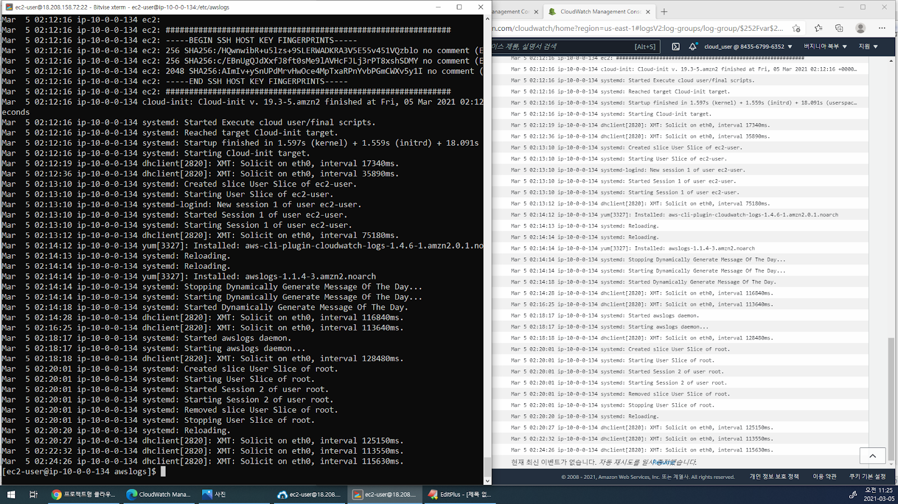

- 참고 :
  
  - https://docs.aws.amazon.com/AmazonCloudWatch/latest/logs/QuickStartEC2Instance.html

<br/>

---

<br/>

## LAB3 : AWS Access Control Alerts with CloudWatch and CloudTrail

- https://learn.acloud.guru/course/178db59b-70f1-4bd8-8d74-9ab9263f8f9a/learn/6bc3035e-205b-4a57-bcfe-b5ded5593bcb/d604c083-853e-453d-8f21-bc65e2c70aee/lab/a3839dd5-7088-4941-9e7e-fd04f006ccd2

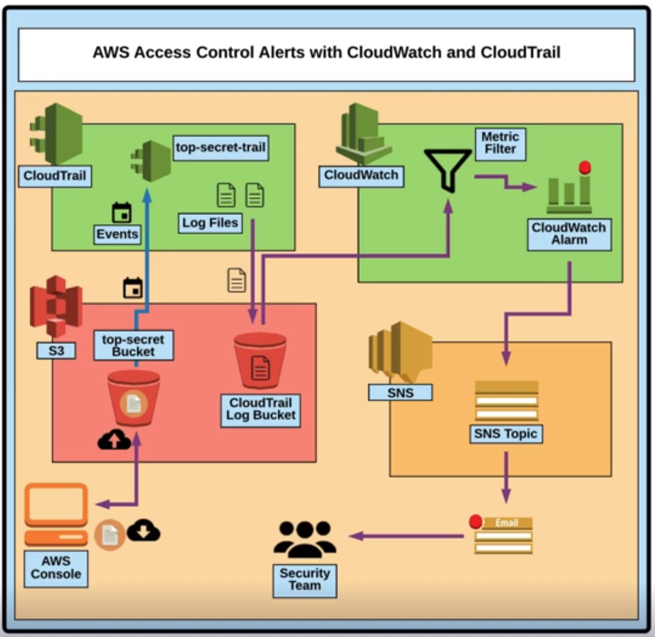

#### #1 중요 정보를 담을 S3 버킷 생성 ← 모니터링이 필요

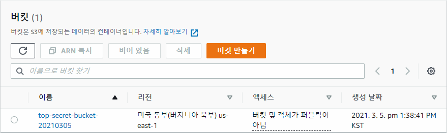


#### #2 CloudTrail 서비스에 추적(trail)을 생성

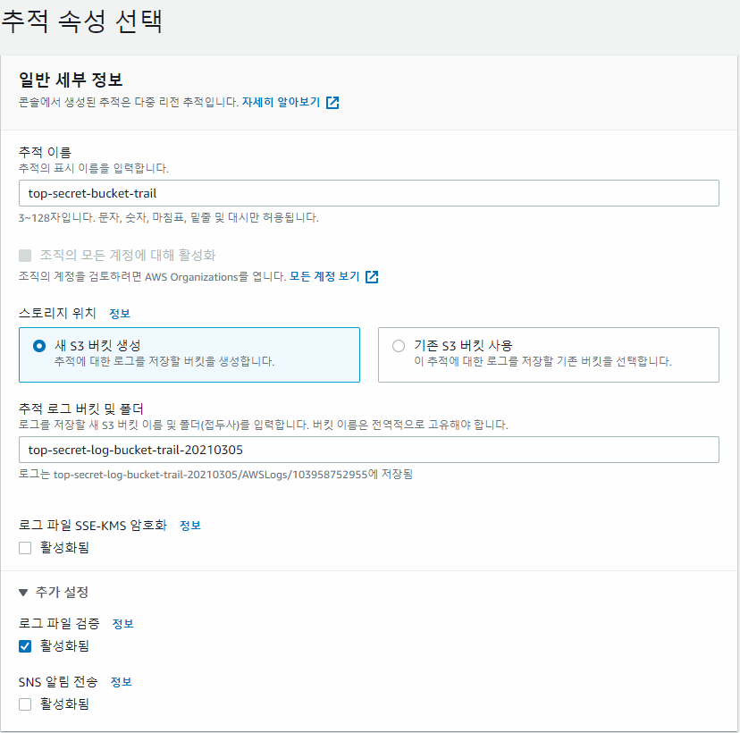

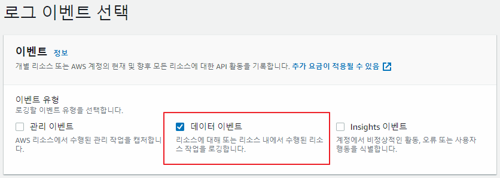

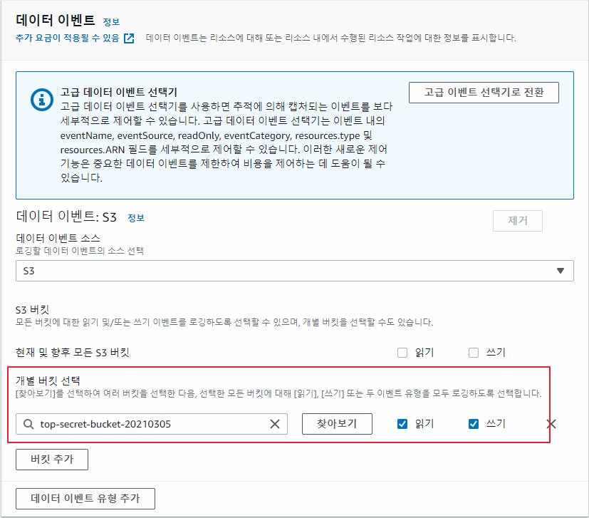

#### 

### #3 CloudWatch 로그 그룹을 생성

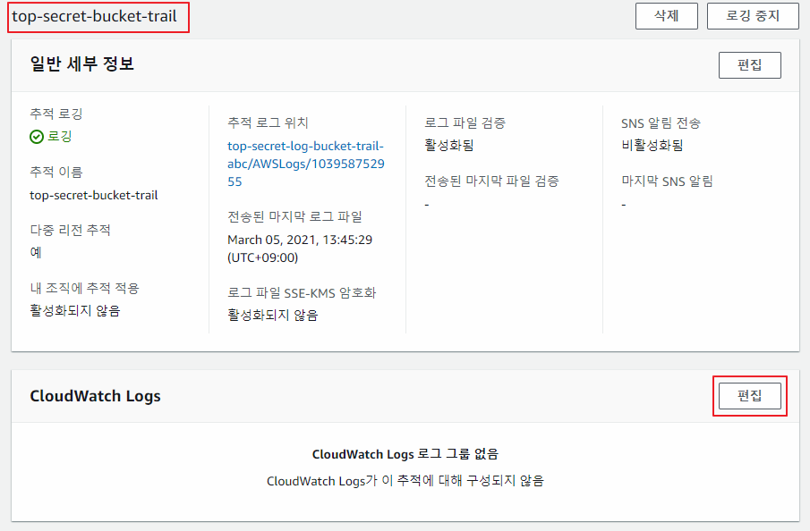

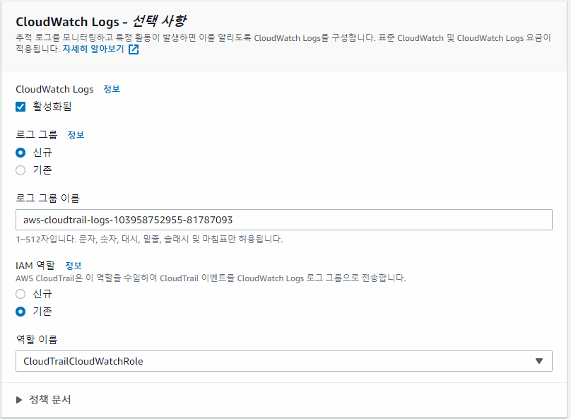

  

#### #4 CloudWatch에서 지표를 설정

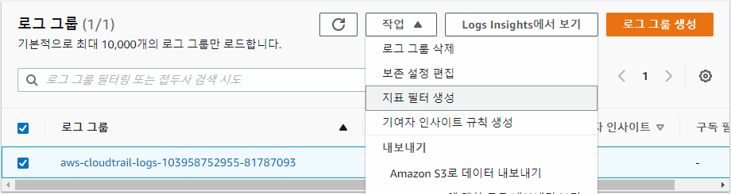

- 패턴 필터링

```
{ ($.eventSource = s3.amazonaws.com) && (($.eventName = PutObject) || ($.eventName = GetObject)) }
```

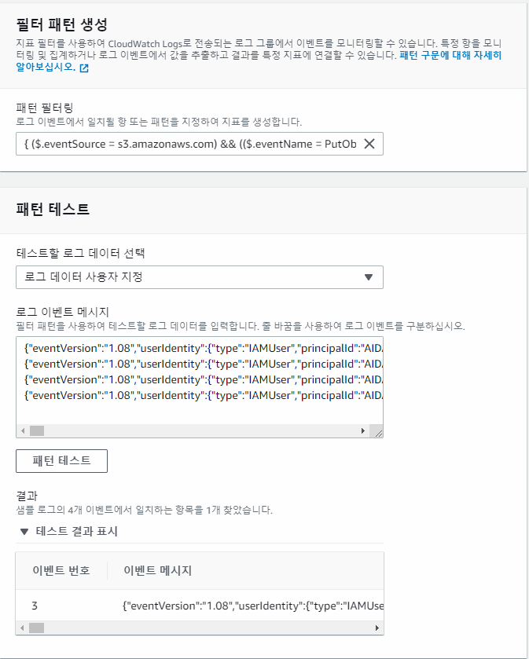

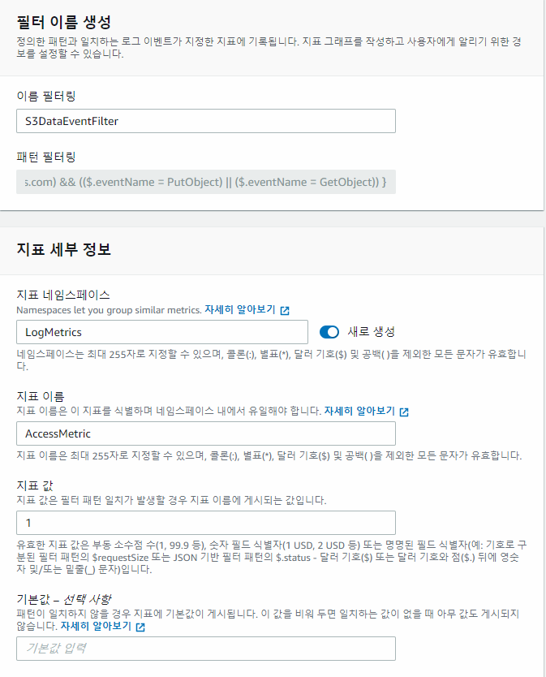

  

#### #5 CloudWatch에서 경보를 설정

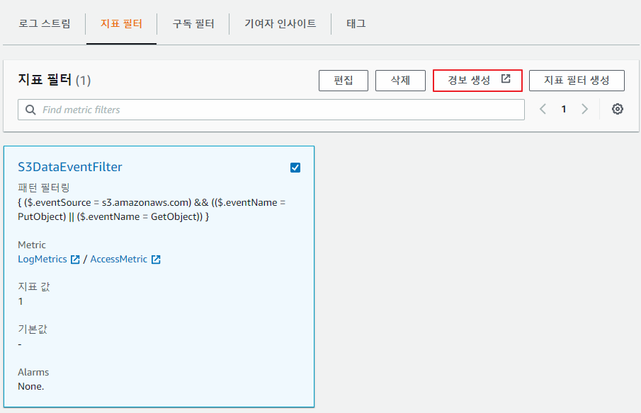


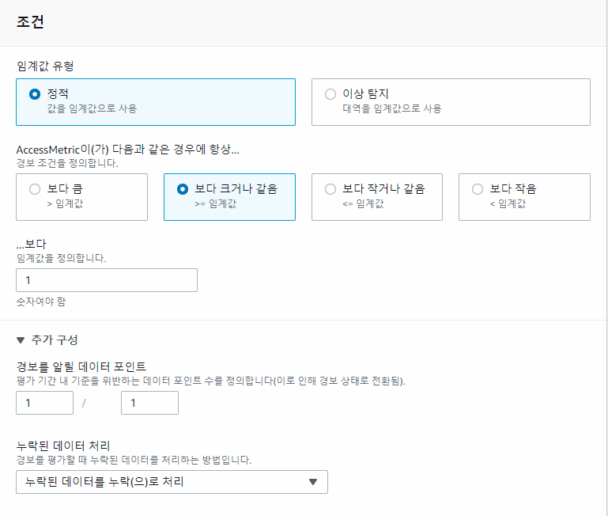

---

- 경보를 알릴 데이터 포인트가 3/3으로 설정된 경우

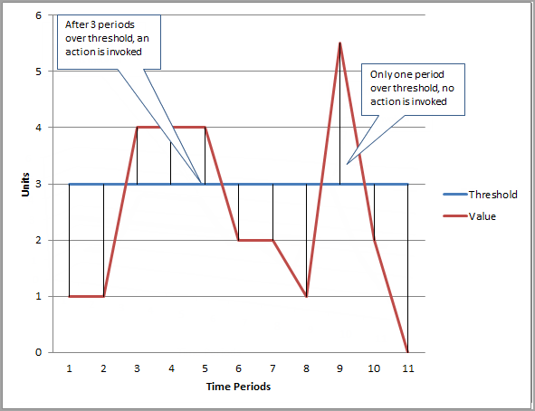

- 지표 경보 상태
  - OK									
    - 지표 또는 표현식이 정의된 임계값 내에 있음
  - ALARM 					      
    - 지표 또는 표현식이 정의된 임계값을 벗어났음
  - INSUFFICIENT_DATA
    - 경보가 방금 시작되었거나, 지표를 사용할 수 없거나, 지표를 통해 경보 상태를 결정하는데 충분한 데이터가 없는 경우

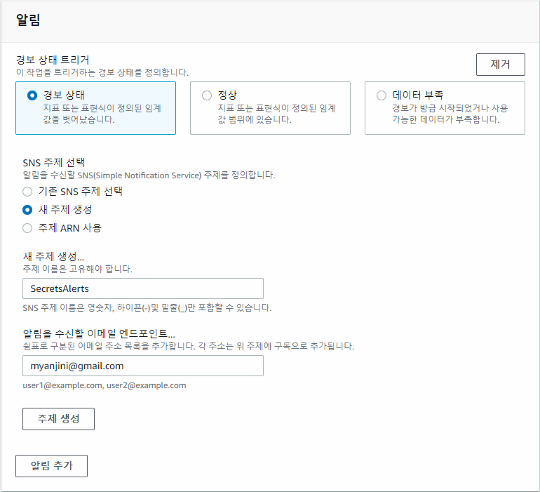

  

#### #6 S3 버킷에 파일을 업로드 후 경보 발생 여부 확인

> 파일 업로드 시, 설정한 경보를 확인한다

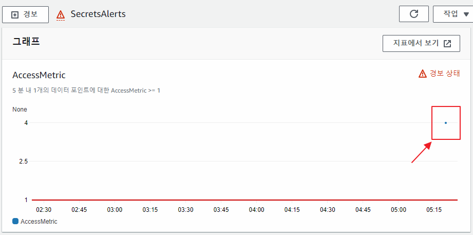

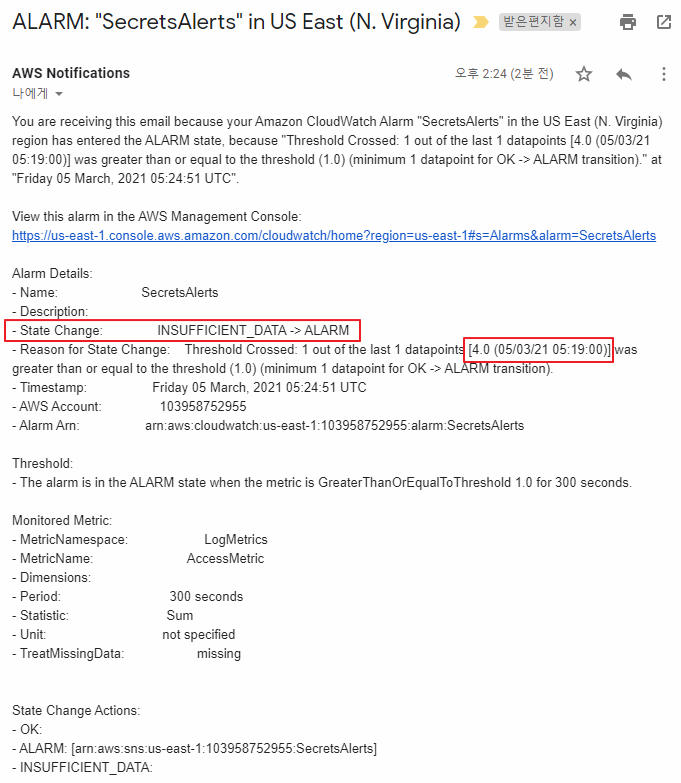