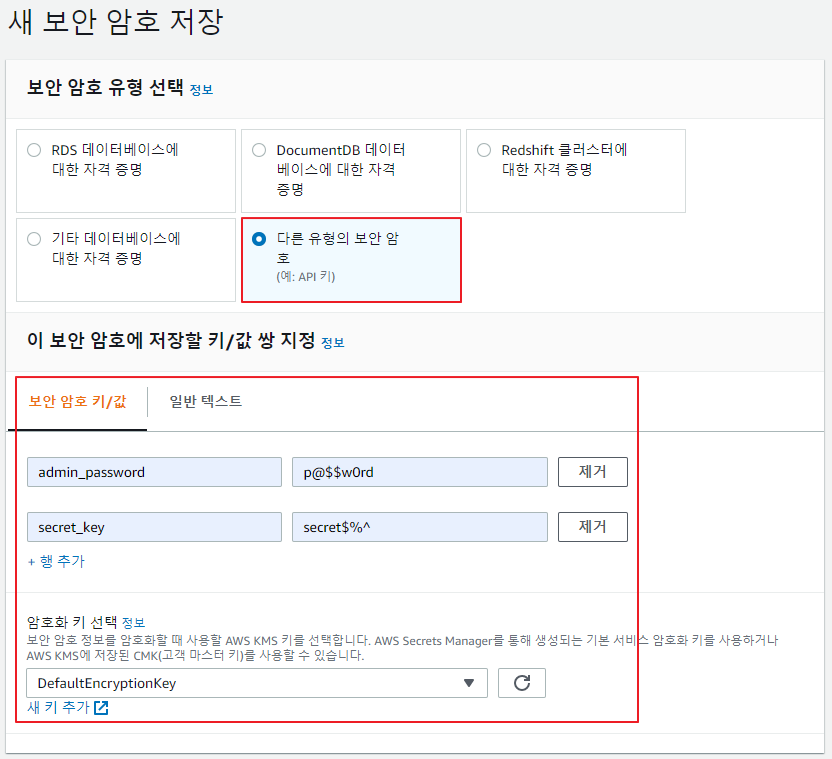

## 암호화

- 평문(Plain text)
- 암호문(Ciper text)

#### 암호시스템

- 암호화
  - 평문 =====> 알고리즘 + 키(key) =====> 암호문
- 복호화
  - 암호문 =====> 알고리즘 + 키(key) =====> 평문

---

- 키 구성에 따라서 **대칭키 암호화 방식**과 **비대칭 암호화 방식**으로 구분이 가능

#### 대칭키 (= 유일키, 비밀키, 관용 암호화 방식)

> 암호화 과정에서 사용된 키와 복호화 과정에서 사용된 키가 동일

- 단점
  - 키 관리 및 분배가 어렵다


#### 비대칭키 (= 공개키 암호화 방식)

> 암호화 과정에 사용된 키와 복호화 과정에 사용된 키가 상이

- 개인키와 공개키로 구성된 키 쌍을 생성
  - 개인는 외부에 오픈되지 않고, 공개키는 외부에 오픈해도 무관 
  - 개인키로 암호화 한 것은 공개키로 복호화할 수 있고, 공개키로 암호화한 것은 개인키로 복호화할 수 있음

##### (1) 키 쌍을 생성

##### (2) 공개키를 공개키 저장소에 오픈 → 누구나가 참조 가능 ⇒ 키 분배의 문제가 해결  모든 사용자는 자신의 개인키만 안전하게 보관 ⇒ 키 관리의 문제가 해결

- 송신자가 수신자A만 볼 수 있도록 데이터를 전달하는 방법 ⇒ 기밀성 서비스를 구현
  1. 수신자A의 공개키를 취득
  2. 수신자A의 공개키로 데이터를 암호화
  3. 암호화된 데이터를 전달
  4. 수신자A는 자신의 개인키로 암호화된 데이터를 복호화
- 원본증명, 부인방지, 인증 등의 서비스를 구현
  1. 송신자가 본인 개인키로 암호화해서 전달 (서명한다)
  2. 암호화된 데이터와 암호화된 데이터를 복호화하는데 필요한 공개키는 누구나 취득이 가능
  3. 암호화된 데이터가 송신자의 공개키로 복호화된다는 것
     - 송신자의 개인키로 암화된 것 = 암호화된 데이터가 송신자가 만들 것이 확실
     - **"서명검증한다"**

<br/>

---

<br/>

## AWS Secret Manager를 이용한 비밀 값 관리

> AWS 인프라 구축 가이드 (p179)

### #1 AWS CLI를 위한 사용자 생성 (p313)

- IAM 사용자 생성

  

  

  

  - 유출되지 않도록 유의!!

  


### #2 비밀(secret) 생성 (p179)

- AWS Secrets Manager

  

  

  - admin_password의 값과 secret_key의 값은 중요한 정보(값)라고 가정

  


### #3 javascript 샘플 코드를 이용해서 비밀 값을 가져와서 사용 (p184)

- EC2 인스턴스 실행

  

- 해당 인스턴스의 퍼블릭 IP로 SSH 접속

  

- 비밀 값을 가져와서 사용자 응답으로 반환하는 코드를 반영

  - $ `cd /var/www`

  - $ `git clone https://github.com/deopard/aws-exercise-a.git`

  - $ `cd aws-exercise-a`

  - $ `git checkout secrets-manager`

  - $ `vi app.js`

    ```javascript
    // Load the AWS SDK
    var AWS = require('aws-sdk'),
        endpoint = "https://secretsmanager.us-east-1.amazonaws.com",  // 본인 리전으로 변경
        region = "ap-northeast-2",  								// 본인 리전
        secretName = "production/aws-exercise",                     // 보안 암호 이름
        secret,
        binarySecretData;
    
    // Create a Secrets Manager client
    var client = new AWS.SecretsManager({
        endpoint: endpoint,
        region: region,
        accessKeyId: 'AKIAS*********7DNCCN',                         // 본인의 액세스 키 ID를 입력
        secretAccessKey: 'UuW6AsjW1Z*****************nKqG1nr6pe2kR'  // 본인의 시크릿 액세스 키를 입력
    });
    
    // http://EC2_INSTANCE_IP/ 형식으로 요청이 들어왔을 수 때 수행하는 기능
    app.get('/', (req, res) => {
      client.getSecretValue({ SecretId: secretName }, function (err, data) {  // 보안 암호 키/값을 반환
        if (err) {
          if (err.code === 'ResourceNotFoundException')
            console.log("The requested secret " + secretName + " was not found");
          else if (err.code === 'InvalidRequestException')
            console.log("The request was invalid due to: " + err.message);
          else if (err.code === 'InvalidParameterException')
            console.log("The request had invalid params: " + err.message);
        }
        else {
          // Decrypted secret using the associated KMS CMK
          // Depending on whether the secret was a string or binary, one of these fields will be populated
          if (data.SecretString !== "") {
            secret = JSON.parse(data.SecretString);
          } else {
            binarySecretData = data.SecretBinary;
          }
        }
        // 사용자에게 전달할 메시지를 생성 (메시지에는 보안 암호 값이 포함)
        res.send(`SecretsManager로 실행되는 AWS exercise의 A project입니다.<br />
    - Admin 비밀번호: ${secret.admin_password}<br />
    - 비밀 값: ${secret.secret_key}`);
      });
    });
    
    app.listen(3000, () => {
      console.log('Example app listening on port 3000!');
    });
    
    app.get('/health', (req, res) => {
      res.status(200).send();
    });
    ```

- 의존 모듈 설치

  - $ `npm install`

- nginx 서비스 재시작

  - $ `sudo service nginx restart`

- 브라우저로 서비스 확인

  - 비밀 값이 출력되는 것을 확인

  


### #4 리소스 정리

- $ `cd ..`
- $ `rm -rf aws-exercise-a/`
- $ `sudo shutdown -h now`

<br/>

---

