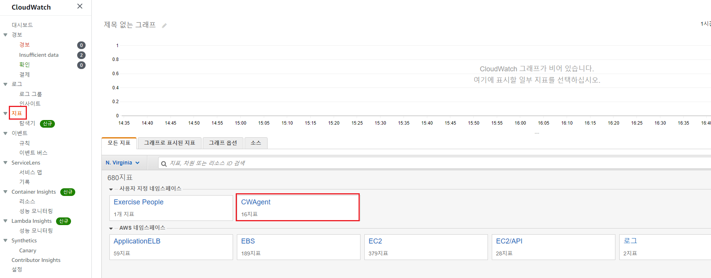

## CloudWatch에 사용자 지정 지표 기록

### #1 사용자에게 CloudWatchEventsFullAccess 정책을 추가

- IAM 사용자

  

  ****

  


### #2 사용자 지정 지표를 생성해서 CloudWatch로 전송

- 인스턴스 시작

  

- SSH 접속

  

  - 작업 디렉터리 생성 및 지표 데이터 파일 생성

    - $ `cd /var/www`

    - $ `mkdir cloudwatch-custom`

    - $ `cd cloudwatch-custom`

    - $ `vi test-data.json`

      ```json
      [
        {
          "MetricName": "People",
          "Dimensions": [{ "Name": "Gender", "Value": "All" }],
          "Timestamp": "2021-03-08T14:00:00.000+09:00",
          "Value": 20,
          "Unit": "Count"
        },
        {
          "MetricName": "People",
          "Dimensions": [{ "Name": "Gender", "Value": "All" }],
          "Timestamp": "2021-03-08T15:00:00.000+09:00",
          "Value": 24,
          "Unit": "Count"
        },
        {
          "MetricName": "People",
          "Dimensions": [{ "Name": "Gender", "Value": "All" }],
          "Timestamp": "2021-03-08T16:00:00.000+09:00",
          "Value": 30,
          "Unit": "Count"
        },
        {
          "MetricName": "People",
          "Dimensions": [{ "Name": "Gender", "Value": "All" }],
          "Timestamp": "2021-03-08T17:00:00.000+09:00",
          "Value": 23,
          "Unit": "Count"
        }
      ]
      ```

      - [참고: https://gist.github.com/deopard/76d334b9c4616c8e5e60429631c0f3b2]

        

- 지표 데이터를 CloudWatch로 전송

  - $ `aws configure`

    ```
    AWS Access Key ID [None]: AKIAS*******7DNCCN				
    AWS Secret Access Key [None]: UuW6AsjW1*****************nKqG1nr6pe2kR  
    Default region name [None]: us-east-1
    ```

  - $ `aws cloudwatch put-metric-data --namespace " Exercise People " --metric-data file://test_data.json`


### #3 CloudWatch에서 지표를 확인

- Cloudwatch 지표 확인

  

  

  


### #4 실습 환경 정리

- $ `cd /var/www`
- $ `rm -rf cloudwatch-custom/`

<br/>

---

<br/>

## CloudWatch Agent로 메모리, 디스크 사용량 지표, 로그 기록

> AWS 인프라 구축 가이드 (p199)

### #1 인스턴스에 IAM 역할 추가

- IAM 역할 만들기

  

  

  

  

### #2 인스턴스의 IAM 역할을 변경(할당)

- IAM 역할 부여

  

  

  

  - 보안에서 IAM 확인

    


### #3 인스턴스에 CloudWatch 에이전트를 설치

> 참고 ⇒ https://docs.aws.amazon.com/ko_kr/AmazonCloudWatch/latest/monitoring/download-cloudwatch-agent-commandline.html

- 에이전트 설치
  - $ `sudo yum install amazon-cloudwatch-agent`
- 설치 마법사 실행 (p204)
  - $ `sudo /opt/aws/amazon-cloudwatch-agent/bin/amazon-cloudwatch-agent-config-wizard`


### #4 설정 정보를 기반으로 에이전트를 실행

- 에이전트 실행

  - $ `sudo /opt/aws/amazon-cloudwatch-agent/bin/amazon-cloudwatch-agent-ctl -a fetch-config -m ec2 -c file:/opt/aws/amazon-cloudwatch-agent/bin/config.json -s`

- 실행 상태 확인

  - $ `sudo systemctl status amazon-cloudwatch-agent`

  - $ `sudo /opt/aws/amazon-cloudwatch-agent/bin/amazon-cloudwatch-agent-ctl -m ec2 -a status`

    

### #5 CloudWatch에 기록된 지표를 확인

- Cloudwatch에서 지표 확인

  

  

  


### #6 실습이 끝나면 인스턴스 중지

- $ `sudo shutdown -h now`