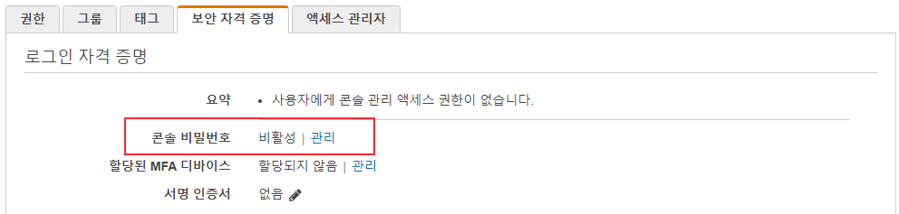
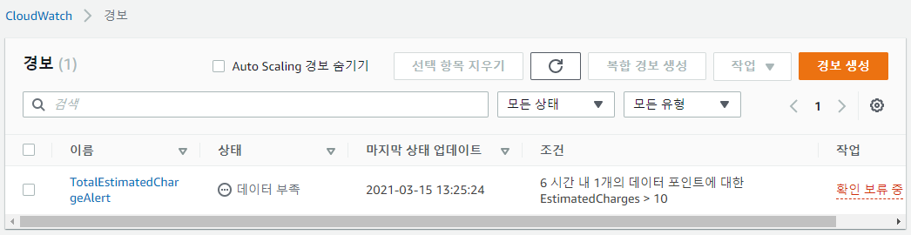

## IAM 사용자

> 사용자, 어플리케이션, 서비스를 식별하는 AWS의 객체

- 서비스 계정(service account)

  - 어플리케이션 또는 서비스를 대신해 작업하도록 만든 IAM 사용자
  - 액세스 키를 사용해서 AWS 서비스 API에 접근할 수 있음

  

  - (1) 사용자를 확인하는데 도움을 주는 친숙한 이름과 (2) AWS에서 사용자를 고유하게 식별하는 ARN(Amazon Resource Name)을 가짐

  

  - 일반적으로 사용자는 AWS에서 자원 및 서비스에 접근하는데 사용할 수 있는 인증서 및 권한 집합을 갖고 있음

### lambda-upload 사용자로 콘솔 로그인이 가능하도록 설정

- 콘솔 엑세스 활성화를 통해 로그인

  

  

  

  

  

### 다중 요소 인증 설정

- 하드웨어를 통한 인증

  

### 그룹(p79)

> IAM 사용자 모음

- 여러 사용자에 대해 사용 권한을 한번에 지정할 수 있는 방법을 제공
- AWS에서는 사용자별로 권한을 정의하는 대신 그룹을 사용해 IAM 사용자에게 권한을 할당할 것을 권장
- 그룹에 속한 모든 사용자는 그룹에 할당된 권한을 상속 받음

---

 

##  lambda-upload 사용자에게 할당된 권한을 Lambda-DevOps 그룹을 이용해서 제공

### #1 Lambda-DevOps 그룹 생성

- IAM 그룹 생성

  

  

### #2 Lambda-DevOps 그룹에 권한을 설정

- 그룹에 권한 설정

  

  

  

  

### #3 lambda-upload 사용자에게 부여된 권한을 삭제

- 사용자 권한 삭제

  

### #4 Lambda-DevOps 그룹에 lambda-upload 사용자를 추가

- 그룹에 사용자 추가

  

  

---

 

### 역할(role) (p82)

> 일정 기간 동안 사용자, 애플리케이션, 서비스가 맡을 수 있는 권한 집합

- 특정 사용자에게 유일하게 결합되지 않고, 암호나 액세스 키와 같은 자격 증명도 없음
- 일반적으로 필요한 리소스에 접근할 수 없는 사용자 또는 서비스에 권한을 부여하도록 설계되어 있음
  - 예: 람다함수가 S3에 접근할 수 있도록 역할을 생성

### 위임(delegation)

> 특정 자원에 대해 접근할 수 있도록 제3자에게 권한을 부여

- 자원을 소유하고 있는 신뢰는 제공하는 계정(trusting account)과 자원에 접근이 필요한 사용자또는 애플리케이션을 포함한 신뢰는 제공받는 계정(trusted account)간의 신뢰 관계(trust relationship)을 설정하는 작업

### 연동(federation)

> 페이스북, 구글과 같은 외부 자격 증명 공급자 또는 SAML(Security Assertion Markup Language) 2.0 및 AWS를 지원하는 기업용 자격 증명 시스템 간에 신뢰 관계를 생성하는 프로세스

- 사용자는 외부 자격 증명 공급자를 통해 로그인하고 임시 자격 증명을 갖는 IAM 역할을 맡을 수 있음

### AWS의 권한 (p83)

- 자격 증명 기반 권한(identity-based permissions)
  - IAM 사용자 또는 열할이 수행할 수 있는 것을 지정
- 자원 기반 권한(resource-based permissions)
  - S3 버킷, SNS 주제와 같은 AWS 자원에서 수행할 수 있는 것 또는 누가 그 자원에 접근할 수 있는지를 지정
  - 주어진 자원에 접근할 수 있는 사용자를 지정
  - S3 버킷, SNS 주제, SQS 큐, Glacier 볼트, OpsWorks 스택, Lambda 함수 등의 서비스만 자원 기반 정책을 제공

### 권한과 정책(permissions, policies)

> 사용자, 그룹, 역할이 수행할 수 있는 작업을 기술하는 정책을 생성해서 권한을 부여

- 정책 유형
  - 관리형 정책(managed policies)
    - 사용자, 그룹, 역할에는 적용되지만 자원에는 적용되지 않음
    - 재사용, 변경관리, 버전관리, 롤백이 용이
  - 인라인 정책(inline policies)
    - 특정 사용자, 그룹, 역할에 직접 생성하고 적용
    - 엔티티가 삭제되면 엔티티에 적용된 인라인 정책도 삭제
    - 자원 기반 정책은 항상 인라인 정책

### 로깅 및 경고 (p86)

- 로그 보존 설정

  

  

---

### 프리티어 사용량 알림 수신 설정

#### 자신의 이메일에서 수신 여부 confirm을 한다

- 요금이 $10을 넘게되면 해당 이메일로 알림
- 경보 생성에서만 그치지 않고 주기적으로 사용량을 모니터링 하면서 서비스 이용 로그를 주기적으로 확인!!

