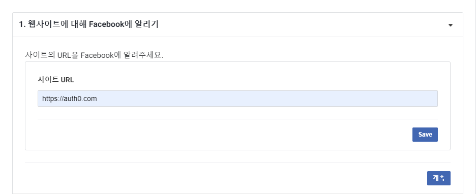
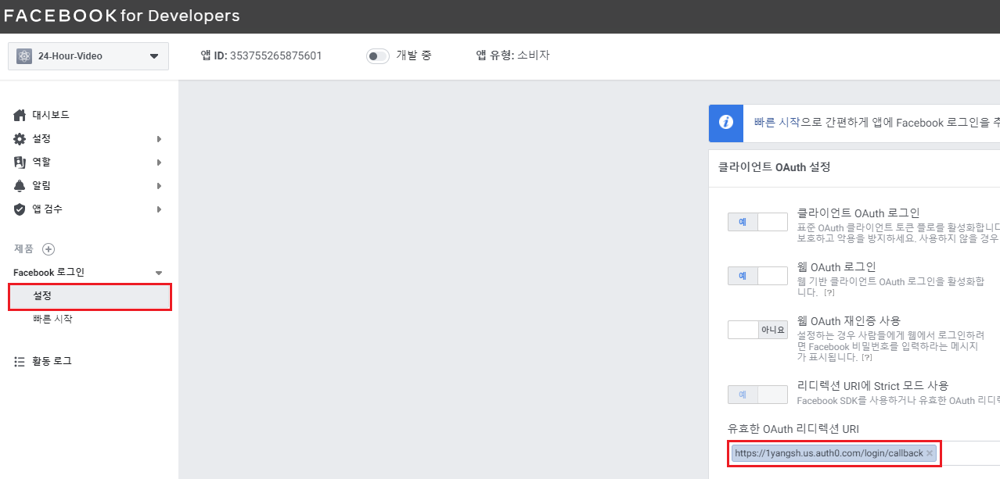

<br/>

## 서버리스 환경에서의 인증(p108)

> Amazon Cognito, Auth0, 위임 토근 등으로 구현 가능

- 인증
  - Cognito, Auth0
- 서비스 간 사용자 정보 교환
  - JWT(Json Web Token)


---

<br/>

## 실습 : 24-Hour Video 사이트에 로그인/로그아웃, 사용자 프로필 기능을 추가


### 수행 순서

1. 로그인, 로그아웃, 사용자 프로필 버큰을 포함한 기본 웹 사이트를 생성
2. Auth0 이용해서 어플리케이션을 등록하고 웹 사이트에 통합 → 사용자가 Auth0를 통해 로그인하고 이를 식별하는 JSON 웹 토큰을 받을 수 있어야 함
3. 웹 사이트에서 람다 함수를 호출할 수 있도록 API Gateway를 추가
4. user-profile 람다 함수를 생성
5. user-profile 람다 함수를 호출할 수 있도록 API Gateway를 구성
6. JWT 토큰 유효성 검사를 수행하도록 API Gateway를 수정


## 24-Hour Video 웹 사이트 제작

### 1. 프로젝트 생성

- `cd C:\serverless\`
- `mkdir 24-hour-video`
- `cd 24-hour-video`
- `npm init -y`
- `npm install local-web-server --save-dev`


### 2. Visual Studio Code 실행해서 start 스크립트 추가

- `package.json`

  ```json:
  	:
  "scripts": {
      "start": "ws"
    },
  	:	
  ```

  

### 3. UI 템플릿 다운로드

- 링크 : http://www.initializr.com/

  

  

### 4. 다운로드 받은 템플릿 파일을 프로젝트 폴더로 압축 해제


### 5. 웹 서버를 실행하고 확인

- `npm start`

  - localhost:8000으로 접속

  


## Auto0 구성 (p116)

### 1. https://auth0.com/ 사이트에 회원 가입

- Tenent Domain에 본인이 기억할 수 있는 이름을 입력
- REGION을 US로 설정


### 2. Application 생성

- Create Application

  

  

  

  

  

  

  

### 3. GCP(Goole Cloud Platform)에 사용자 인증 정보를 추가

> https://console.cloud.google.com

- GCP에서 새 프로젝트 생성

  

  

- OAuth 동의 화면 생성

  

  

  

  

  

  - 이후부터로 디폴트 상태에서 [저장 후 계속]으로 진행


- 사용자 인증 정보 생성

  

  


### 4. Auth0에 Social Connection으로 Google-oauth을 추가하고 테스트

- Auth0 - Connection - Social

  

- GCP 사용자 인증 정보 생성을 통해서 만들어진 Client ID와 Client Secret을 입력

- 추가한 후 Try Connection

  

  

  

  

### 5. Facebook for Developers 사이트에서 Facebook 로그인 앱 추가

> https://developers.facebook.com/apps/

- Facebook for Developers 앱 만들기

  

  

  

  

  

  

  

  

  

  

  


### 6 Auth0에 Social Connection으로 Facebook 추가 테스트


-  Client ID와 Client Secret을 입력

- Try Connection

  

  

  

  

  

  ---

  

## 웹 사이트에 Auto0를 연결 (p119)

### 1. Auto0 Lock 스크립트, Domain, Client ID를 확인

- Universal Login 확인

  

  - <script src="https://cdn.auth0.com/js/lock/11.27/lock.min.js"></script>


### 2. Auto0 Lock 스크립트 및 로그인/로그아웃/프로필 버튼 추가

- Auto0 Lock

  - 로그인, 회원가입 등의 대화상자를 제공하는 Auth0의 무료 위젯

- `c:\serverless\24-hour-video\index.html`

  ```html
        :
          <div id="navbar" class="navbar-collapse collapse">
            <div class="navbar-form navbar-right">
              <button id="user-profile" class="btn btn-default">
                &nbsp;<span id="profilename"></span>
              </button>
              <button id="auth0-login" class="btn btn-success">Sign in</button>
              <button id="auth0-logout" class="btn btn-success">Sign out</button>
            </div>
            <!--
            <form class="navbar-form navbar-right" role="form">
              <div class="form-group">
                <input type="text" placeholder="Email" class="form-control">
              </div>
              <div class="form-group">
                <input type="password" placeholder="Password" class="form-control">
              </div>
              <button type="submit" class="btn btn-success">Sign in</button>
            </form>
            -->
          </div><!--/.navbar-collapse -->
          :
  		:
          <script src="js/vendor/bootstrap.min.js"></script>
  
          <script src="https://cdn.auth0.com/js/lock/11.27/lock.min.js"></script>
          <script src="js/user-controller.js"></script>
          <script src="js/config.js"></script>
          <script src="js/main.js"></script>
  
          <script src="js/main.js"></script>
  		:
  ```

  

- js 디렉토리 안에 3개 파일 생성

  

  

- `user-controller.js`

  ```javascript
  // user-Controller 객체를 선언
  var userController = {
      data: {
          auth0Lock: null,
          config: null
      }, 
      // HTML 문서에서 제어할 요소들(버튼, 이미지, 라벨, ... 등)
      uiElements: {
          loginButton: null,
          logoutButton: null, 
          profileButton: null, 
          profileNameLabel: null,
          profileImage: null
      }, 
      // 설정 정보와 제어할 요소들을 초기화
      init: function (config) {
          var that = this;
  
          // HTML 문서에서 id 속성의 값이 auth0-login인 요소를 가져와서 loginButton 변수에 할당
          // <button id="auth0-login" class="btn btn-success">Sign in</button>
          this.uiElements.loginButton = $('#auth0-login');
          this.uiElements.logoutButton = $('#auth0-logout');
          this.uiElements.profileButton = $('#user-profile');
          this.uiElements.profileNameLabel = $('#profilename');
          this.uiElements.profileImage = $('#profilepicture');
          
          // config.js의 포함되어 있는 설정 정보를 변수에 할당
          this.data.config = config;
   
          var auth0Options = {
              auth: { 
                  responseType: 'token id_token'
              }
          };
          this.data.auth0Lock = new Auth0Lock(config.auth0.clientId, config.auth0.domain, auth0Options);
          
          this.configureAuthenticatedRequests();
          
          var accessToken = localStorage.getItem('accessToken');
          if (accessToken) {
              // 사용자의 profile을 조회
              this.data.auth0Lock.getProfile(accessToken, function (err, profile) {
                  if (err) {
                      return alert('프로필을 가져오는데 실패했습니다. ' + err.message);
                  }
                  // 사용자 프로필 조회에 성공하면 프로필 정보를 showUserAuthenticationDetails 함수로 전달
                  that.showUserAuthenticationDetails(profile);
              });
          }
          // 이벤트 핸들러를 정의
          this.wireEvents();
      },
      // 로컬 스토리지에 저장된 IdToken, accessToken을 Authorization, AccessToken 요청 헤더의 값으로 설정
      // => 요청 헤더의 값으로 설정되려면, 로컬 스토리지에 해당 값들이 존재해야 함
      configureAuthenticatedRequests: function() {
          $.ajaxSetup({
              'beforeSend': function (xhr) {
                  console.log(xhr);
                  xhr.setRequestHeader('Authorization', 'Bearer ' + localStorage.getItem('idToken'));
                  xhr.setRequestHeader('AccessToken', localStorage.getItem('accessToken'));
              }
          })
      }, 
      // 전달받은 프로필 정보를 사용자 화면에 출력
      showUserAuthenticationDetails: function(profile) {
          // 프로필 정보 여부를 참, 거짓으로 설정 => profile이 있으면 true 없거나 정의되지 않으면 false (bool타입으로 표현)
          var showAuthenticationElements = !!profile;
          // 프로필 정보가 존재하면 사용자 이름과 사진을 출력
          if (showAuthenticationElements) {
              this.uiElements.profileNameLabel.text(profile.nickname);
              this.uiElements.profileImage.attr('src', profile.picture);
          }
          // 프로필 정보가 존재하면 login 버튼을 감추고 logout 버튼과 profile 버튼을 나타나게 처리
          this.uiElements.loginButton.toggle(!showAuthenticationElements);
          this.uiElements.logoutButton.toggle(showAuthenticationElements);
          this.uiElements.profileButton.toggle(showAuthenticationElements);
      }, 
      // 특정 이벤트에 반응하는 함수를 정의
      wireEvents: function() {
          var that = this;
          // auto0 lock에서 제공하는 로그인 창에서 authenticated 이벤트가 발생하는 경우
          // 수행할 함수를 정의
          this.data.auth0Lock.on('authenticated', function(authResult) {
              // 로그인에 성공하면 accessToken, idToken 값을 로컬 스토리지에 저장
              console.log(authResult);
              localStorage.setItem('accessToken', authResult.accessToken);
              localStorage.setItem('idToken', authResult.idToken);
              
              // 로그인에 성공하면 사용자 정보로 조회
              that.data.auth0Lock.getUserInfo(authResult.accessToken, function (error, profile) {
                  // 사용자 정보 조회에 성공하면 반환받은 profile 정보를 showUserAuthenticationDetails 함수로 전달
                  if (!error) {
                      that.showUserAuthenticationDetails(profile);
                  }
              });
          });
  
          // login 버튼을 클릭했을 때 처리 -> auto0 lock에서 제공하는 로그인 화면을 실행
          this.uiElements.loginButton.click(function(e) {
              that.data.auth0Lock.show();
          });
  
          // logout 버튼을 클릭했을 때 처리 
          // -> 로컬 스토리지에 저장된 accessToken, idToken을 삭제
          // -> logout, profile 버튼을 숨기고 login 버튼을 나타나게 처리 
          this.uiElements.logoutButton.click(function(e) {
              localStorage.removeItem('accessToken');
              localStorage.removeItem('idToken');
              that.uiElements.logoutButton.hide();
              that.uiElements.profileButton.hide();
              that.uiElements.loginButton.show();
          });
      }
  };
  ```

- `config.js`

  ```javascript
  var configConstants = {
      auth0: {
          domain: '본인의AUTH0의도메인',
          clientId: '본인의AUTH0의클라이언트ID'
      }
  };
  ```

- `css/main.css`

  ```css
  var configConstants = {
      auth0: {
          domain: '본인의AUTH0의도메인',
          clientId: '본인의AUTH0의클라이언트ID'
      }
  };
  ```

- `js/main.js`

  ```javascript
  (function() {
      $(document).ready(function() {
          userController.init(configConstants);
      });
  })();
  ```

- 작성한 후 auth0 callback url로 등록해놓은 `127.0.0.1:8000` 접속, Sign in 시 로그인 창 확인


####  <a href="https://auth0.com/docs/libraries/lock/lock-api-reference">Auth0 Lock API Reference 보기</a>


- 로그인에 성공하면 아래와 같이 프로필과 로그아웃 버튼이 출력


