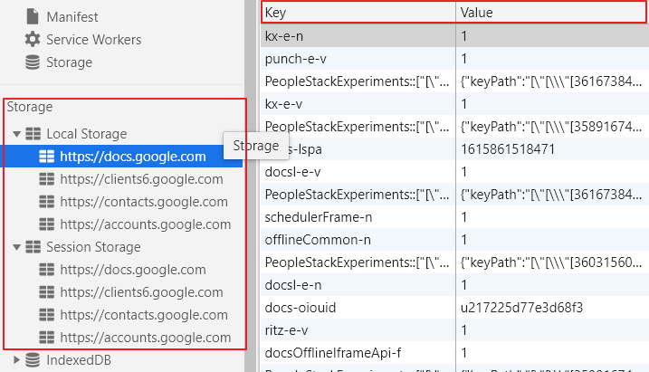
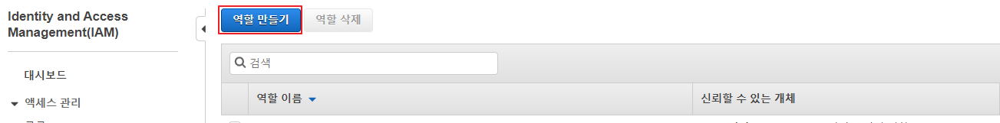
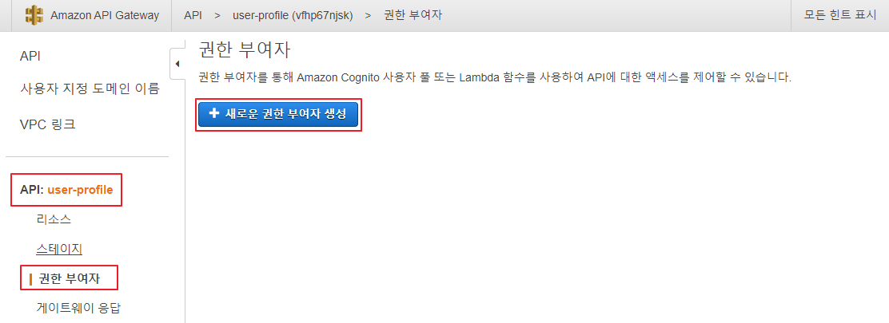

<br/>

## 서버리스 환경에서의 인증(p108)

> Amazon Cognito, Auth0, 위임 토근 등으로 구현 가능

- 인증
  - Cognito, Auth0
- 서비스 간 사용자 정보 교환
  - JWT(Json Web Token)


---

<br/>

## 실습 : 24-Hour Video 사이트에 로그인/로그아웃, 사용자 프로필 기능을 추가


### 수행 순서

1. 로그인, 로그아웃, 사용자 프로필 버큰을 포함한 기본 웹 사이트를 생성
2. Auth0 이용해서 어플리케이션을 등록하고 웹 사이트에 통합 → 사용자가 Auth0를 통해 로그인하고 이를 식별하는 JSON 웹 토큰을 받을 수 있어야 함
3. 웹 사이트에서 람다 함수를 호출할 수 있도록 API Gateway를 추가
4. user-profile 람다 함수를 생성
5. user-profile 람다 함수를 호출할 수 있도록 API Gateway를 구성
6. JWT 토큰 유효성 검사를 수행하도록 API Gateway를 수정


## 24-Hour Video 웹 사이트 제작

### 1. 프로젝트 생성

- `cd C:\serverless\`
- `mkdir 24-hour-video`
- `cd 24-hour-video`
- `npm init -y`
- `npm install local-web-server --save-dev`


### 2. Visual Studio Code 실행해서 start 스크립트 추가

- `package.json`

  ```json:
  	:
  "scripts": {
      "start": "ws"
    },
  	:	
  ```

  

### 3. UI 템플릿 다운로드

- 링크 : http://www.initializr.com/

  

  

### 4. 다운로드 받은 템플릿 파일을 프로젝트 폴더로 압축 해제


### 5. 웹 서버를 실행하고 확인

- `npm start`

  - localhost:8000으로 접속

  


## Auto0 구성 (p116)

### 1. https://auth0.com/ 사이트에 회원 가입

- Tenent Domain에 본인이 기억할 수 있는 이름을 입력
- REGION을 US로 설정


### 2. Application 생성

- Create Application

  

  

  

  

  

  

  

### 3. GCP(Goole Cloud Platform)에 사용자 인증 정보를 추가

> https://console.cloud.google.com

- GCP에서 새 프로젝트 생성

  

  

- OAuth 동의 화면 생성

  

  

  

  

  

  - 이후부터로 디폴트 상태에서 [저장 후 계속]으로 진행


- 사용자 인증 정보 생성

  

  


### 4. Auth0에 Social Connection으로 Google-oauth을 추가하고 테스트

- Auth0 - Connection - Social

  

- GCP 사용자 인증 정보 생성을 통해서 만들어진 Client ID와 Client Secret을 입력

- 추가한 후 Try Connection

  

  

  

  

### 5. Facebook for Developers 사이트에서 Facebook 로그인 앱 추가

> https://developers.facebook.com/apps/

- Facebook for Developers 앱 만들기

  

  

  

  

  

  

  

  

  

  

  


### 6 Auth0에 Social Connection으로 Facebook 추가 테스트


-  Client ID와 Client Secret을 입력

- Try Connection

  

  

  

  

  

  ---

  

## 웹 사이트에 Auto0를 연결 (p119)

### 1. Auto0 Lock 스크립트, Domain, Client ID를 확인

- Universal Login 확인

  

  - <script src="https://cdn.auth0.com/js/lock/11.27/lock.min.js"></script>


### 2. Auto0 Lock 스크립트 및 로그인/로그아웃/프로필 버튼 추가

- Auto0 Lock

  - 로그인, 회원가입 등의 대화상자를 제공하는 Auth0의 무료 위젯

- `c:\serverless\24-hour-video\index.html`

  ```html
        :
          <div id="navbar" class="navbar-collapse collapse">
            <div class="navbar-form navbar-right">
              <button id="user-profile" class="btn btn-default">
                &nbsp;<span id="profilename"></span>
              </button>
              <button id="auth0-login" class="btn btn-success">Sign in</button>
              <button id="auth0-logout" class="btn btn-success">Sign out</button>
            </div>
            <!--
            <form class="navbar-form navbar-right" role="form">
              <div class="form-group">
                <input type="text" placeholder="Email" class="form-control">
              </div>
              <div class="form-group">
                <input type="password" placeholder="Password" class="form-control">
              </div>
              <button type="submit" class="btn btn-success">Sign in</button>
            </form>
            -->
          </div><!--/.navbar-collapse -->
          :
  		:
          <script src="js/vendor/bootstrap.min.js"></script>
  
          <script src="https://cdn.auth0.com/js/lock/11.27/lock.min.js"></script>
          <script src="js/user-controller.js"></script>
          <script src="js/config.js"></script>
          <script src="js/main.js"></script>
  
          <script src="js/main.js"></script>
  		:
  ```

  

- js 디렉토리 안에 3개 파일 생성

  

  

- `user-controller.js`

  ```javascript
  // user-Controller 객체를 선언
  var userController = {
      data: {
          auth0Lock: null,
          config: null
      }, 
      // HTML 문서에서 제어할 요소들(버튼, 이미지, 라벨, ... 등)
      uiElements: {
          loginButton: null,
          logoutButton: null, 
          profileButton: null, 
          profileNameLabel: null,
          profileImage: null
      }, 
      // 설정 정보와 제어할 요소들을 초기화
      init: function (config) {
          var that = this;
  
          // HTML 문서에서 id 속성의 값이 auth0-login인 요소를 가져와서 loginButton 변수에 할당
          // <button id="auth0-login" class="btn btn-success">Sign in</button>
          this.uiElements.loginButton = $('#auth0-login');
          this.uiElements.logoutButton = $('#auth0-logout');
          this.uiElements.profileButton = $('#user-profile');
          this.uiElements.profileNameLabel = $('#profilename');
          this.uiElements.profileImage = $('#profilepicture');
          
          // config.js의 포함되어 있는 설정 정보를 변수에 할당
          this.data.config = config;
   
          var auth0Options = {
              auth: { 
                  responseType: 'token id_token'
              }
          };
          this.data.auth0Lock = new Auth0Lock(config.auth0.clientId, config.auth0.domain, auth0Options);
          
          this.configureAuthenticatedRequests();
          
          var accessToken = localStorage.getItem('accessToken');
          if (accessToken) {
              // 사용자의 profile을 조회
              this.data.auth0Lock.getProfile(accessToken, function (err, profile) {
                  if (err) {
                      return alert('프로필을 가져오는데 실패했습니다. ' + err.message);
                  }
                  // 사용자 프로필 조회에 성공하면 프로필 정보를 showUserAuthenticationDetails 함수로 전달
                  that.showUserAuthenticationDetails(profile);
              });
          }
          // 이벤트 핸들러를 정의
          this.wireEvents();
      },
      // 로컬 스토리지에 저장된 IdToken, accessToken을 Authorization, AccessToken 요청 헤더의 값으로 설정
      // => 요청 헤더의 값으로 설정되려면, 로컬 스토리지에 해당 값들이 존재해야 함
      configureAuthenticatedRequests: function() {
          $.ajaxSetup({
              'beforeSend': function (xhr) {
                  console.log(xhr);
                  xhr.setRequestHeader('Authorization', 'Bearer ' + localStorage.getItem('idToken'));
                  xhr.setRequestHeader('AccessToken', localStorage.getItem('accessToken'));
              }
          })
      }, 
      // 전달받은 프로필 정보를 사용자 화면에 출력
      showUserAuthenticationDetails: function(profile) {
          // 프로필 정보 여부를 참, 거짓으로 설정 => profile이 있으면 true 없거나 정의되지 않으면 false (bool타입으로 표현)
          var showAuthenticationElements = !!profile;
          // 프로필 정보가 존재하면 사용자 이름과 사진을 출력
          if (showAuthenticationElements) {
              this.uiElements.profileNameLabel.text(profile.nickname);
              this.uiElements.profileImage.attr('src', profile.picture);
          }
          // 프로필 정보가 존재하면 login 버튼을 감추고 logout 버튼과 profile 버튼을 나타나게 처리
          this.uiElements.loginButton.toggle(!showAuthenticationElements);
          this.uiElements.logoutButton.toggle(showAuthenticationElements);
          this.uiElements.profileButton.toggle(showAuthenticationElements);
      }, 
      // 특정 이벤트에 반응하는 함수를 정의
      wireEvents: function() {
          var that = this;
          // auto0 lock에서 제공하는 로그인 창에서 authenticated 이벤트가 발생하는 경우
          // 수행할 함수를 정의
          this.data.auth0Lock.on('authenticated', function(authResult) {
              // 로그인에 성공하면 accessToken, idToken 값을 로컬 스토리지에 저장
              console.log(authResult);
              localStorage.setItem('accessToken', authResult.accessToken);
              localStorage.setItem('idToken', authResult.idToken);
              
              // 로그인에 성공하면 사용자 정보로 조회
              that.data.auth0Lock.getUserInfo(authResult.accessToken, function (error, profile) {
                  // 사용자 정보 조회에 성공하면 반환받은 profile 정보를 showUserAuthenticationDetails 함수로 전달
                  if (!error) {
                      that.showUserAuthenticationDetails(profile);
                  }
              });
          });
  
          // login 버튼을 클릭했을 때 처리 -> auto0 lock에서 제공하는 로그인 화면을 실행
          this.uiElements.loginButton.click(function(e) {
              that.data.auth0Lock.show();
          });
  
          // logout 버튼을 클릭했을 때 처리 
          // -> 로컬 스토리지에 저장된 accessToken, idToken을 삭제
          // -> logout, profile 버튼을 숨기고 login 버튼을 나타나게 처리 
          this.uiElements.logoutButton.click(function(e) {
              localStorage.removeItem('accessToken');
              localStorage.removeItem('idToken');
              that.uiElements.logoutButton.hide();
              that.uiElements.profileButton.hide();
              that.uiElements.loginButton.show();
          });
      }
  };
  ```

- `config.js`

  ```javascript
  var configConstants = {
      auth0: {
          domain: '본인의AUTH0의도메인',
          clientId: '본인의AUTH0의클라이언트ID'
      }
  };
  ```

- `css/main.css`

  ```css
  var configConstants = {
      auth0: {
          domain: '본인의AUTH0의도메인',
          clientId: '본인의AUTH0의클라이언트ID'
      }
  };
  ```

- `js/main.js`

  ```javascript
  (function() {
      $(document).ready(function() {
          userController.init(configConstants);
      });
  })();
  ```

- 작성한 후 auth0 callback url로 등록해놓은 `127.0.0.1:8000` 접속, Sign in 시 로그인 창 확인


####  <a href="https://auth0.com/docs/libraries/lock/lock-api-reference">Auth0 Lock API Reference 보기</a>


- 로그인에 성공하면 아래와 같이 프로필과 로그아웃 버튼이 출력


# 추가 : Kakao Social Login 기능 추가

> https://developers.kakao.com/


- 실습 : Github 등 다른 소셜 플랫폼 연동


---


### Storage ⇒ HTML5에 추가된 기능

> https://developer.mozilla.org/ko/docs/Web/API/Web_Storage_API/Using_the_Web_Storage_API

- 브라우저에서 쿠키를 사용하는 것보다 훨씬 직관적으로 **key/value 데이터를 안전하게 저장**할 수 있는 메커니즘을 제공

- **sessionStorage**는 페이지의 **세션이 유지되는 동안 사용**할 수 있는 각 origin별로 별도의 스토리지를 관리합니다. (페이지 리로딩 및 복원을 포함한, 브라우저가 열려있는 한 최대한 긴 시간 동안)

- **localStorage**도 같은 일을 하지만, **브라우저가 닫히거나 다시 열리더라도 유지**합니다

  

<br/>

---

<br/>

## AWS와 통합 

> 웹 사이트에서 JWT(Json Web Token)를 승인하고 유효성을 검증한 후 auth0.com으로 사용자에 대한 추가 정보를 요청하는 람다 함수를 작성


## JWS(JSON Web Token) 토큰 검증 후 사용자 프로필 조회 (p126)


### 1. auth0.com에 등록된 사용자 프로필 정보를 반환하는 람다 함수를 생성

- api-gatewat-lambda-exec-role 역할을 생성

  

  

  

  

  

- 람다 함수 생성

  - JSON Web Token 검증
  - auth0 엔드포인트를 호출해서 사용자 정보를 조회
  - 웹 사이트에 응답을 전송

  

  

  

  

- 람다 소스 코드 작성

  - `cd C:\serverless`
  - `mkdir user-profile`
  - `cd user-profile`
  - `npm init -y`
  - `npm install jsonwebtoken`
  - `npm install request`

  

- package.json 파일에 deploy, predeploy 스크립트를 추가

  - `package.json`

  ```json
  "scripts": {
      "predeploy": "del Lambda-Deployment.zip & zip -r Lambda-Deployment.zip * -x *.zip *.log node_modules/aws-sdk/*", 
      "deploy": "aws lambda update-function-code --function-name [user-profile-lambda function ARN] --zip-file fileb://Lambda-Deployment.zip"
    },
  ```


- index.js 파일 생성 및 소스코드 추가 (p130)

  - `index.js`

  ```javascript
  'use strict';
  
  var jwt = require('jsonwebtoken');
  var request = require('request');
  
  /*
  event = {
      authToken: "...",
      accessToken: "bearer [string.string.string]";
  }
  */
  
  exports.handler = function(event, context, callback){
      console.log(JSON.stringify(event));
  
      // event 객체에 authToken, accessToken 존재 여부를 확인
      // 만약, 존재하지 않으면 리턴
      if (!event.authToken) {
          callback('Could not find authToken');
          return;
      }
      if (!event.accessToken) {
          callback('Could not find access_toekn');
          return;
      }
  
      // authToken은 값을 공백문자를 기준으로 분리한 후에 두번째 값을 id_token 변수에 할당
      // authToken은 Bearer 값.값.값 형식을 가짐
      var token = event.authToken.split(' ')[1];
  
      var secretBuffer = 
      new Buffer(process.env.AUTH0_SECRET);
      jwt.verify(token, secretBuffer, function(err, decoded){
          if(err){
              console.log('Failed jwt verifacation: ', err, 'auth: ', event.authToken);
          }
          else {
              var body = {
                  'id_token': token
              };
  
              /*  환경변수 DOMAIN의 값을 auth0.com에 설정되어 있는 애플리케이션 도메인
                  auth0.com에 사용자 프로필 정보를 조회에 필요한 값을 설정 
                      => 로그인 시 절달받은 access token을 요청 파라미터로 전달
                  https://auth0.com/docs/api/authentication#user-profile */
              var options = {
                  url: 'https://'+ process.env.DIMAIO + '/tokeninfo',
                  method: 'POST',
                  json: true,
                  body: body 
              };
              
              // auth0.com으로 사용자 프로필 정보를 조회
              request(options, function(err, response, body){
                  if (!error && response.statusCode == 200) {
                      // 정상적으로 조회한 경우 호출한 곳으로 프로필 정보를 반환
                      callback(null, body);
                  }
                  else {
                      callback(error);
                  }
              });
          }
      })
  };
  ```

  

- 람다 함수 배포
  
  - `npm run deploy`


- 환경변수 등록

  

  - 값 추가

    | 키           | 값            |
    | ------------ | ------------- |
    | DOMAIN       | AUTO0 도메인  |
    | AUTH0_SECRET | Client Secret |


- 람다 함수 테스트

  - 소셜 로그인 후 브라우저 개발자 도구를 이용해서 localStorage에 저장된 accessToken과 idToken 값을 추출

    

  - 람다 함수 테스트

    

    

    

    

  - 참고: 테스트 케이스를 만드는 스크립트

    

    - 테스트 수행 시 응답(response)에 사용자 프로필이 출력되는 것을 확인


### 2. API Gateway 설정

> 웹 사이트의 요청을 받아서  user-profile 람다 함수를 호출

- REST API 구출

  

  


- 리소스 생성

  

  


- 메서드 생성

  > 해당 리소스에 접근하는 방식 (GET, POST 등)

  

  

  

  

  

  - OPTIONS 항목 확인

    


- 매핑 생성

  > 맵 사이트의 Autorization 헤더를 통해 전달된 JWT 토큰을 람다 함수에서 사용할 수 있도로 event 객체의 값으로 설정
  ```
  웹 브라우저  -----------------------> API Gateway ----------------------> user-profile 람다 함수
  (웹 사이트)
              Authorization: JWT_TOKEN              event = { authToken: JWT_TOKEN, … }
              ~~~~~~~~~~~~~~~~~~~~~~~~              ~~~~~~~~~~~~~~~~~~~~~~~~~~~~~~~~~~~~
                        |                                             |
                        +---------------- 맵핑(mapping) --------------+
  ```

  

  


- API 배포

  > 해당하는 API를 외부해서 호출 가능

  

  

  

  

  

  - API Gateway 및 리소스 URL로 접근하면 오류를 반환 ⇒ 내부 수행에 필요한 값이 전달되지 않기 때문

  

  

### 3. API Gateway를 통해서 람다 함수를 호출(실행)하도록 웹 페이지를 수정 (p138)

> 프로필 보기 기능을 추가 구현

- config.js 파일에 API Gateway 호출 URL을 등록

  - `/24-hour-video/js/config.js`

    ```javascript
    var configConstants = {
        auth0: {
            domain: '1yangsh.us.auth0.com',
            clientId: 'Bkia8NNISRVmEw6M7lANfYmvoutaOVdD'
        },
        apiBaseUrl: 'https://tzecikd5j7.execute-api.us-east-1.amazonaws.com/dev' // 추가
    };
    ```

- user-confroller.js 파일에 Show Profile 버튼을 클릭했을 때 동작을 추가 (이벤트 핸들러를 추가)

  - `c:\serverless\24-hour-video\js\user-controller.js`

    ```javascript
    },
        // API Gateway 호출 URL
        apiBaseUrl: 'https://vfhp67njsk.execute-api.us-east-1.amazonaws.com/dev'
    };
    // 특정 이벤트에 반응하는 함수를 정의
        wireEvents: function() {
            var that = this;
     
            // P138
            // Show profile 버튼 클릭 이벤트 핸들러
            this.uiElements.profileButton.click(function(e) {
                // user-profile 리소스 호출 URL
                var url = that.data.config.apiBaseUrl + '/user-profile';
     
                // 지정된 URL 주소로 GET 방식의 요청을 전달
                $.get(url, function(data, status) {
                    console.log('data', data);
                    console.log('status', status);
                }).fail(function(e) {
                    console.log(e);
                });
            });
     
            //          :
    ```

    

### 4. 사용자 프로필 조회 테스트

- 프로필 클릭

  -  -> 콘솔창에 오류 메시지를 확인

  

  

  


- 본 요청(main request)에 AccessToken이라는 요청 헤더가 포함되어 있음
  - 기원이 다른 서버(API 게이트웨이)에서 해당 헤더를 처리할 수 있는지 여부를 먼저 확인(preflighted request)
- 프리플라이트 요청 결과에 access-control-allow-headers에 AccessToken이 포함되어 있지 않음 ⇒ Request header field accesstoken is not allowed by Access-Control-Allow-Headers in preflight response. 오류가 발생
- 해결 방안 
  - ⇒ 기원이 다른 서버(API Gateway)에서 Access-Control-Allow-Headers 응답 헤더에  AccessToken을 추가


#### Access-Control-Allow-Headers 응답 헤더에 AccessToken을 추가


#### 프로필 요청 테스트


​	

---


### CORS(교차 기원 자원 공유)

> https://developer.mozilla.org/ko/docs/Web/HTTP/CORS

- 웹(Web) = 공유 ⇒ 교차 기원 요청이 가능

- 다른 기원에서 오는 이미지를 쓸 수 있게 가능

  - 기원 = 스킴(프로토콜) + 호스트(도메인, IP) + 포트

  

  


### HTTP 요청은 기본적으로 교차 기원 요청(Cross Origin Request)이 가능

> 기원이 다른 js 파일, 이미지 파일을 가져와서 서비스(보여지고 실행) 가능

- http://127.0.0.1:8000/cors_test.html

  ```html
  <html>
  <head></head>
  <body>
      
      
   
      <script src="http://127.0.0.1:8000/js/main.js"></script>
      <script src="https://nid.naver.com/login/js/bvsd.1.3.4.min.js"></script>
   
  </body>
  </html>
  ```

  

```
http://127.0.0.1:8000/cors_test.html
http://127.0.0.1:8000/tile.png
http://127.0.0.1:8000/js/main.js
https://s.pstatic.net/static/www/img/uit/2020/sp_shop_bffdc9.png	 ⇐ 기원이 다름에도 불구하고 가져와서 사용이 가능
https://nid.naver.com/login/js/bvsd.1.3.4.min.js
```


#### 스크립트 내에서 교차 기원 요청은 보안 상의 이유로 제한 ⇒ SOP(Same Origin Policy) : 동일 기원 정책

> ajax 통신 = XMLHttpRequest 객체를 이용한 비동기 통신

- SOP ⇒ XMLHttpRequest 객체를 사용해서 가져오는 리소스는 해당 웹 애플리케이션과 동일한 기원으로 제한

#### CORS(Cross Origin Resource Sharing: 교차 기원 자원 공유)

⇒ SOP를 완화하는 정책

⇒ Access-Control-Allow-Origin 응답 헤더를 이용해서 자원 사용 여부를 허가


#### 단순 요청(simple request)


#### 프리플라이트 요청(preflighted request)


---

<br/>


## API Gateway의 권한 부여자를 이용한 권한 부여(p139)

>  API Gateway의 권한 부여자를 이용해서 JWT 토큰을 검증한 후 유효한 토큰인 경우에만 사용자 프로필을 조회하는 람다 함수를 실행할 수 있는 권한을 부여

- 참고 ⇒ https://auth0.com/docs/tokens/json-web-tokens/validate-json-web-tokens


### 1. JWT 토큰을 검증하는 custom-authorizer 람다 함수를 생성

- 람다 함수 생성

  

  

- 작업 디렉터리 생성 및 필요 모듈 설치

  - `cd C:\serverless`
  - `mkdir custom-authorizer`
  - `cd custom-authorizer`
  - `npm init -y`
  - `npm install jsonwebtoken`


- package.json 파일에 predeploy, deploy 스크립트 추가

  - `package.json`

    ```json
    "scripts": {
        "predeploy": "del Lambda-Deployment.zip & zip -r Lambda-Deployment.zip * -x *.zip *.log node_modules/aws-sdk/*", 
        "deploy": "aws lambda update-function-code --function-name custom-authorizer-람다함수ARN --zip-file fileb://L
    ```


- 람다 함수 작성

  - `index.js`

    ```javascript
    // P141
    'use strict';
     
    var jwt = require('jsonwebtoken');
     
    // generatePolicy 함수를 정의
    /* 정책 문서 형식을 생성
        {
            "principalId": "...", 
            "policyDocument": {
                "Version": "2012-10-17",
                "Statement": [
                    {
                        "Effect": "Allow",
                        "Action": "*",
                        "Resource": "*"
                    }
                ]
            }
        }
    */
    var generatePolicy = function (principalId, effect, resource) {
        var authResponse = {};  // authResponse 객체 선언
        authResponse.principalId = principalId;
        if (effect && resource) {
            var policyDocument = {};
            policyDocument.Version = '2012-10-17'; // 정책 문서 형식 버전
            policyDocument.Statement = []; 
     
            var statementOne = {};
            statementOne.Action = 'execute-api:Invoke'; 
            statementOne.Effect = effect;
            statementOne.Resource = resource;
     
            policyDocument.Statement[0] = statementOne;
            authResponse.policyDocument = policyDocument;
        }
        return authResponse;
    };
     
    // 핸들러 함수를 정의
    exports.handler = function(event, context, callback) {
        if (!event.authorizationToken) {
            callback('Could not find authorizationToken');
            return;
        }
     
        // JWT 토큰의 앞부분(Bearer)을 제거
        // "authorizationToken": "Bearer eyJhbGciOiJ~~~cCI6IkpXVCJ9.eyJnaXZlbl~~~pKNDQuZSJ9.mioxKcb1~~~W1LTk5_anGo"
        var token = event.authorizationToken.split(' ')[1];
     
        // auth0.com에서 제공한 Client Secret을 환경변수로부터 읽어와서 변수에 할당
        var secretBuffer = new Buffer(process.env.AUTH0_SECRET);
        // JWT 토큰을 검증
        jwt.verify(token, secretBuffer, function(err, decoded) {
            if (err) {
                console.log('Failed jwt verification: ', err, 'auth:', event.authorizationToken);
                callback('Authorization Failed');
            } else {
                var policy = generatePolicy('user', 'allow', event.methodArn);
                console.log(policy);
                callback(null, policy);
            }
        });
    };
    ```


- 람다 함수 배포
  - `npm run deploy`


- 람다 함수 실행에 필요한 환경 변수 설정

  - 구성 -> 환경변수 편집

    | 키           | 값                              |
    | ------------ | ------------------------------- |
    | AUTH0_SECRET | AUTH0_SECRET값( AUTH0에서 확인) |

    

- 람다 함수 테스트

  

  - 로컬 스토리지에 저장된 idToken 값에 "Bearer "를 추가한 값을 "authorizationToken" 값으로 설정

    ```
    {
       "authorizationToken": "Bearer xxxxxxxxxxxxxxxxxxxxx.yyyyyyyyyyyyyyyyyyyy.zzzzzzzzzzzzzzzzzzz"
    }
    ```

    

  - 테스트 결과 

    


-  https://jwt.io 사이트를 통해서 JWT 토큰을 수작업으로 검증

- auth0.com 서명에서 사용하는 알고리즘을 변경

  

  ​															:

​	


### 참고 : Specify the algorithm used to sign the JsonWebToken: 

- HS256: JWT will be signed with your client secret. 
  - ⇐ 비밀키 암호화 방식 
- RS256: JWT will be signed with your private signing key and they can be verified using your public signing key. 
  - ⇐ 공개키 암호화 방식 


- 다시 로그인해서 발급받은 idToken을 추출해서 테스트

  


- API Gateway에 권한 부여자를 생성

  

  

  

  

  

- 사용자 정의 권한 부여자를 /user-profile - GET 메서드에 연결

  - 주의 : API Gateway 대시보드로 이동했다가 리소스 메뉴로 이동

  

  


- 로그인 후 프로필 버튼을 클릭했을 때 사용자 정보가 콘솔에 출력되는지 확인

  - 요청 응답 해더

  

  - 브라우저 콘솔

  

  - custom-authorizer 로그

  

  - user-profile 로그

  

  

- 개발자 도구를 이용해서 idToken 값을 수정(조작)했을 때 오류가 출력되는 것을 확인

  > 요청/응답 헤더 ⇒ 4xx번 대 오류와 5xx번 대 오류가 발생하는 경우 CORS 관련 헤더를 설정하지 않음
  - 요청 응답 헤더

    

  - 브라우저 콘솔 로그

    

  - CloudWatch에 user-profile 로그 그룹이 생성되지 않음 ⇒ user-profile 람다 함수가 호출(실행)되지 않음

    

    

  - 브라우저 콘솔 로그

    

  - CloudWatch에 user-profile 로그 그룹이 생성되지 않음 ⇒ user-profile 람다 함수가 호출(실행)되지 않음

    

  - customer-authorizer 람다 함수의 로그

    


- **4xx번 대 오류와 5xx번 대 오류가 발생  CORS 관련 헤더를 설정하도록 CORS 설정**

  

  

  

  

  

  


