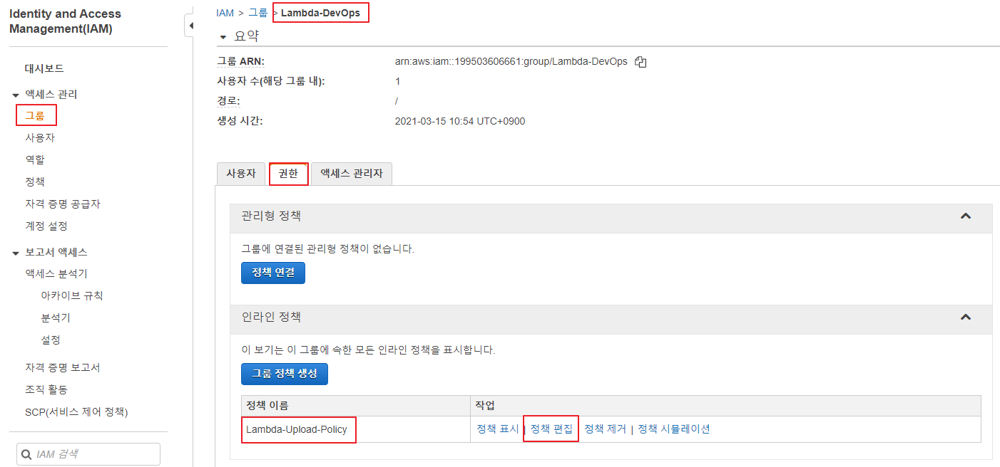
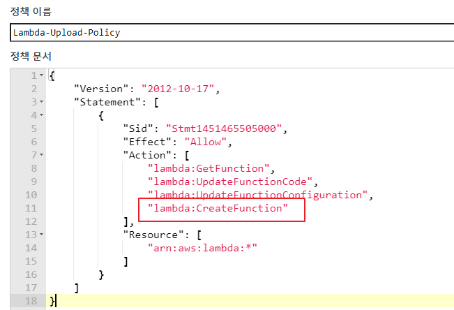
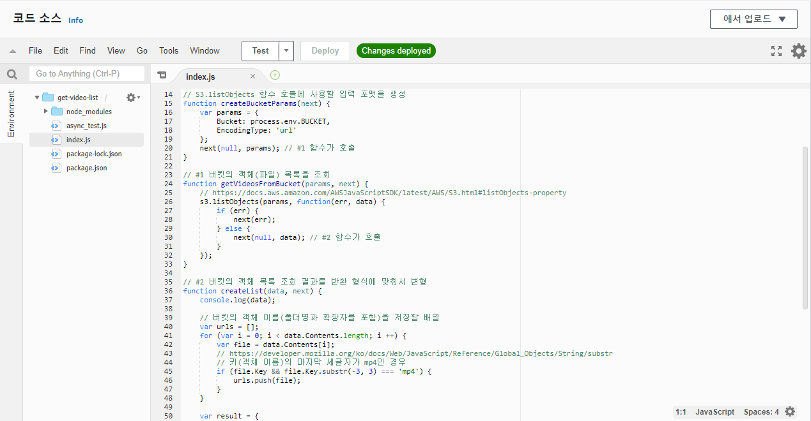
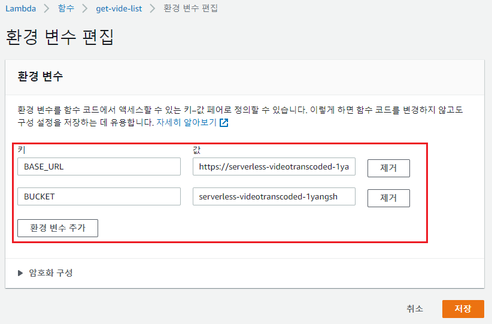
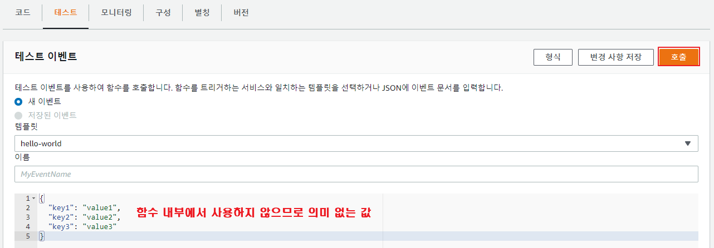
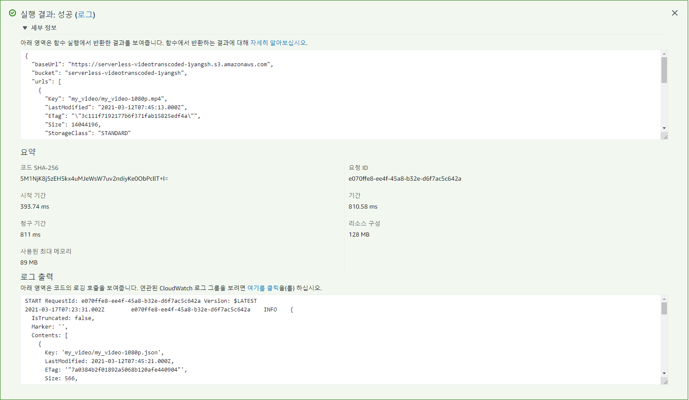

## 조율자 Lambda

> AWS 기반 서버리스 아키텍처 (p149)

- Lambda에서는 사용자가 함수 코드를 제공하고, Lambda는 요구에 따라 그 함수를 실행한다.
- 사용자는 그 함수가 어떻게 그리고 어디서 실행되는지 모른다. (serverless)


---

<br/>

## 실습 : S3 버킷에 저장된 파일 목록을 반환하는 람다 함수를 생성, 배포 (P166)

> CLI 환경에서 람다 함수를 생성하고, 배포 ⇒ CreateFunction 권한이 필요

### 1. Lambda-DevOps 그룹에 CreateFunction 권한을 추가

- IAM -> 그룹 -> 권한 -> 정책 편집

  

  

  


### 2. 프로젝트 환경 구성

- 작업 디렉터리 생성 및 프로젝트 초기화
  - `cd C:\serverless`
  - `mkdir get-video-list`
  - `d get-video-list`
  - `npm init -y`


- 필요 모듈 추가
  - `npm install aws-sdk`
  - `npm install async`
    - async는 비동기 통신을 지원해주는 javascript 모듈


- package.json 파일에 create, precreate 스크립트를 추가

  - `package.json`

    ```json
    {
      "name": "get-video-list",
      "version": "1.0.0",
      "description": "",
      "main": "index.js",
      "scripts": {
        "create": "aws lambda create-function --function-name get-vide-list --handler index.handler --memory-size 128 --runtime nodejs4.3 --role 본인의_lambda-s3-execution-role-ARN --timeout 3 --publish --zip-file fileb://Lambda-Deployment.zip",
        "precreate": "zip -r Lambda-Deployment.zip * -x *.zip *.log node_modules/aws-sdk/*"
      },
      "keywords": [],
      "author": "",
      "license": "ISC"
    }
    ```

    

### 3. 람다 함수 생성

- async 모듈의 watefall() 함수 사용법

  - `async_test.js

    ```javascript
    // https://caolan.github.io/async/v3/docs.html#waterfall
     
    var async = require("async");
     
    async.waterfall([
        function(firstcallbackfunc) {
            console.log(`첫번째 함수`);
            firstcallbackfunc(null, "Peter", "Sam");
        }, 
        function(a1, a2, secondcallbackfunc) {
            console.log(`두번째 함수 ${a1}, ${a2}`);
            secondcallbackfunc(null, "Serverless");
        }, 
        function(a3, thirdcallbackfunc) {
            console.log(`세번째 함수 ${a3}`);
            thirdcallbackfunc(null, "Done")
        }
    ], function(err, result) {
        console.log(`최종 콜백 ${err}, ${result}`);
    });
    ```

  

- 람다 함수 작성

  - `index.js`

    ```javascript
    // P172
    'use strict';
     
    // 필요 모듈 추가 및 S3 객체 생성
    var AWS = require('aws-sdk');
    var async = require('async');
    var s3 = new AWS.S3();
     
    // next : callback 함수
    // next(ERROR, DATAS, ...)
    // next(null, ...) ==> 오류가 발생하지 않았으며, 어떤 값을 반환
    // next(어떤값)    ==> callback 함수로 오류를 반환
     
    // S3.listObjects 함수 호출에 사용할 입력 포맷을 생성
    function createBucketParams(next) {
        var params = {
            Bucket: process.env.BUCKET,
            EncodingType: 'url'
        };
        next(null, params); // #1 함수가 호출
    }
     
    // #1 버킷의 객체(파일) 목록을 조회
    function getVideosFromBucket(params, next) {
        // https://docs.aws.amazon.com/AWSJavaScriptSDK/latest/AWS/S3.html#listObjects-property
        s3.listObjects(params, function(err, data) {
            if (err) {
                next(err);
            } else {
                next(null, data); // #2 함수가 호출
            }
        });
    }
     
    // #2 버킷의 객체 목록 조회 결과를 반환 형식에 맞춰서 변형
    function createList(data, next) {
        console.log(data); 
     
        // 버킷의 객체 이름(폴더명과 확장자를 포함)을 저장할 배열
        var urls = [];
        for (var i = 0; i < data.Contents.length; i ++) {
            var file = data.Contents[i];
            // https://developer.mozilla.org/ko/docs/Web/JavaScript/Reference/Global_Objects/String/substr
            // 키(객체 이름)의 마지막 세글자가 mp4인 경우 
            if (file.Key && file.Key.substr(-3, 3) === 'mp4') {
                urls.push(file);
            }
        }
     
        var result = {
            baseUrl: process.env.BASE_URL,  // 버킷 접근 URL
            bucket: process.env.BUCKET,
            urls: urls
        };
     
        next(null, result); // #3 함수로 전달
    }
     
    exports.handler = function(event, context, callback) {
        async.waterfall([ 
            createBucketParams, 
            getVideosFromBucket, 
            createList
        ], 
        // #3 함수 : [ ... ]에 정의된 함수가 모두 정상 수행 또는 오류가 발생한 경우에 호출
        function(err, result) {
            if (err) {
                callback(err);
            } else {
                callback(null, result); // 버킷에 저장된 객체 목록을 버킷 접속 주소, 버킷 ARN과 함께 반환
            }
        });
    };
    
    ```


- 람다 함수 생성 및 배포

  - `npm run create`

    ```
    			:
    An error occurred (InvalidParameterValueException) when calling the CreateFunction operation: The runtime parameter of nodejs4.3 is no longer supported for creating or updating AWS Lambda functions. We recommend you use the new runtime (nodejs12.x) while creating or updating functions. ⇒ 런타임 버전이 낮아서 함수를 생성할 수 없음
    npm ERR! code ELIFECYCLE
    npm ERR! errno 254
    npm ERR! get-video-list@1.0.0 create: `aws lambda create-function --function-name get-video-list --handler index.handler --memory-size 128 --runtime nodejs4.3 --role arn:aws:iam::199503606661:role/lambda-s3-execution-role --timeout 3 --publish --zip-file fileb://Lambda-Deployment.zip`
    npm ERR! Exit status 254
    npm ERR!
    npm ERR! Failed at the get-video-list@1.0.0 create script.
    npm ERR! This is probably not a problem with npm. There is likely additional logging output above.
    
    npm ERR! A complete log of this run can be found in:
    npm ERR!     C:\Users\i\AppData\Roaming\npm-cache\_logs\2021-03-17T06_42_58_746Z-debug.log
    ```


- 런타임 버전 변경 후 다시 람다 함수 생성 및 배포

  - `package.json`

    ```json
    "create": "aws lambda create-function --function-name get-video-list --handler index.handler --memory-size 128 --runtime nodejs12.x --role arn:aws:iam::199503606661:role/lambda-s3-execution-role --timeout 3 --publish --zip-file fileb://Lambda-Deployment.zip",
    ```

  - 다시 `npm run create`

    


### 8. 함수 실행에 필요한 환경 변수 설정

- 해당 Lambda에서 환경 변수 편집

  

  - BUCKET 환경 변수 ⇒ 트랜스 코딩된 결과가 저장된 버킷 이름
  - BASE_URL 환경 변수 ⇒ 트랜스 코딩된 객체에 객체 URL에서 키를 제외한 부분 ⇒ https://버킷이름.s3.amazonaws.com 


### 9. 람다 함수 테스트

> 해당 함수는 외부(함수를 호출하는 곳)에서 전달하는 값을 사용하는 부분이 없음 ⇒ event 객체를 사용하는 부분이 없음⇒ 테스트를 수행할 때 별도의 값 설정이 필요 없음






> 요약:
>
> waterfall와 같은 패턴 및 라이브러리 생성
>
> 로컬 및 AWS에서 하는 Lambda 함수 테스트