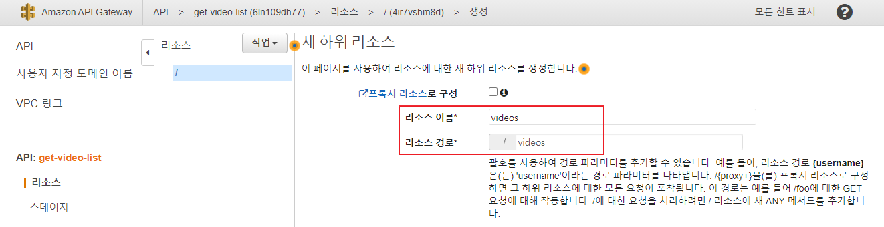

## API Gateway

> AWS 서버리스 아키텍처 7장 (p189)


## 실습 : API Gateway에 get-video-list API를 추가 (p193)

### 1. get-video-list API 생성

- API Gateway에서 API 생성

  

  

  

  

  

### 2. 리소스 생성

- 리소스 생성

  

  


### 3. 매서드 생성

- 매서드 생성

  

  

  

#### 4. 매서드 테스트


### 5. CORS 활성화 및 API 배포


<br/>

---

<br/>

## 웹 사이트에 비디오 목록을 가져와서 재생하는 기능을 추가 (p209)

### 1. config.js 파일에 get-file-list API 호출 URL을 추가

- `js/config.js`

  

  ```javascript
  var configConstants = {
      auth0: {
          domain: '1yangsh.us.auth0.com',
          clientId: 'Bkia8NNISRVmEw6M7lANfYmvoutaOVdD'
      },
      // user-profile API 호출 URL
      apiBaseUrl: 'https://tzecikd5j7.execute-api.us-east-1.amazonaws.com/dev',
  
      // get-file-list API 호출 URL
      getFileListApiUrl: 'https://x9p0er0szb.execute-api.us-east-1.amazonaws.com/dev' // 추가
  };
  ```

  

### 2. video-controller.js 파일을 추가


- `c:\serverless\24-hour-video\js\video-controller.js`

  ```javascript
  // P209
  var videoController = {
      data: {
          config: null
      },
      uiElements: {
          videoCardTemplate: null, 
          videoList: null
      }, 
      init: function(config) {
          // index.html 문서에 id 속성이 video-template, video-list인 요소를 참조
          this.uiElements.videoCardTemplate = $('#video-template');
          this.uiElements.videoList = $('#video-list');
   
          // config.js 파일에 있는 내용을 참조
          this.data.config = config;
   
          this.getVideoList();
      }, 
      // get-video-list API를 호출
      getVideoList: function() {
          var that = this;
   
          // get-video-list API 호출 URL + 리소스 이름
          // videos 리소스를 GET 방식으로 호출 --> get-video-list 람다 함수를 실행하고 결과를 반환 받음
          var url = this.data.config.getFileListApiUrl + '/videos';
          $.get(url, function(data, status) {
              that.updateVideoFrontPage(data);
          });
      }, 
      // get-video-list 람다 함수의 실행 결과를 목록으로 화면에 출력
      updateVideoFrontPage: function(data) {
          console.log(data);
          // TODO
      }
  };
  ```

  

### 3. main.js 파일에 videoController 객체의 초기화 함수 호출을 추가

- `c:\serverless\24-hour-video\js\main.js`

  ```javascript
  // 즉시 실행 함수
  (function() {
      console.log("### 1");
      // 해당 웹 페이지 문서가 로딩되면 설정 정보를 가져와서 설정
      $(document).ready(function() {
          console.log("### 2");
          // user-controller.js에 선언되어 있는 userController 객체의 init 메소드를 호출
          // coonfig.js에 선언되어 있는 configConstants 객체를 인자로 전달
          userController.init(configConstants);
          videoController.init(configConstants);  /* 추가 */
      });
  })();
  ```

 

### 4. index.html 파일에 동영상 목록과 출력 부분을 추가

- `c:\serverless\24-hour-video\index.html`

  ```html
     <!-- (생략) -->
      <!-- Main jumbotron for a primary marketing message or call to action -->
      <div class="jumbotron">
        <!-- 대략 66번 라인
        <div class="container">
          <h1>Hello, world!</h1>
          <p>This is a template for a simple marketing or informational website. It includes a large callout called a jumbotron and three supporting pieces of content. Use it as a starting point to create something more unique.</p>
          <p><a class="btn btn-primary btn-lg" href="#" role="button">Learn more &raquo;</a></p>
        </div>
        -->
        <!-- 추가 시작: P209 코드 참조 -->
        <div class="container" id="video-list-container">
          <div id="video-template" class="col-md-6 col">
            <div class="video-card">
              <video width="100%" height="100%" controls>
                <source type="video/mp4">
                지원하지 않는 타입
              </video>
            </div>
          </div>
          <div calss="row">
            <ul id="video-list">
   
            </ul>
          </div>
        </div>
        <!-- 추가 끝 -->
      </div>
      <!-- (생략) -->
          <script src="https://cdn.auth0.com/js/lock/11.27/lock.min.js"></script>
          <script src="js/config.js"></script>
          <script src="js/user-controller.js"></script>
          <script src="js/video-controller.js"></script>  <!-- 추가 -->
          <script src="js/main.js"></script>
          <!-- (생략) -->
  ```

  

### 4. 웹 페이지 테스트

- 정상적인 로그를 console에서 확인

  

  

  


### 6. S3 버킷 목록을 화면에 출력 

- `c:\serverless\24-hour-video\js\video-controller.js`

  ```javascript
   updateVideoFrontPage: function(data) {
          console.log(data);
          // <ul id="video-list">
          // <li url="https://serverless...jini.s3.amazonaws.com/my+video/my+video-1080p.mp4">동영상 파일명</li>
          //          ~~~~~~~~~~~~~~~~~~~~~~~~~~~~~~~~~~~~~~~~~~ ~~~~~~~~~~~~~~~~~~~~~~~~~~~  ~~~~~~~~~~~~
          //          baseUrl                                    urls.Key                     urls.Key에서 파일명만 추출
          var baseUrl = data.baseUrl;
          var urls = data.urls;
          /*
          for (var i = 0; i < urls.length; i ++) {
              var url = urls[i];
              var key = url.Key;
              var filename = key.split('/')[1];
              var litag = '<li url="' + baseUrl + '/' + key + '">' + filename + '</li>';
              $('#video-list').append(litag);
          }
          */
   
          urls.forEach(url => {
              var key = url.Key;
              var filename = key.split('/')[1];
              var litag = `<li url="${baseUrl}/${key}">${filename}</li>`; 
              $('#video-list').append(litag);
          });
      }
  ```

  


### 7. 목록을 클릭했을 때 비디오가 재생

- `controller.js`

  ```javascript
  // 추가
  // 이벤트를 처리하는 함수(이벤트 핸들러)를 정의
      // https://developer.mozilla.org/ko/docs/Web/HTML/Element/Video
      wireEvents: function() {
          // id 속성(attibute) 값이 video-list인 요소(element, tag) 아래에서 
          // li 요소에 click 이벤트가 발생했을 때 수행할 동작을 정의
          $('#video-list').on('click', 'li', function() {
              // 클릭한 li 태그(요소)의 url 속성의 값을 가져와서 url 변수에 할당
              var url = $(this).attr('url');
              /*
              <video width="100%" height="100%" controls>
                <!-- video 태그에 사용될 동영상의 소스 -->
                <!-- src 속성에 동영상의 주소를 추가하면 재생이 가능 -->
                <source type="video/mp4">
                지원하지 않는 타입
              </video>
              */
              // source 태그(요소)의 src 속성의 값으로 url 변수의 값을 설정
              $('source').attr('src', url);
              // video 태그(요소)에 설정된 동영상 파일을 읽어들림
              $('video').load();
          });
      }
  ```

  