## LAB1 : Creating a Simple AWS Lambda Function

#### #1 Lambda 함수 생성

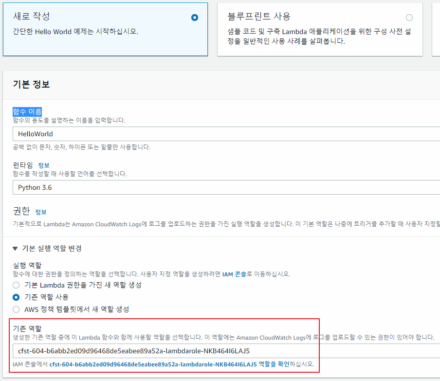

- 적절한 권한이 부여되고 있는지 확인

  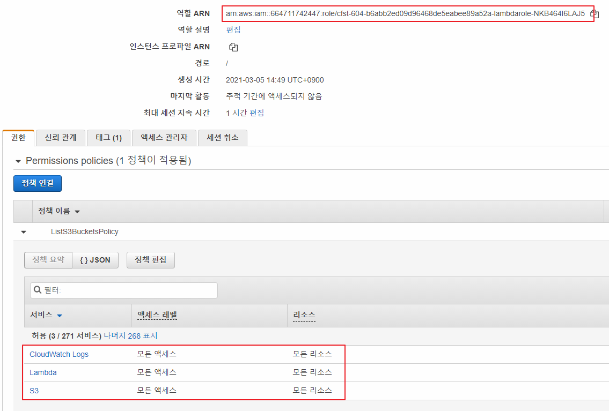

  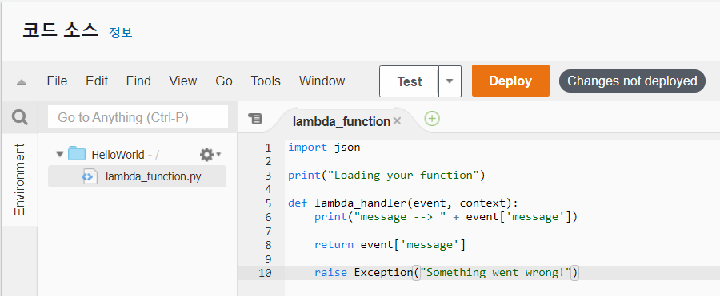

- lambda code

  ```python
  import json
  
  print('Loading your function')
  
  def lambda_handler(event, context):
      #print("Received event: " + json.dumps(event, indent=2))
      # print statements actually get printed to the logs.
      print("message --> " + event['message'])
  
      # Actually returning the value of the 'message' key.
      return event['message']
  
      # Raising an exception if something goes wrong...
      raise Exception('Something went wrong!')
  ```


#### #2 작성한 함수 테스트 (Test 탭에서)

- event 인자값에 message 이름의 키가 존재하지 않으므로 오류가 발생

  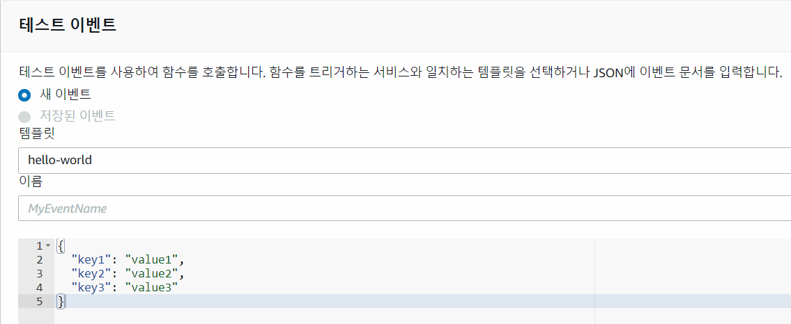

  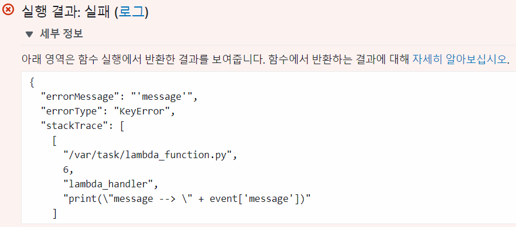

- message 값 추가

  - 예시

  ```json
  {
    "message": "Congrats! Your first successful Lambda function! Oh....and 'Hello World!' ",
    "notmessage": "If this shows, it is broken!"
  }
  ```

  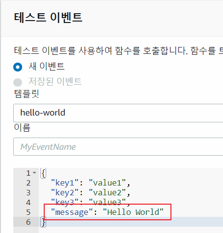

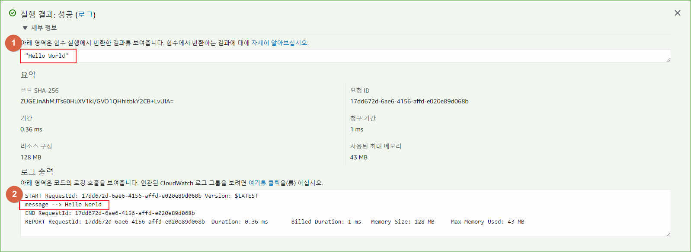

​	(1) 소스코드 8번 라인의 return event['message'] 코드의 결과

​	(2) 소스코드 6번 라인의 print("message --> " + event['message']) 코드의 결과 

​			⇐ CloudWatch에 저장된 로그 내용

​	  

#### #3 Cloudwatch에서 log 확인

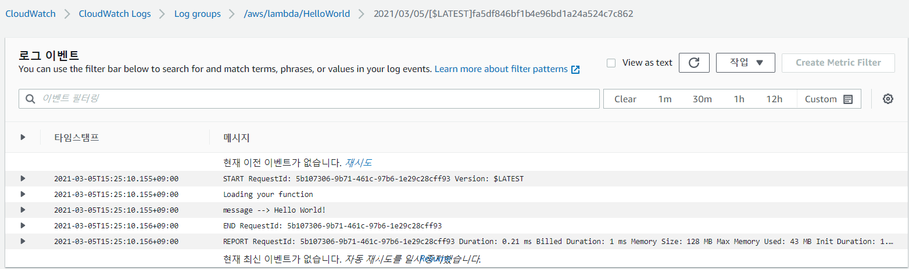

<br/>

---

<br/>

## LAB2 : Using the AWS CLI to Create an AWS Lambda Function

> 클라이언트에서 작성한 Lambda 함수를 AWS CLI를 이용해서 배포 및 실행

- https://learn.acloud.guru/course/178db59b-70f1-4bd8-8d74-9ab9263f8f9a/learn/247ebc2e-5abe-4d65-af18-a8609c5596f5/65b1afb4-77dd-4eaa-8158-472a2ef344bd/lab/0b85c5a2-1674-4295-b55c-cf3c6f2826d3


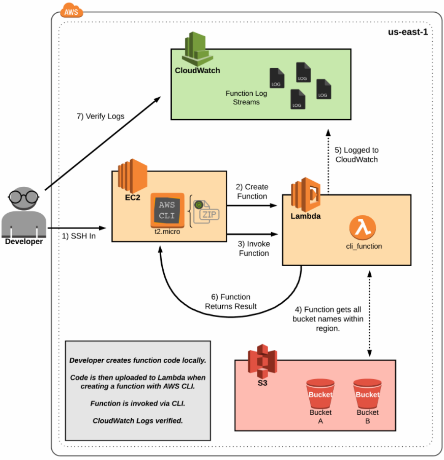


#### #1 실습 환경을 확인 - S3 버킷, IAM 역할, EC2 인스턴스 확인

- S3 버킷 확인

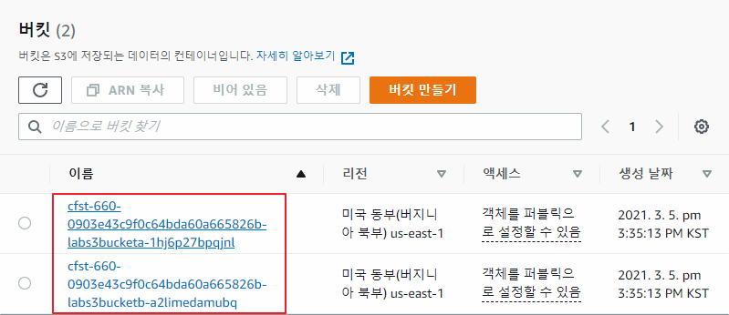

- IAM lambda 정책 확인

  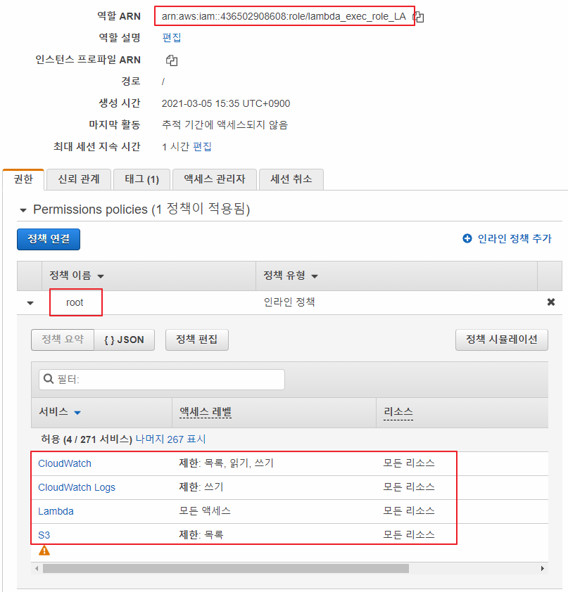

- 인스턴스 확인

  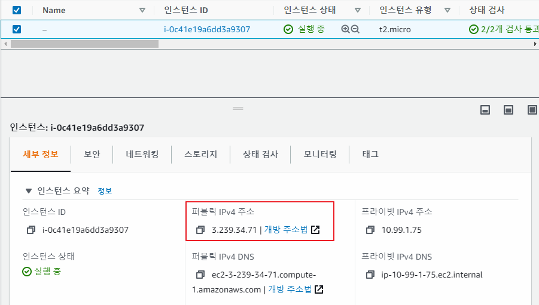


#### #2 EC2인스턴스로 SSH 접속

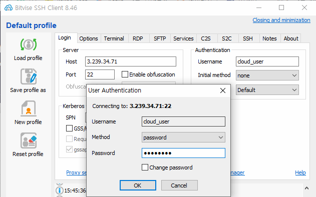


#### #3 AWS CLI 설치 여부 확인

- [cloud_user@ip-10-99-1-75 ~]$ `aws --version`

  ```
  aws-cli/1.16.113 Python/2.7.16 Linux/4.14.173-106.229.amzn1.x86_64 botocore/1.12.103
  ```

  

#### #4 해당 지역(버지니아 북부)의 람다 함수를 조회

- [cloud_user@ip-10-99-1-75 ~]$ `aws lambda list-functions --region us-east-1`

  ```
  {
      "Functions": []
  }
  ```

  - list-functions 참고
    -  ⇒  https://docs.aws.amazon.com/cli/latest/reference/lambda/list-functions.html
  - --region 참고
    - ⇒ https://docs.aws.amazon.com/ko_kr/cli/latest/userguide/cli-configure-options.html


#### #5 S3 버킷 목록을 반환하는 람다 함수를 작성

- `vim lambda_function.js`

  ```javascript
  // Here is where we load the SDK for JavaScript
  const AWS = require('aws-sdk');
  
  // We need to set the region.
  AWS.config.update({region: 'us-east-1'});
  
  // Creating S3 service object
  const s3 = new AWS.S3({apiVersion: '2006-03-01'});
  
  exports.handler = (event, context, callback) => {
      // Here we list all S3 Buckets
      s3.listBuckets(function(err, data) {
         if (err) {
            console.log("Error:", err);
         } else {
            console.log("List of all S3 Buckets", data.Buckets);
         }
      });
  };
  ```

  

#### #6 작성한 람다 함수를 배포

- zip 파일로 묶음

  - [cloud_user@ip-10-99-1-75 ~]$ `zip lambda_function.zip lambda_function.js`

- zip 파일 확인

  - [cloud_user@ip-10-99-1-75 ~]$ `ll`

- 람다 함수 생성

  ```
  [cloud_user@ip-10-99-1-75 ~]$ aws lambda create-function \
  --region us-east-1 \
  --function-name "ListS3Buckets" \
  --runtime "nodejs12.x" \
  --role "arn:aws:iam::498145783765:role/lambda_exec_role_LA" \
  --handler "lambda_function.handler" \
  --zip-file fileb:///home/cloud_user/lambda_function.zip
  ```


- [cloud_user@ip-10-99-1-75 ~]$ `aws lambda list-functions --region us-east-1`

  ```
  {
      "Functions": [
          {
              "TracingConfig": {
                  "Mode": "PassThrough"
              },
              "Version": "$LATEST",
              "CodeSha256": "Fr0Pm6jmV41kxdA/p0bcSFp5/WoOqmxdaU7pgAdAFRw=",
              "FunctionName": "ListS3Buckets",
              "MemorySize": 128,
              "RevisionId": "4e92b5d0-7891-4724-9a18-b212de8e4ef4",
              "CodeSize": 418,
              "FunctionArn": "arn:aws:lambda:us-east-1:436502908608:function:ListS3Buckets",
              "Handler": "lambda_function.handler",
              "Role": "arn:aws:iam::436502908608:role/lambda_exec_role_LA",
              "Timeout": 3,
              "LastModified": "2021-03-05T07:02:25.147+0000",
              "Runtime": "nodejs12.x",
              "Description": ""
          }
      ]
  }
  ```

  

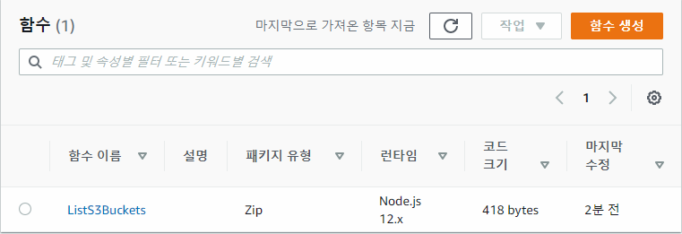


#### #7 람다 함수를 호출

- [cloud_user@ip-10-99-1-75 ~]$ `aws lambda invoke --region us-east-1 --function-name "ListS3Buckets" OUTPUT.log`

  ```
  {         
      "ExecutedVersion": "$LATEST",
      "StatusCode": 200
  }
  ```

  

#### #8 CloudWatch에서 로그 그룹을 확인

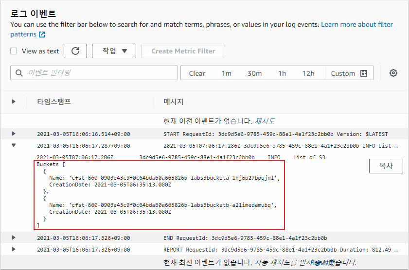

- ⇒ 소스 코드의 "console.log("List of S3 Buckets", data.Buckets);" 부분의 출력

- [cloud_user@ip-10-99-1-75 ~]$ `cat OUTPUT.log`

  ```
  null			⇐ 아무 내용이 없음 → 반환하는 값이 없기 때문
  ```

  

#### #9 반환하는 값을 보기 위해 소스코드를 수정 (TODO)

- `[cloud_user@ip-10-99-1-75 ~]$ vim lambda_function.js`

  ```javascript
  const AWS = require('aws-sdk');
  
  AWS.config.update({ region: 'us-east-1' });
  
  const s3 = new AWS.S3({ apiVersion: '2006-03-01' });
  
  exports.handler = (event, context, callback) => {
  	s3.listBuckets(
  		(err, data) => {
  			if (err) {
  				console.log("Error: ", err);
  			} else {
  				console.log("List of S3 Buckets", data.Buckets);
  				return data.Buckets;   // return 값 추가
  			}
  		}
  	);
  };
  
  ```

- zip 파일 다시 생성

  - [cloud_user@ip-10-99-1-75 ~]$ `zip lambda_function.zip lambda_function.js`

    ```
    updating: lambda_function.js (deflated 35%)
    ```

- [cloud_user@ip-10-99-1-75 ~]$ `aws lambda update-function-code --region us-east-1 --function-name "ListS3Buckets" --zip-file fileb:///home/cloud_user/lambda_function.zip`

  ```
  {
      "TracingConfig": {
          "Mode": "PassThrough"
      },
      "CodeSha256": "hWTdjE1+m73H0/Vs8axhG7fUT8dqr1AMDfbPltyra+o=",
      "FunctionName": "ListS3Buckets",
      "CodeSize": 427,
      "RevisionId": "1ddd4d10-0b4a-46b8-9e8d-4a88d19540d5",
      "MemorySize": 128,
      "FunctionArn": "arn:aws:lambda:us-east-1:436502908608:function:ListS3Buckets",
      "Version": "$LATEST",
      "Role": "arn:aws:iam::436502908608:role/lambda_exec_role_LA",
      "Timeout": 3,
      "LastModified": "2021-03-05T07:15:47.256+0000",
      "Handler": "lambda_function.handler",
      "Runtime": "nodejs12.x",
      "Description": ""
  }
  ```

  

- lambda 서비스 내 코드에서 확인

  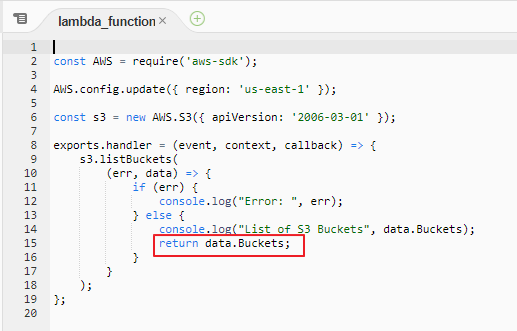

- [cloud_user@ip-10-99-1-75 ~]$ `aws lambda invoke --region us-east-1 --function-name "ListS3Buckets" OUTPUT.log`
- [cloud_user@ip-10-99-1-75 ~]$ `cat OUTPUT.log`
- update-function-code  ⇒  https://docs.aws.amazon.com/cli/latest/reference/lambda/update-function-code.html

<br/>

---

<br/>

### # 참고 

### Serverless Framework

- https://myanjini.tistory.com/entry/Serverless-Framework-1
- https://myanjini.tistory.com/entry/Serverless-Framework-2
- https://myanjini.tistory.com/entry/Serverless-Framework-3-%EC%8B%A4%ED%96%89-%ED%99%98%EA%B2%BD-%EC%A0%9C%ED%95%9C-%EC%84%A4%EC%A0%95
- https://myanjini.tistory.com/entry/Serverless-Framework-4-%EB%9E%8C%EB%8B%A4-%ED%95%A8%EC%88%98-%EC%8B%A4%ED%96%89%EC%97%90-%ED%95%84%EC%9A%94%ED%95%9C-%EA%B6%8C%ED%95%9C-%EC%84%A4%EC%A0%95
- https://myanjini.tistory.com/entry/Serverless-Framework-5-%EB%9E%8C%EB%8B%A4-%ED%95%A8%EC%88%98-%EC%8B%A4%ED%96%89%EC%97%90-%ED%95%84%EC%9A%94%ED%95%9C-%ED%99%98%EA%B2%BD%EB%B3%80%EC%88%98-%EC%84%A4%EC%A0%95
- https://myanjini.tistory.com/entry/Serverless-Framework-6-%EC%97%85%EB%A1%9C%EB%93%9C-%EC%9D%B4%EB%AF%B8%EC%A7%80%EC%9D%98-%EC%8D%B8%EB%84%A4%EC%9D%BC-%EC%9E%90%EB%8F%99-%EC%83%9D%EC%84%B1

<br/>

---

<br/>

## LAB3 : API Gateway Canary Release Deployment


<br/>

---

<br/>

## LAB4 : Triggering Lambda from Amazon SQS

>  https://learn.acloud.guru/course/178db59b-70f1-4bd8-8d74-9ab9263f8f9a/learn/247ebc2e-5abe-4d65-af18-a8609c5596f5/2e9078ee-5fd2-4e82-b9a5-062414155379/lab/2e9078ee-5fd2-4e82-b9a5-062414155379

- SQS를 사용해서 람다 함수를 트리거 하는 방법
  - SQS 대기열의 메시지를 처리하고 메시지 데이터를 DynamoDB 테이블에 삽입

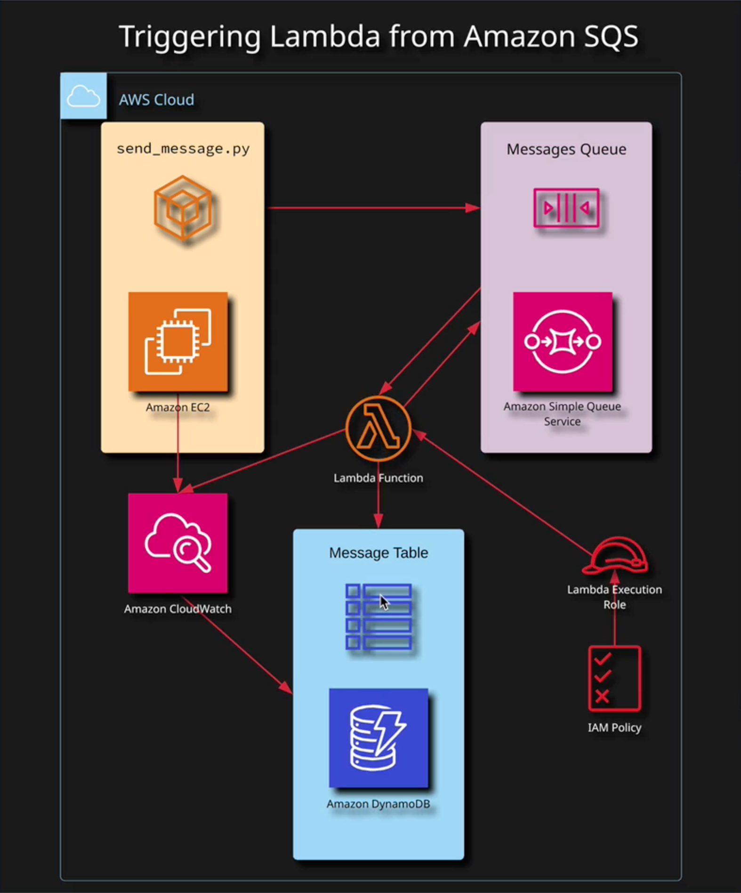


#### #1 IAM 정책을 생성

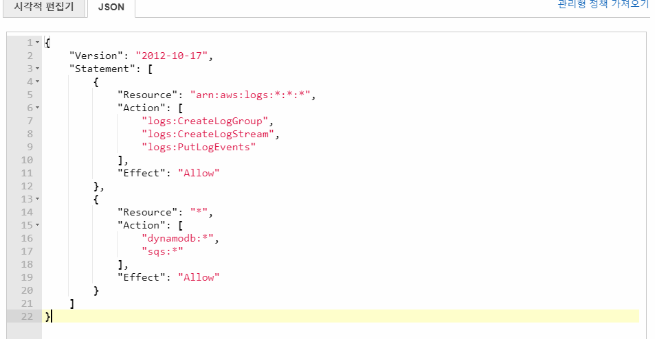

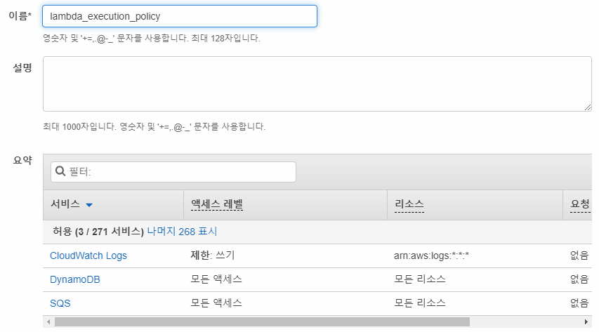


#### #2 IAM 역할을 생성

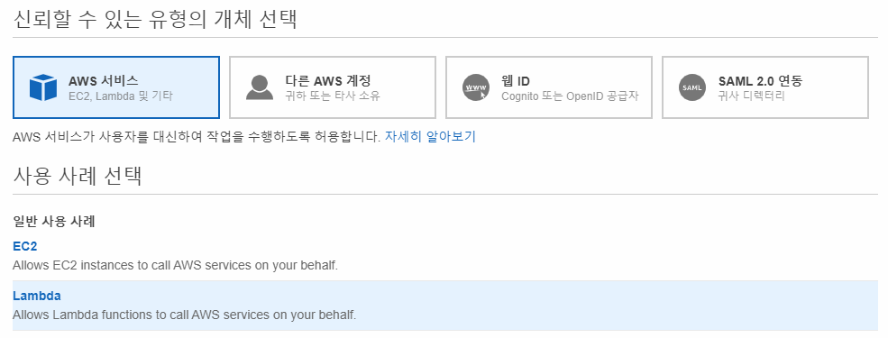

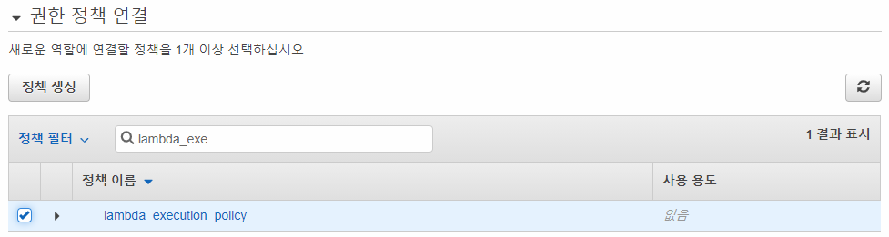

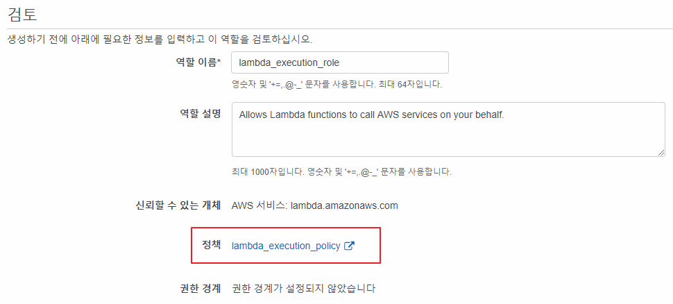


#### #3 람다 함수 생성

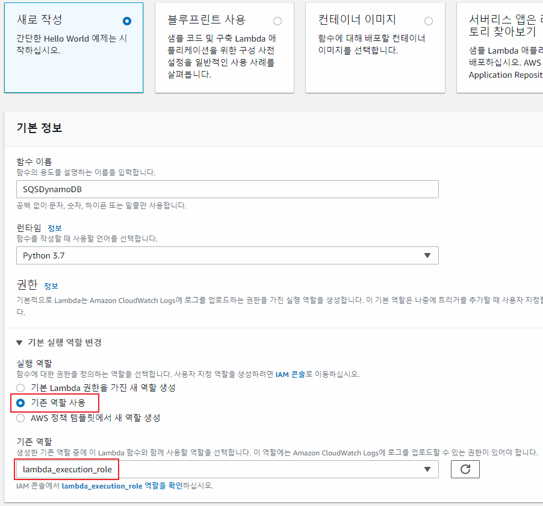

- 함수 코드 `lambda_function.py`

  ```python
  from datetime import datetime
  import json
  import os
  import boto3
  
  QUEUE_NAME = os.environ['QUEUE_NAME']                   # 환경 변수의 값을 가져오는 부분	
  MAX_QUEUE_MESSAGES = os.environ['MAX_QUEUE_MESSAGES']
  DYNAMODB_TABLE = os.environ['DYNAMODB_TABLE']
  
  sqs = boto3.resource('sqs')
  dynamodb = boto3.resource('dynamodb')
  
  
  def lambda_handler(event, context):
  
      # Receive messages from SQS queue
      queue = sqs.get_queue_by_name(QueueName=QUEUE_NAME)
  
      print("ApproximateNumberOfMessages:",
            queue.attributes.get('ApproximateNumberOfMessages'))
  
      for message in queue.receive_messages(
              MaxNumberOfMessages=int(MAX_QUEUE_MESSAGES)):
  
          print(message)
  
          # Write message to DynamoDB
          table = dynamodb.Table(DYNAMODB_TABLE)
  
          response = table.put_item(
              Item={
                  'MessageId': message.message_id,
                  'Body': message.body,
                  'Timestamp': datetime.now().isoformat()
              }
          )
          print("Wrote message to DynamoDB:", json.dumps(response))
  
          # Delete SQS message
          message.delete()
          print("Deleted message:", message.message_id)
  ```

  

#### #4 함수 실행에 필요한 환경 변수의 값을 설정

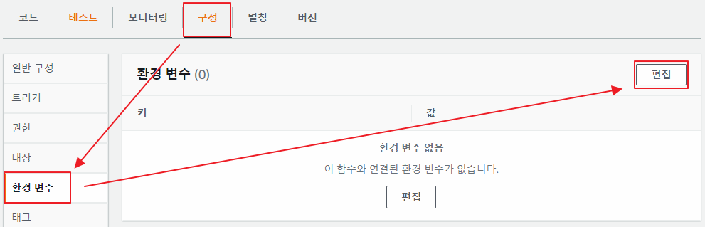

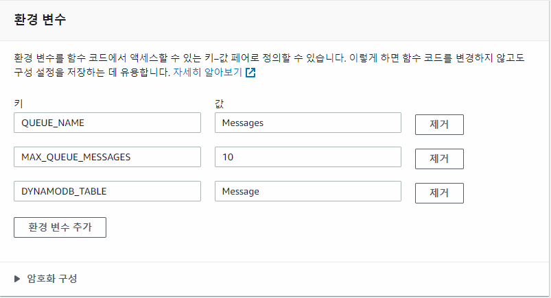

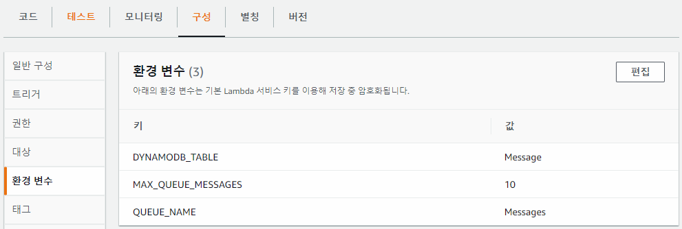

- QUEUE_NAME
  - Amazon SQS에서 확인

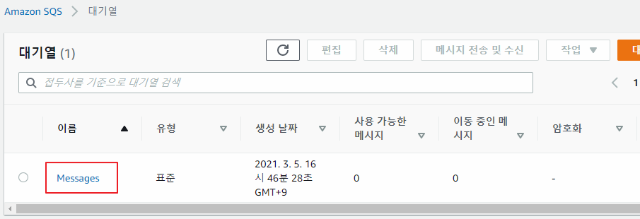

- DYNAMODB_TABLE
  - DynamoDB에서 확인

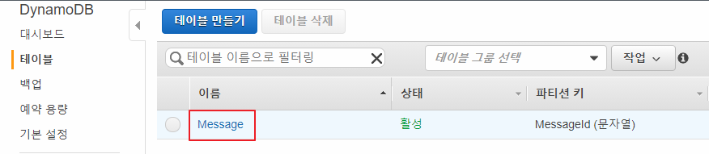


#### #5 람다 함수의 트리거를 설정

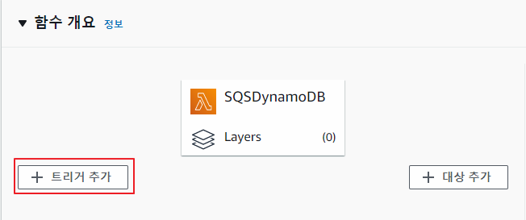

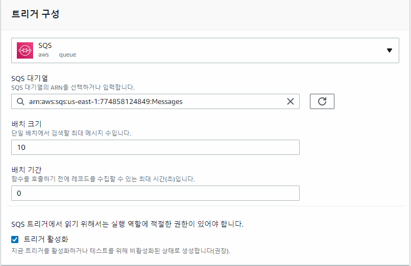


#### #6 EC2 인스턴스에 SSH 접속

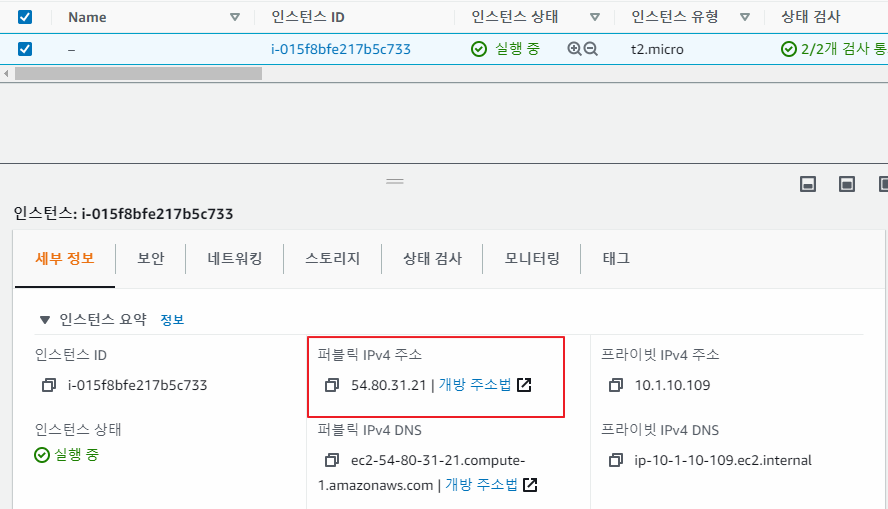

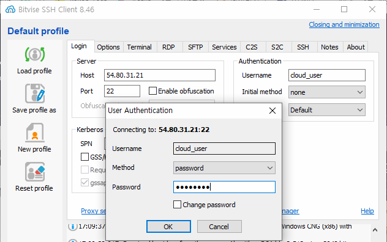


#### #7 메시지를 생성

- [cloud_user@ip-10-1-10-109 ~]$ `ls`

  ```
  send_message.py
  ```

- [cloud_user@ip-10-1-10-109 ~]$ `cat send_message.py`

  ```python
  #!/usr/bin/env python3.7
  # -*- coding: utf-8 -*-
  import argparse
  import logging
  import sys
  from time import sleep
  import boto3
  from faker import Faker
  
  
  parser = argparse.ArgumentParser()
  parser.add_argument("--queue-name", "-q", required=True,
                      help="SQS queue name")
  parser.add_argument("--interval", "-i", required=True,
                      help="timer interval", type=float)
  parser.add_argument("--message", "-m", help="message to send")
  parser.add_argument("--log", "-l", default="INFO",
                      help="logging level")
  args = parser.parse_args()
  
  if args.log:
      logging.basicConfig(
          format='[%(levelname)s] %(message)s', level=args.log)
  
  else:
      parser.print_help(sys.stderr)
  
  sqs = boto3.client('sqs')
  
  response = sqs.get_queue_url(QueueName=args.queue_name)
  
  queue_url = response['QueueUrl']
  
  logging.info(queue_url)
  
  while True:
      message = args.message
      if not args.message:
          fake = Faker()
          message = fake.text()
  
      logging.info('Sending message: ' + message)
  
      response = sqs.send_message(
          QueueUrl=queue_url, MessageBody=message)
  
      logging.info('MessageId: ' + response['MessageId'])
      sleep(args.interval)
  ```

  

- [cloud_user@ip-10-1-10-109 ~]$ `./send_message.py -q Messages -i 0.1`
  - `-q Messages `
    - queue 이름
  - `-i 0.1`
    - 실행 주기(iterate) = 0.1	