## Amazon Virtual Private Cloud (VPC)

> AWS 전용 가상 네트워크

- 리전
  - AWS 서비스가 운영되는 지역
  - 복수개의 데이터 센터들의 집합
- 가용영역(AZ)
  - 리전 내에 위치한 데이터 센터
  - 물리적으로 분리되어 있음 
    - 고가용성을 보장하기 위해
- VPC(Virtual Private Cloud)
  - AWS 계정 전용 가상 네트워크
  - 한 AWS 리전 안에서만 존재할 수 있고, 한 리전에 만든 VPC는 다른 리전에서는 보이지 않음
  - 연속적인 IP 주소 범위로 구성 ⇒ CIDR 블록으로 표시
    - 10.0.0.0/8		→ 10.0.0.0 ~ 10.255.255.255
    - 172.16.0.0/12		→ 172.16.0.0 ~ 172.31.255.255
    - 192.168.0.0/16		→ 192.168.0.0 ~ 192.168.255.255
- 서브넷(subnet)
  - VPC 내 논리 컨테이너
  - EC2 인스턴스를 배치하는 장소 ⇒ 인스턴스는 서브넷 안에 위치
    - 서브넷에 인스턴스를 생성하면 다른 서브넷으로 이동할 수 없음
    - 인스턴스를 종료하고 다른 서브넷에 새 인스턴스를 생성
  - 인스턴스를 서로 격리하고, 인스턴스 간의 트래픽 흐름을 제어하고, 인스턴스를 기능별로 묶을 수 있음
  - 서브넷 CIDR 블록
    - VPC의 일부, VPC 내에서는 유일해야함
    - 모든 서브넷에서 처음 4개의 IP와 마지막 1개는 예약되어 있으므로 인스턴스에 할당할 수 없음
      - 예) 서브넷 CIDR가 172.16.100.0/24인 경우
        - 172.16.100.0 ~ 172.16.100.3와 172.16.100.255 는 할당 불가
  - 서브넷은 하나의 가용 영역(AZ) 내에서만 존재할 수 있음


- ENI(Elastic Network Interface, 탄력적 네트워크 인터페이스)

  - 물리 서버의 NIC(Network Interface Controller)와 같은 기능을 수행
  - 모든 인스턴스에는 기본 ENI가 존재하며, 이 인터페이스는 하나의 서브넷에만 연결

- IGW(Internet Gateway, 인터넷 게이트워이)

  - 퍼블릭 IP주소를 할당받은 인스턴스가 인터넷과 연결되어서 인터넷으로부터 요청을 수신할 수 있도록 해주는 서비스
  - 처음 VPC를 생성하더라도 IGW가 연결되지는 않음 
    - ⇒ 직접 IGW를 생성하고 VPC와 연결해야 함
  - VPC는 하나의 IGW만 연결 가능

- 라우팅 테이블

  - VPC는 소프트웨어 함수로 IP 라우팅을 구현한 라우터를 제공
    - ⇒ 사용자는 라우팅 테이블만 관리
  - 라우팅 테이블은 하나 이상의 라우팅과 하나 이상의 서브넷 연결로 구성
  - VPC를 생성하면 기본 라우팅 테이블을 자동으로 만들고 해당 VPC의 모든 서브넷과 연결

- 라우팅

  - 라우팅 테이블과 연결된 서브넷 내 인스턴스에서 트래픽을 전달하는 방법을 결정

  - 라우팅 테이블에는 같은 VPC에 있는 인스턴스 간에 통신할 수 있게 하는 로컬라우팅이 필수적으로 포함

  - 기본 라우팅

    - 인스턴스가 인터넷에 엑세스하게 하려면 IGW를 가리키는 기본 라우팅을 생성해야 함
      - 대상(target) 주소 : 0.0.0.0/0          ⇐ 인터넷 상의 모든 호스트의 IP 주소
      - 대상                       : igw-xxxx...

  - 퍼블릭 서브넷

    - IGW를 가리키는 기본 라우팅이 포함된 라우팅 테이블과 연관된 서브넷

  - 프라이빗 서브넷

    - 기본 라우팅이 포함되어 있지 않음

  - 라우팅을 결정할 때는 가장 근접하게 일치하는 항목을 기반으로 라우팅

    | 대상주소      | 대상        |
    | ------------- | ----------- |
    | 172.31.0.0/16 | LOCAL       |
    | 0.0.0.0/0     | igw-xxxx... |

    - 198.51.100.50으로 패킷을 보내려고 하면, IGW로 패깃을 전달
    - 172.31.0.10으로 패킷을 보내려고 하면, 172.31.0.10으로 패킷을 전달

- 보안 그룹(security group)

  - 방화벽과 같은 기능을 제공
    - 상태 저장 방화벽 역할
    - 보안 그룹이 트래픽을 한 방향으로 전달되도록 허용할 때 반대 반향의 응답 트래픽을 지능적으로 허용
  - 인스턴스의 ENI 최소 하나 이상의 보안 그룹과 연결되어야 함
    - 보안 그룹과 ENI는 N:N 관계
    - 보안 그룹 생성 시 보안 그룹 이름, 설명, 포함될 VPC를 지정하고, 보안 그룹 생성 후에 인바운드, 아웃바운드 규칙을 지정해서 트래픽을 지어

- NACL(Network Access Control List)

  - 보안 그룹과 유사
    - 원본(source)/대상(target) 주소 CIDR, 포드를 기반으로 트래픽을 허용하는 인바운드, 아웃바운드 규칙을 포함 ⇒ 방화벽 기능
    - VPC에는 삭제할 수 없는 기본 NACL이 존재
  - NACL은 ENI가 아닌 서브넷에 연결, 해당 서브넷과 송수신하는 트래픽을 제어
    - 서브넷 내의 인스턴스 간 트래픽을 제어할 때는 NACL을 사용할 수 없음  ⇒ 보안 그룹
  - NACL은 상태를 저장하지 않음 = NACL은 통과하는 연결 상태를 추적하지 않음
    - 모든 인바운드, 아웃바운드 트래픽의 허용 규칙을 별도로 작성해야 함
  - NACL 규칙은 규칙 번호의 내림차순으로 처리

---

<br/>

### LAB : Creating a Basic VPC and Associated Components

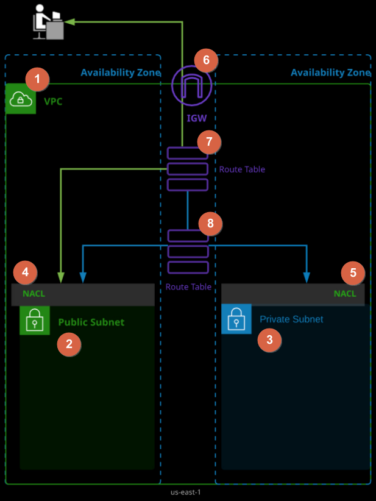

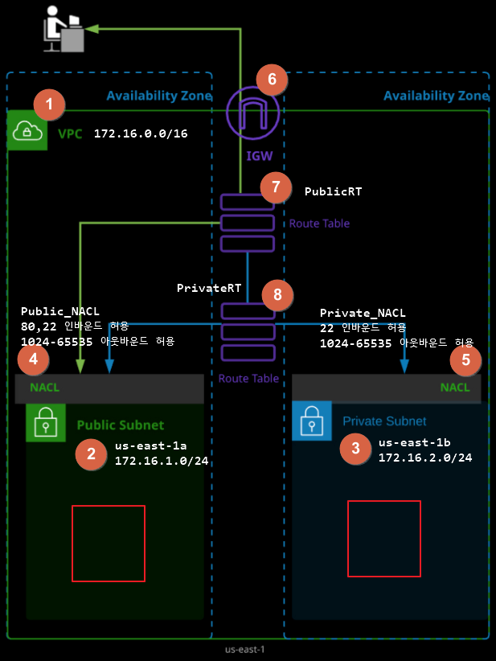

- 추가적으로

1. 각 서브넷에 EC2 인스턴스를 생성 후 SSH 접속 여부를 확인
2. Public Subnet에 설치한 EC2 인스턴스에 nginx 설치 후 HTTP 접속 여부를 확인

---

<br/>

### LAB : Building a Three-Tier Network VPC from Scratch in AWS

**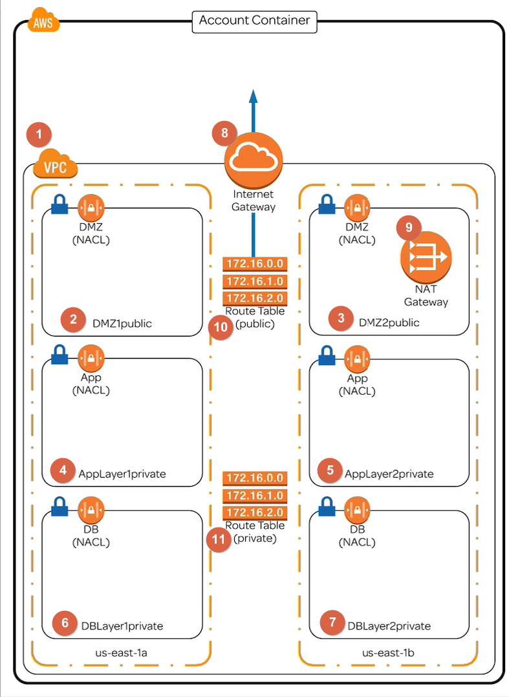**

In this lab, we're going to create a three-tier VPC network from scratch. We'll start by building the VPC, building and attaching an internet gateway, and building six different subnets inside our VPC:

- A DMZ layer
- An app layer
- A database layer

Next, we're going to split these pairs of subnets across two different Availability Zones — the bare minimum we always want to do for highly available and fault-tolerant architecture in AWS.

Then we're going to create two different route tables:

- A route to the internet for our public subnets, or subnets we want to have access to the open internet
- A route to the NAT gateway so that anything placed into our private subnets will have a route to update software from the open internet

Finally, we'll add some security to our subnets with three network access control lists (NACLs), which we'll assign to our pairs of subnet layers.

If you haven't already done so, log in to the environment using the credentials provided on the lab page. The username will always be `cloud_user`, and the password will be provided next to the `cloud_user` login name. Select **Sign In**. Once you're in the AWS account, make sure you are using `us-east-1` (N. Virginia) as the selected region.

#### Build and Configure a VPC, Subnets, and Internet Gateway

Let's begin by creating the foundation of our VPC. We'll start by creating our VPC, creating six subnets inside the VPC, and creating and attaching an internet gateway to our VPC.

#### VPC 확인 및 생성

Select **All services**, and then click **VPC** under *Networking & Content Delivery*.

On the *Resources* page, we'll see there aren't currently any VPCs created.

- Click **Your VPCs** in the sidebar.
- Click **Create VPC**.
- For the *Name tag*, enter "SysOpsVPC".
- For the *IPv4 CIDR block* range, enter "10.99.0.0/16".
- Leave the *IPv6 CIDR block* and *Tenancy* fields as their default values.
- Click **Create**.

We've now created our VPC, but we still need to create the components within the VPC. Close out of the success message.

```
DMZ, app, DB 레이어 각각의 서브넷을 생성 → 6개

[레이어명칭]   [가용영역]       [개방여부]
DMZ          1(us-east-1a)    public
AppLayer     2(us-east-1b)    private
DBLayer
```


We have six subnets to create — two each for the DMZ, app, and database layers.

Let's start with the DMZ layer.

- Click **Subnets** in the sidebar.
- Click **Create subnet**.
- For the *Name tag*, enter "DMZ1public".
- Select **SysOpsVPC** in the *VPC* dropdown menu.
- Select **us-east-1a** in the *Availability Zone* dropdown menu.
- For the *IPv4 CIDR block* range, enter "10.99.1.0/24".
- Click **Create**, and close out of the success message.

- Click **Create subnet**.
- For the *Name tag*, enter "DMZ2public".
- Set the *VPC* to **SysOpsVPC**.
- Set the *Availability Zone* to **us-east-1b**.
- For the *IPv4 CIDR block* range, enter "10.99.2.0/24".
- Click **Create**, and close out of the success message.

Next, let's make the app layers.

- Click **Create subnet**.
- For the *Name tag*, enter "AppLayer1private".
- Set the *VPC* to **SysOpsVPC**.
- Set the *Availability Zone* to **us-east-1a**.
- For the *IPv4 CIDR block* range, enter "10.99.11.0/24".
- Click **Create**, and close out of the success message.

- Click **Create subnet**.
- For the *Name tag*, enter "AppLayer2private".
- Set the *VPC* to **SysOpsVPC**.
- Set the *Availability Zone* to **us-east-1b**.
- For the *IPv4 CIDR block* range, enter "10.99.12.0/24".
- Click **Create**, and close out of the success message.

Finally, let's create our database layers.

- Click **Create subnet**.
- For the *Name tag*, enter "DBLayer1private".
- Set the *VPC* to **SysOpsVPC**.
- Set the *Availability Zone* to **us-east-1a**.
- For the *IPv4 CIDR block* range, enter "10.99.21.0/24".
- Click **Create**, and close out of the success message.

- Click **Create subnet**.
- For the *Name tag*, enter "DBLayer2private".
- Set the *VPC* to **SysOpsVPC**.
- Set the *Availability Zone* to **us-east-1b**.
- For the *IPv4 CIDR block* range, enter "10.99.22.0/24".
- Click **Create**, and close out of the success message.

We've now created all six subnets. We have three subnets each in the `us-east-1a` Availability Zone and the `us-east-1b` Availability Zone.

Notice a pattern in the CIDR block ranges? Using the third octet, we categorized them by groups of 10. So for quick reference, we know that if the third octet is:

- 1 or 2, it's part of the DMZ layer
- In the teens, it's part of the app layer
- In the 20s, it's part of the database layer

*Note:* Whether we labeled these subnets public or private doesn’t *actually* make them public or private — it’s just a naming construct. We’ll actually make them public or private in a bit when we route them to a public or private route table.

#### 인터넷 게이트웨이

Now, we need to create the internet gateway.

- Click **Internet Gateways** in the sidebar.
- Click **Create internet gateway**.
- For the *Name tag*, enter "IGW".
- Click **Create**, and close out of the success message.

#### IGW를 VPC 연결

Once it's created, you'll see its *State* says *detached*. Even though it's been created, it isn't part of the VPC yet. Let's fix that.

- Click **Actions** at the top of the screen.
- Click **Attach to VPC**.
- Set the *VPC* to **SysOpsVPC**.
- Click **Attach**.

The state should now say *attached*.

#### Build and Configure a NAT Gateway, Route Tables, and NACLs

Next, we need to create a NAT gateway and route tables, set up proper routing, and create and associate our NACLs.

#### NAT 게이트웨이 생성

First, let's create our NAT gateway.

- Click NAT Gateways in the sidebar.
  - If there’s one already in your account, you can ignore it; we’re still going to create a new one.
- Click **Create NAT Gateway**.
- Set the *Subnet* to **DMZ2public**.

All NAT gateways require that we create and attach an elastic IP address. We could attach our own if we previously created one, but let's have AWS do it for us. Click **Create New EIP**, and then close out of the success message.

Next, we need to create our route tables. (We can do this while the status of our NAT gateway is pending, since it'll take a few minutes.)

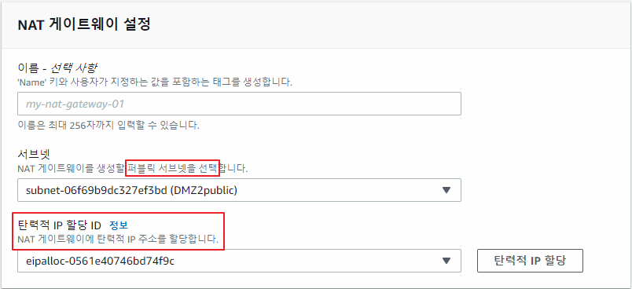

#### 라우팅 테이블을 생성

Click **Route Tables** in the sidebar. We can see that a route table already exists — when we created the VPC, it created a default route table. But we're going to create two new route tables.

- Click **Create route table**.
- For the *Name tag*, enter "PublicRT".
- Set the *VPC* to **SysOpsVPC**.
- Click **Create**, and close out of the success message.

- Click **Create route table**.
- For the *Name tag*, enter "PrivateRT".
- Set the *VPC* to **SysOpsVPC**.
- Click **Create**, and close out of the success message.

#### 라우팅 설정

On their own, route tables don't do anything — we have to give them routes *to* something. For the public route table, we need to provide a route to the internet gateway. For the private route table, we need to provide a route to the NAT gateway.

Navigate to the bottom of the screen, where you'll find the **Summary** and **Routes** tabs. Select **PublicRT** at the top, and click the **Routes** tab at the bottom.

#### PublicRT 테이블에 IGW로 라우팅을 추가

Under *Target*, it says *local*, which means it can communicate with any of the subnets that are in the VPC. However, right now, nothing can communicate with the internet gateway, so nothing can communicate with the outside internet. Let's fix that.

- Click **Edit routes**.
- Click **Add route**.
- Click into the *Target* field, and select **Internet Gateway** from the dropdown menu.
- Enter "0.0.0.0/0" in the *Destination* field.
- Click **Save routes**, and close out of the success message.

We've now created a route from our public route table through the internet gateway into the open internet. Close out of the success message.

#### PrivateRT 테이블에 NAT Gateway로 라우팅을 추가

Now let's go to the private route table. Here, we need to add a route from the private route table to the NAT gateway.

- Select **PrivateRT** at the top of the screen.
- Under the **Routes** tab at the bottom of the screen, click **Edit routes**.
- Click **Add route**.
- Click into the *Target* field, and select **NAT Gateway** from the dropdown menu.
- Enter "0.0.0.0/0" in the *Destination* field.
- Click **Save routes**, and close out of the success message.

Although both of these route tables have been created, they aren't currently associated with any subnets. This is another important part of routing: We have to associate subnets with a route table in order for those subnets — or the resources provisioned inside those subnets — to be able to access them.

#### 라우팅 테이블을 서브넷에 연결

Now, we're going to make our public subnets, well, *public*. They're currently only labeled as public, but by associating them with a route table that has a path to the internet gateway, we're going to make them public for real.

- At the top of the screen, click **PublicRT**.
- Under **Subnet Associations** at the bottom of the screen, click **Edit subnet associations**.
- Select the **DMZ1public** and **DMZ2public** subnets.
- Click **Save**.

Next, let's associate our private subnets with the private route table.

- Select **PrivateRT** at the top of the screen.
- Under **Subnet Associations** at the bottom of the screen, click **Edit subnet associations**.
- Select the four private subnets.
- Click **Save**.

Now anything placed inside the public route table has a route to the internet gateway, and anything placed inside the private route table has a route to the NAT gateway.

If we have databases or EC2 instances located inside these private subnets, they can get updates from the open internet by going through the NAT gateway, which provides an extra layer of security. Essentially, it’s a one-way street: The resources in the private subnets can access the open internet, but the open internet cannot access the resources in the private subnets (unless we explicitly allow it).

#### NACL 설정

We’re almost done with this lab. Before we wrap things up, let’s add another layer of security to our VPC by creating an NACL — a sort of firewall for controlling traffic in and out of one or more subnets — for each of our layers.

Click **Network ACLs** in the sidebar. We should see a default NACL, like we saw with the route tables. The default NACL was created when we created our VPC. But we're going to create three new ones.

- Click **Create network ACL** at the top of the screen.
- For the *Name tag*, enter "DMZNACL".
- Set the *VPC* to **SysOpsVPC**.
- Click **Create**.

- Click **Create network ACL** at the top of the screen.
- For the *Name tag*, enter "AppNACL".
- Set the *VPC* to **SysOpsVPC**.
- Click **Create**.

- Click **Create network ACL** at the top of the screen.
- For the *Name tag*, enter "DBNACL".
- Set the *VPC* to **SysOpsVPC**.
- Click **Create**.

#### NACL을 서브넷에 연결

Just like with the route tables, we need to associate subnets with our NACLs.

- Select **DMZNACL** at the top of the screen.
- At the bottom of the screen, click **Subnet associations**.
- Click **Edit subnet associations**.
- Select the DMZ layer subnets.
- Click **Edit**.

Now traffic coming in and out of these subnets will be subject to the inbound and outbound rules we set up on this particular NACL. We're not going to set up any rules as part of this lab — right now, we're just building the infrastructure and a shell we could put resources in.

Let's finish things up with the NACLs for the remaining layers.

- Select **AppNACL** at the top of the screen.
- Under **Subnet associations** at the bottom of the screen, click **Edit subnet associations**.
- Select the app layer subnets.
- Click **Edit**.

- Select **DBNACL** at the top of the screen.
- Under **Subnet associations** at the bottom of the screen, click **Edit subnet associations**.
- Select the database layer subnets.
- Click **Edit**.

#### NACL에 인바운드/아웃바운드 규칙을 추가 ⇐ 해당 서브넷에서 제공하는 서비스와 관리를 위한 서비스(SSH, 22)를 고려

- DMZ*public ⇒ 웹 서버 (80) 
- AppLayer**private ⇒ express.js (3000)*
- DBLayer*private ⇒ MySQL (3306)

---

<br/>

## LAB : Troubleshooting AWS Network Connectivity: Security Groups and NACLs

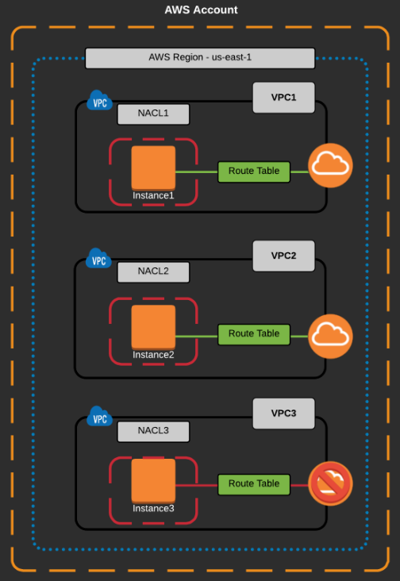

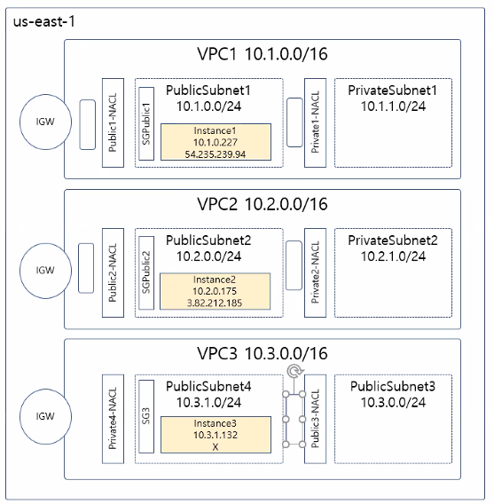

- **각 인스턴스에 SSH 접속 또는 ping 테스트를 시도**
  - ⇒ Instance3은 퍼블릭 IP가 없어서 접근이 불가

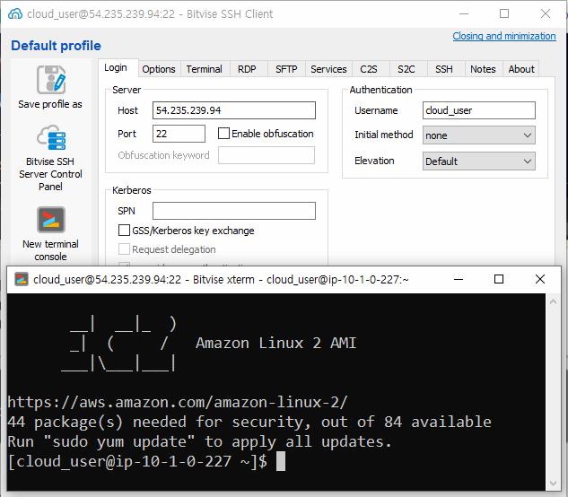

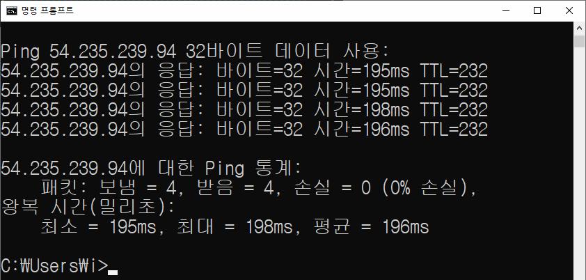


- Instance3의 퍼블릭 IP를 할당
  - EIP 생성 후 인스턴스에 할당

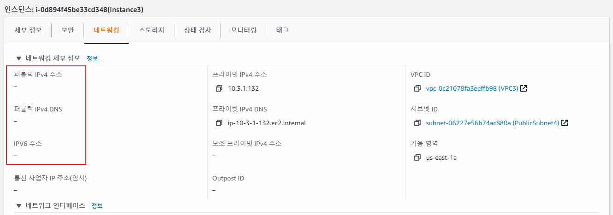

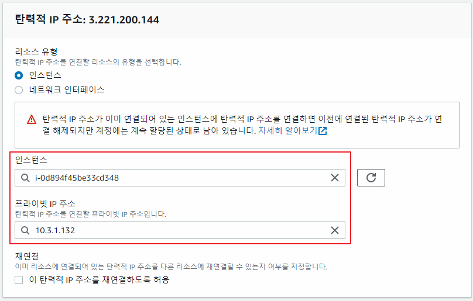

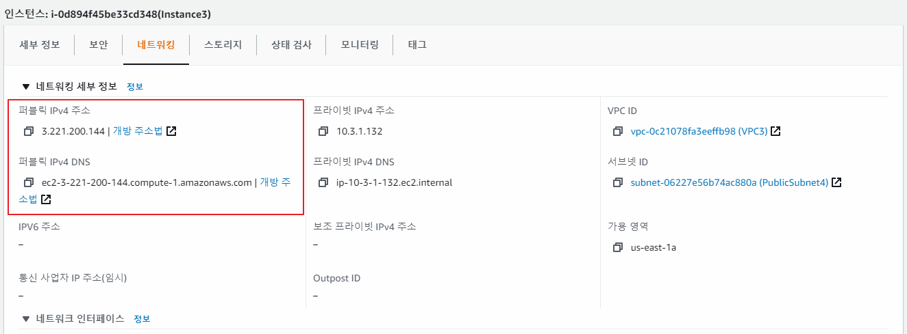

- 다시 Instance3로 접속 테스트
  - ⇒ 접속되지 않는 것을 확인
  - ⇒ 연결된 보안 그룹 설정을 확인
    - 인바운드로 SSHm ICMP 연결을 허용하고, 아웃바운드로 모든 포트를 허용하고 있음
      - 따라서 보안 그룹 설정에는 문제가 없음

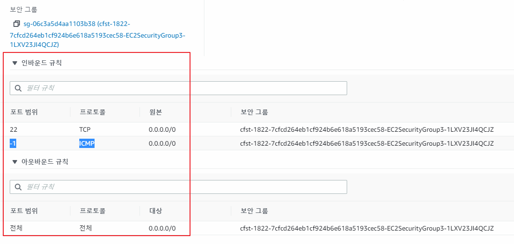

- Instance3가 속해 있는 PublicSubnet4와 연결된 Private4-NACL 설정을 확인
  - 모든 트래픽을 차단하고 있음

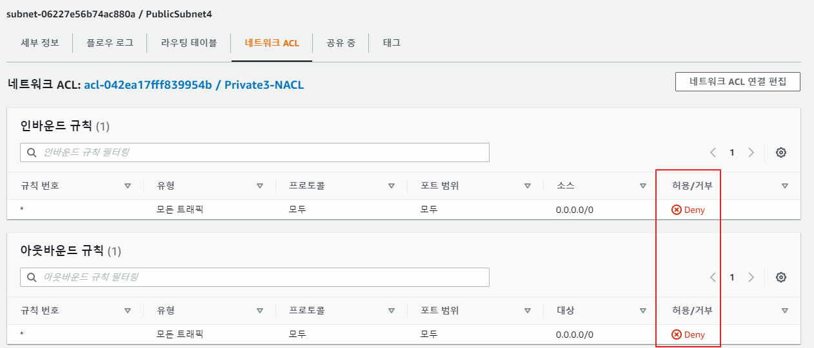

- 가장 설정이 유사한 Public3-NACL을 PublicSubnet4에 연결

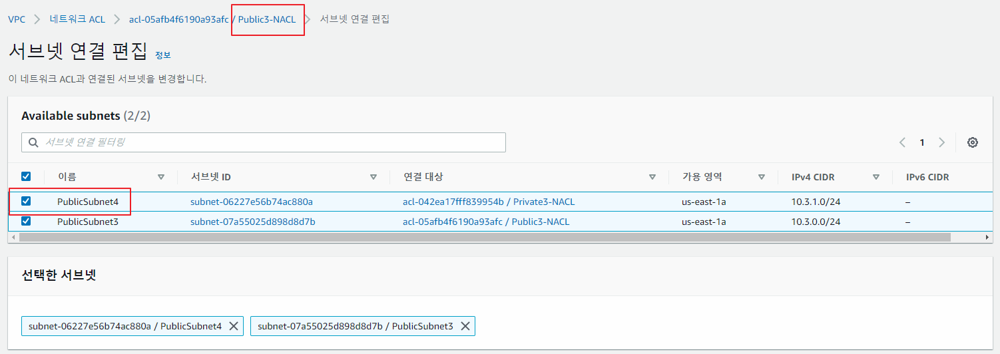

- 여전히 접속되지 않는 것을 확인
  - 라우팅 테이블을 확인

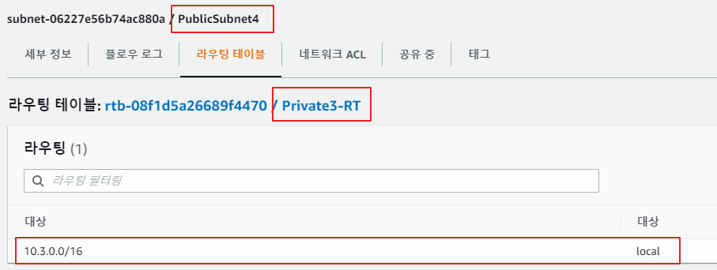

- 인터넷 게이트웨이 라우팅을 추가

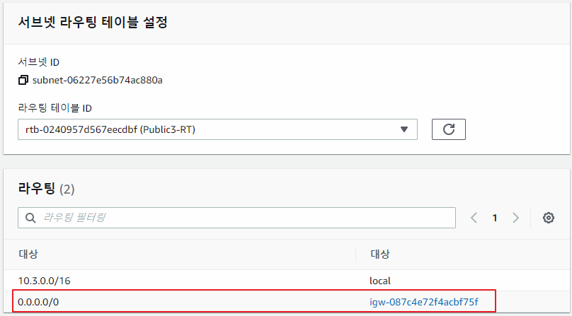

- 연결을 확인

```
C:\Users\i>ping  3.221.200.144

Ping 3.221.200.144 32바이트 데이터 사용:
3.221.200.144의 응답: 바이트=32 시간=193ms TTL=223
3.221.200.144의 응답: 바이트=32 시간=195ms TTL=223
3.221.200.144의 응답: 바이트=32 시간=192ms TTL=223
3.221.200.144의 응답: 바이트=32 시간=193ms TTL=223

3.221.200.144에 대한 Ping 통계:
    패킷: 보냄 = 4, 받음 = 4, 손실 = 0 (0% 손실),
왕복 시간(밀리초):
    최소 = 192ms, 최대 = 195ms, 평균 = 193ms
```

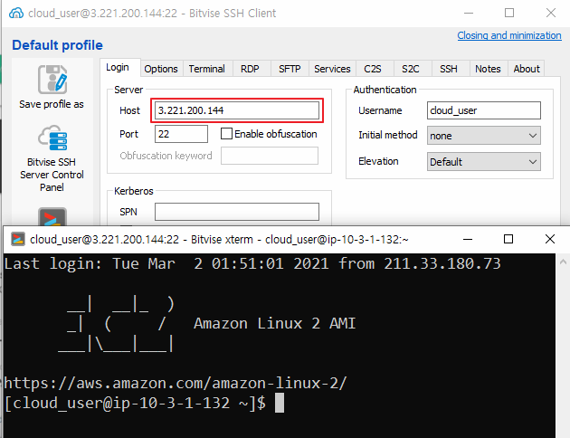